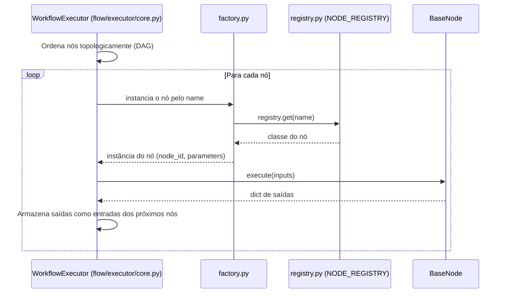
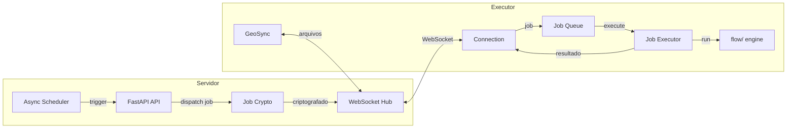

# Guia de Contribuição — Atlans

Guia completo para desenvolvedores que desejam contribuir com o Atlans, uma plataforma de workflows geoespaciais com execução distribuída via executores.

## Sumário

- [Licença e acordo de contribuidor](#licença-e-acordo-de-contribuidor)
- [Configuração do Ambiente](#configuração-do-ambiente)
- [Estrutura do Projeto](#estrutura-do-projeto)
- [Workflow de Git](#workflow-de-git)
- [Backend (FastAPI)](#backend-fastapi)
- [Motor de Workflow (flow/)](#motor-de-workflow-flow)
- [Sistema de Executores](#sistema-de-executores)
- [Frontend (Next.js)](#frontend-nextjs)
- [Banco de Dados](#banco-de-dados)
- [Convenções de Código](#convenções-de-código)
- [Testes](#testes)
- [Integração Contínua (CI) e Releases](#integração-contínua-ci-e-releases)
- [Checklist de PR](#checklist-de-pr)

---

## Licença e acordo de contribuidor

O Atlans é distribuído sob a [AGPL-3.0-only](LICENSE), e o titular do projeto
também o oferece sob outros termos. Por isso toda contribuição entra sob o
[acordo de contribuidor (CLA)](CLA.md): você continua dono do que escreveu e
dá ao titular uma licença ampla para usá-lo, e ele se compromete a
distribuí-lo também como software livre.

Versão 1.0, de 2 de outubro de 2026.
Escreva no seu primeiro PR, na descrição ou num comentário:

> Li o CLA.md, versão 1.0, e concordo com ele.

Um PR sem o aceite não entra.

O que vem de terceiros vai com a origem e a licença, e a licença precisa
conviver com a AGPL-3.0:

- **Um arquivo copiado para o repositório** (código, fonte, ícone): o texto
  da licença ao lado dele e uma entrada em `NO_REPOSITORIO`, no
  `scripts/avisos_de_terceiros.py`.
- **Uma dependência nova do npm ou do PyPI**: depois de atualizar o lock, rode
  `python scripts/avisos_de_terceiros.py`. O [THIRD-PARTY-NOTICES.md](THIRD-PARTY-NOTICES.md)
  ganha o pacote, e a seção «Para revisar» aponta uma licença fora das
  compatíveis (`COMPATIVEIS`, no mesmo script).

---

## Configuração do Ambiente

### 1. Pré-requisitos

| Ferramenta | Versão mínima |
|---|---|
| Docker | 24+ |
| Docker Compose | v2+ |
| Git | 2.x |
| Node.js (dev local frontend) | 24 (a LTS do CI e da imagem; a suíte exige 22 ou mais) |
| Python (dev local backend) | 3.12 |

### 2. Clone e configure

```bash
git clone https://github.com/seu-usuario/atlans-studio.git atlans
cd atlans
cp .env.example .env
```

### 3. Geração de secrets

Edite o `.env` e gere os valores sensíveis:

```bash
# REDIS_PASSWORD — senha do Redis
python -c "import secrets; print(secrets.token_hex(32))"

# AUTH_SECRET — secret do NextAuth
openssl rand -base64 32

# APP_SECRET — secret interno da API
python -c "import secrets; print(secrets.token_urlsafe(48))"

# FERNET_KEY — criptografia de credenciais no banco
python -c "from cryptography.fernet import Fernet; print(Fernet.generate_key().decode())"

# EXECUTOR_SIGNING_KEY — semente da chave Ed25519 que assina os jobs e que os
# executores fixam na matrícula. OBRIGATÓRIA: vazia, nenhum executor matricula
# (503 em /executores/server-public-key) e nenhum job é despachado. O `make
# bootstrap` a gera; à mão:
openssl rand -base64 32
```

### 4. Suba os serviços

```bash
# Stack completa em modo dev (hot-reload em API e frontend)
make up-dev

# Apenas backend
docker compose --profile dev up -d api redis

# Apenas frontend (dev local fora do Docker)
cd web && npm install && npm run dev
```

| Serviço | URL |
|---|---|
| Frontend | http://localhost:3000 |
| API (Swagger) | http://localhost:8000/docs |
| MinIO Console | http://localhost:9001 |

### 5. Logs

```bash
make logs                       # todos os serviços
docker compose logs -f api      # apenas API
# O executor NÃO faz parte do docker-compose.yml principal — vive no
# docker-compose.executor.yml. Para acompanhar os logs dele:
docker compose -f docker-compose.executor.yml logs -f
```

### 6. Pre-commit hooks

Todo commit passa por `detect-secrets` (bloqueia PATs/JWTs/API keys) e
higienizadores basicos (trailing whitespace, EOF, YAML valido). Os hooks são
`repo: local`: rodam o pre-commit, o detect-secrets e os pre-commit-hooks do
`requirements-dev.txt`, travados e com hash (ver "Dependências Python"). Instale
uma vez por clone, no ambiente onde você roda o `git commit` (Linux, macOS ou
Windows; o ambiente do backend, com os dois locks, já serve):

```bash
pip install --require-hashes -r requirements-dev.txt
pre-commit install
```

Depois disso, `git commit` roda os hooks automaticamente. Para rodar
manualmente em todos os arquivos: `pre-commit run --all-files`.

Se detect-secrets flagar um falso positivo (chave de exemplo em test
fixture, hash SHA-256 legítimo), duas opções:

1. **Atualizar o baseline** — se e um secret legitimo que sempre existiu:
   ```bash
   detect-secrets scan --baseline .secrets.baseline
   git add .secrets.baseline
   ```
2. **Marcar inline** — se e um caso pontual:
   ```python
   API_KEY_EXAMPLE = "sk-example123..."  # pragma: allowlist secret
   ```

O CI roda o mesmo scan como safety net — commits sem `pre-commit install`
local ainda sao bloqueados no PR.

---

## Estrutura do Projeto

```
atlans/
├── app/                            # Backend FastAPI
│   ├── main.py                     # Entry point — registra routers, middleware, lifespan
│   ├── api/
│   │   ├── dependencies.py         # Dependências injetáveis (get_db, get_current_user)
│   │   └── routers/                # Um arquivo por domínio
│   │       ├── auth_router.py          # Registro, login, refresh, /me
│   │       ├── workflows_router.py     # CRUD de workflows, export/import, execução
│   │       ├── executores_router.py    # CRUD de executores, enrollment, install.sh
│   │       ├── executor_ws_router.py   # WebSocket do executor (endpoint; fachada do pacote)
│   │       ├── executor_ws/            # Protocolo, fila, resultados e órfãos do WS
│   │       ├── credentials_router.py   # CRUD de credenciais criptografadas
│   │       ├── schedules_router.py     # Agendamentos (cron, interval, rrule)
│   │       ├── drive_router.py         # Upload/download de arquivos (MinIO)
│   │       ├── observability_router.py # Métricas de execução, runs-by-day
│   │       ├── log_workflows_router.py # WebSocket de logs em tempo real
│   │       ├── nodes_router.py         # Catálogo de nós disponíveis
│   │       ├── workspace_router.py     # CRUD de workspaces
│   │       ├── workflow_groups_router.py # Grupos de workflows
│   │       ├── artifacts_router.py     # Artefatos gerados por execuções
│   │       ├── portal_router.py        # Portal público de mapas
│   │       ├── health_router.py        # /ping, healthcheck
│   │       ├── telemetry_router.py     # Telemetria de uso
│   │       └── webhook_router.py       # Recebe webhooks externos
│   ├── core/
│   │   ├── config.py               # Variáveis de ambiente (os.getenv), validadas no import
│   │   ├── db.py                   # Engine async SQLAlchemy + sessão
│   │   ├── storage.py              # Integração com MinIO (S3-compatible)
│   │   ├── async_scheduler.py      # Scheduler async para agendamentos
│   │   ├── executor_connections.py # Registry de conexões WebSocket de executores
│   │   ├── job_crypto.py           # Criptografia de jobs (X25519 + AES-GCM)
│   │   ├── run_result_consumer.py  # Processa resultados recebidos dos executores
│   │   ├── drive_events.py         # Eventos de sincronização de arquivos
│   │   ├── rate_limiter.py         # Rate limiting por endpoint
│   │   ├── rbac.py                 # Controle de acesso baseado em papéis
│   │   ├── constants.py            # Constantes globais
│   │   ├── exceptions.py           # Exceções customizadas
│   │   ├── authorization/          # Middleware e guards de autorização
│   │   ├── credentials/            # Builders de DSN por tipo (PostgreSQL, S3...)
│   │   ├── scheduling/             # Estratégias de agendamento
│   │   └── utils/                  # JWT, logging, handlers de erro
│   ├── models/                     # Modelos SQLAlchemy (ORM)
│   │   ├── base.py                 # Base declarativa + mixins
│   │   ├── user.py                 # Usuário (auth)
│   │   ├── workspace.py            # Workspace multi-tenant
│   │   ├── workspace_member.py     # Membros do workspace
│   │   ├── workflow.py             # Definição do workflow (DAG JSON)
│   │   ├── workflow_run.py         # Execução de um workflow
│   │   ├── workflow_version.py     # Versionamento de workflows
│   │   ├── workflow_group.py       # Grupos/pastas de workflows
│   │   ├── schedule.py             # Agendamento
│   │   ├── credential.py           # Credencial criptografada
│   │   ├── executor.py                # Executor registrado
│   │   ├── artifact.py             # Artefato gerado
│   │   └── ...                     # Demais modelos de domínio
│   ├── schemas/                    # Schemas Pydantic (request/response)
│   ├── services/                   # Lógica de negócio
│   │   ├── workflow_service.py     # Orquestração de workflows
│   │   ├── executor_service.py     # Gestão de executores e dispatch de jobs
│   │   ├── credential_service.py   # CRUD + criptografia de credenciais
│   │   ├── schedule_service.py     # CRUD de agendamentos
│   │   ├── node_service.py         # Catálogo e validação de nós
│   │   └── ...
│   ├── crud/                       # Operações CRUD genéricas
│   └── extensoes/                  # O que uma instalação tem além do núcleo (docs/architecture.md)
│       └── __init__.py             # O registro: cada subpacote é uma extensão, ligada por registrar()
│
├── flow/                           # Motor de execução DAG
│   ├── executor/                   # Pacote do motor de execução
│   │   ├── core.py                 # WorkflowExecutor.run() — traversal + execução dos nós
│   │   ├── node_manager.py         # Instancia e gerencia os nós do run
│   │   ├── edge_resolver.py        # Resolve arestas (inputs ← outputs dos predecessores)
│   │   ├── events.py               # Emissão de node_events durante o run
│   │   ├── rendering.py            # Renderização de parâmetros (Jinja) por nó
│   │   ├── pin.py                  # Pins de saída (cache de resultados de nó)
│   │   └── spill.py                # Spill de saídas grandes para o MinIO
│   ├── factory.py                  # Instancia nó a partir do nome registrado
│   ├── registry.py                 # NODE_REGISTRY: name → classe (via @register_node + auto-discovery)
│   ├── core/
│   │   └── graph.py                # Representação e validação do grafo DAG
│   ├── nodes/
│   │   ├── base.py                 # Classe base BaseNode
│   │   ├── action/                 # HTTP, transformação, geocodificação, scripts
│   │   ├── spatial/                # Operações GeoPandas (buffer, clip, dissolve, voronoi...)
│   │   ├── datasource/             # Leitores (PostGIS, GeoJSON, Shapefile, WFS, CSV...)
│   │   ├── outputs/                # Saídas (arquivo, S3, PostGIS, webhook, e-mail, artefato)
│   │   ├── control/                # Fluxo (condicional, loop, switch, sub-workflow, merge)
│   │   └── trigger/                # Gatilhos (schedule, webhook, arquivo, workflow, geofence)
│   ├── utils/                      # Helpers do motor
│   │   ├── geo_helpers.py          # Funções utilitárias geoespaciais
│   │   ├── expression_service.py   # Avaliação de expressões Jinja/Python
│   │   ├── circuit_breaker.py      # Circuit breaker para chamadas externas
│   │   ├── get_asyncpg_pool.py     # Pool de conexões asyncpg
│   │   ├── artifact_helpers.py     # Helpers para geração de artefatos
│   │   ├── publisher/              # Publicação de eventos de nós
│   │   └── ...
│   └── metrics/
│       └── collector.py            # Coleta de métricas de execução
│
├── executor/                          # Executor externo (execução distribuída)
│   ├── main.py                     # Entry point do executor
│   ├── config.py                   # Configuração via env vars
│   ├── connection.py               # WebSocket client (reconnect, heartbeat, mTLS)
│   ├── crypto.py                   # X25519/Ed25519/AES-GCM
│   ├── job_executor.py             # Executa flow/ localmente
│   ├── job_queue.py                # Fila de jobs com back-pressure
│   ├── job_validator.py            # Validação de jobs recebidos
│   ├── event_publisher.py          # Publica eventos de nós via WebSocket
│   ├── utils.py                    # Utilitários (URL conversion, host aliases)
│   └── sync/                       # GeoSync — sincronização de arquivos
│       ├── manager.py              # Orquestrador principal
│       ├── scanner.py              # Scanner de datasets locais
│       ├── watcher.py              # File watcher (inotify/fsevents)
│       ├── uploader.py             # Upload para o Drive
│       ├── downloader.py           # Download do Drive
│       ├── manifest.py             # Manifesto local (estado de sync)
│       ├── validator.py            # Validação de datasets
│       ├── metadata.py             # Extração de metadados geoespaciais
│       ├── trigger.py              # Triggers de sincronização
│       └── ...
│
├── web/                            # Frontend Next.js 16
│   ├── app/
│   │   ├── (auth)/                 # Login e registro (sem autenticação)
│   │   ├── (dashboard)/            # Páginas protegidas (editor, admin, observabilidade)
│   │   ├── (portal)/               # Portal público de mapas
│   │   └── layout.tsx              # Layout raiz
│   ├── app/components/
│   │   ├── workflow/               # Editor visual (XYFlow), configuração de nós
│   │   ├── credentials/            # CRUD de credenciais
│   │   ├── projects/               # Lista e filtros de workflows
│   │   ├── sidebar/                # Navegação lateral
│   │   ├── ui/                     # Componentes shadcn/ui reutilizáveis
│   │   └── shared/                 # Componentes compartilhados
│   ├── context/                    # Contextos React (FlowContext, etc.)
│   ├── extensoes/                  # O que uma instalação tem além do núcleo (docs/architecture.md)
│   │   ├── index.ts                # O registro: o núcleo lê EXTENSOES daqui, e só daqui
│   │   └── instaladas.ts           # As extensões desta instalação (a distribuição livre: nenhuma.ts)
│   ├── hooks/                      # Hooks customizados (useExecuteWorkflow, etc.)
│   ├── service/                    # Cliente HTTP (GisFlowService.ts) e a casa única de tipos (types.ts)
│   ├── auth.ts                     # Configuração NextAuth
│   └── proxy.ts                    # Proteção de rotas (o middleware do Next)
│
├── catalogo/                       # Catálogo de fontes: cópia versionada do Vault de geosserviços (docs/sources.md)
│   ├── README.md                   # O formato das notas e como atualizar
│   └── geoservicos/                # Uma pasta por instituição (nota, Camadas.md, Atributos.md)
│
├── alembic/                        # Migrações de banco de dados
│   ├── env.py
│   └── versions/                   # Arquivos de migração
│
├── tests/                          # Testes automatizados
│   ├── conftest.py                 # Fixtures globais
│   ├── unit/                       # Testes unitários
│   ├── integration/                # Testes de integração
│   └── extensoes/                  # Os testes de cada extensão (app/extensoes), fora do núcleo; só existe quando há uma
│
├── docker-compose.yml              # Stack principal (API, Redis, MinIO, frontend)
├── docker-compose.executor.yml        # Stack do executor (distribuição para clientes)
├── Dockerfile.api                  # Build do backend
├── Dockerfile.executor                # Build do executor
├── Makefile                        # Atalhos (up-dev, logs, etc.)
├── alembic.ini                     # Configuração do Alembic
├── requirements.in                 # Dependências Python diretas do backend (edite aqui)
├── requirements.txt                # Lock gerado do .in, com hash (o que a imagem e o CI instalam)
├── requirements-dev.in/.txt        # Ferramentas de dev fora da imagem (ruff, pip-audit, detect-secrets, pre-commit, pip-tools)
├── ruff.toml                       # Regras do lint Python (CI)
└── pytest.ini                      # Configuração do pytest
```

---

## Workflow de Git

### Fluxo padrão

```bash
# 1. Crie uma branch a partir de main
# Convenção do repo: o tipo do commit + slug curto (ex.: feat/dashboard-periodo).
git checkout main && git pull
git checkout -b feat/nome-da-funcionalidade

# 2. Desenvolva e commite em pequenos passos
git add <arquivos>
git commit -m "feat: descrição curta do que foi feito"

# 3. Mantenha a branch atualizada
git fetch origin
git rebase origin/main

# 4. Abra o PR quando estiver pronto
```

### Conventional Commits

Todos os commits devem seguir o padrão [Conventional Commits](https://www.conventionalcommits.org/):

| Prefixo | Quando usar | Exemplo |
|---|---|---|
| `feat:` | Nova funcionalidade | `feat: adicionar nó de dissolve espacial` |
| `fix:` | Correção de bug | `fix: corrigir timeout no WebSocket do executor` |
| `docs:` | Apenas documentação | `docs: atualizar guia de contribuição` |
| `refactor:` | Reestruturação sem mudança de comportamento | `refactor: extrair lógica de dispatch para service` |
| `test:` | Testes | `test: adicionar testes unitários para buffer node` |
| `chore:` | Manutenção (deps, CI, configs) | `chore: atualizar dependências do frontend` |
| `perf:` | Melhoria de performance | `perf: usar asyncpg pool no database_query` |
| `desktop:` | Mudanças/bump do app desktop (Electron) | `desktop: v2.15.0` |
| `executor:` | Mudanças específicas do executor | `executor: ocultar no Windows os arquivos internos` |

**Escopo opcional:** `feat(executor): suportar sync bidirecional`

---

## Backend (FastAPI)

### Adicionando um endpoint

1. Crie ou edite o router em `app/api/routers/`:

```python
# app/api/routers/exemplo_router.py
from fastapi import APIRouter, Depends
from sqlalchemy.ext.asyncio import AsyncSession

from app.api.dependencies import get_db, get_current_user
from app.models.user import User

router = APIRouter(prefix="/exemplo", tags=["exemplo"])


@router.get("/")
async def listar(
    db: AsyncSession = Depends(get_db),
    current_user: User = Depends(get_current_user),
) -> list[dict]:
    """Retorna todos os exemplos do workspace."""
    ...
```

2. Registre o router em `app/main.py`:

```python
from app.api.routers.exemplo_router import router as exemplo_router
app.include_router(exemplo_router)
```

### Adicionando um modelo

1. Crie o arquivo em `app/models/`
2. Herde de `Base` (importado de `app/core/db.py`)
3. Use `id_hash: str` como chave primária (gerado via `uuid4().hex`)
4. Inclua `created_at` e `updated_at` com `server_default`
5. Adicione `workspace_id` se o recurso pertence a um workspace

```python
# app/models/exemplo.py
from sqlalchemy import Column, String, DateTime, func
from app.models.base import Base


class Exemplo(Base):
    __tablename__ = "exemplos"

    id_hash = Column(String, primary_key=True)
    workspace_id = Column(String, nullable=False, index=True)
    name = Column(String, nullable=False)
    created_at = Column(DateTime(timezone=True), server_default=func.now())
    updated_at = Column(DateTime(timezone=True), onupdate=func.now())
```

### Adicionando um schema Pydantic

- Schemas de entrada e saída ficam em `app/schemas/`
- Use `model_validator(mode="after")` para validações cruzadas
- Schemas de response definem `model_config = ConfigDict(from_attributes=True)`

```python
# app/schemas/exemplo.py
from pydantic import BaseModel, ConfigDict


class ExemploCreate(BaseModel):
    name: str


class ExemploResponse(BaseModel):
    model_config = ConfigDict(from_attributes=True)

    id_hash: str
    name: str
    workspace_id: str
```

### Adicionando um service

- Lógica de negócio fica em `app/services/`, nunca diretamente no router
- Services recebem `AsyncSession` e retornam modelos ou dicts
- Erros de domínio levantam `HTTPException` com status e mensagem adequados

### Formato de erros da API

Todos os erros seguem formato padronizado (via `app/core/utils/error_handlers.py`):

```jsonc
// HTTP exceptions (400, 401, 403, 404, 429)
{ "error": "http_exception", "message": "Descrição legível.", "status_code": 400 }

// Erros de validação Pydantic (422)
{ "error": "validation_error", "message": "Validation failed", "details": [...] }

// Erro interno (500)
{ "error": "internal_server_error", "message": "Unexpected error occurred" }
```

---

## Motor de Workflow (flow/)

O motor `flow/` executa DAGs **dentro dos executores** — nunca no processo da API. O servidor importa `flow/` apenas para metadados (registry, `description()`), simulação de schema (`simulate()`) e validação de contrato de sub-workflow. Nós não têm acesso ao banco, ao MinIO nem ao Redis do servidor: tudo passa por endpoints HTTP autenticados por mTLS (`/drive/executor-*`, `/internal/*`) e pre-signed URLs.

### Ciclo de vida de um nó



1. O `WorkflowExecutor` (`flow/executor/core.py`, método `run()`) faz traversal topológico do DAG definido no workflow JSON
2. Para cada nó, o `factory.py` consulta o `NODE_REGISTRY` (`registry.py`) e instancia a classe correspondente com `(node_id, parameters)`
3. A instância recebe os parâmetros do usuário no construtor (acessíveis via `self.parameters` / `self.get_param()`); os `inputs` (saídas dos nós predecessores) chegam no `execute()`
4. O método `execute(self, inputs)` roda a lógica e retorna um dict de saídas — nós CPU-bound implementam `execute_sync(self, inputs)` (ver abaixo)
5. As saídas ficam disponíveis como entradas para os nós seguintes no DAG

### Criando um novo nó

1. Crie o arquivo na categoria adequada dentro de `flow/nodes/` e decore a classe com `@register_node`. O nó é descoberto **automaticamente** — `registry.auto_discover_nodes()` varre `flow/nodes/` na importação e dispara os decorators; você **não** edita o `registry.py` manualmente.

```python
# flow/nodes/spatial/meu_no.py
from typing import Any, Dict

from flow.nodes.base import BaseNode
from flow.registry import register_node


@register_node
class MeuNoNode(BaseNode):
    """Descrição do que o nó faz."""

    @classmethod
    def description(cls) -> Dict[str, Any]:
        # Metadados para descoberta e geração da interface no editor.
        return {
            "name": "MeuNo",                  # chave ÚNICA de registro (sem espaços)
            "alias": "Meu Nó",                # nome exibido no editor
            "description": "O que o nó faz.",
            "type": "spatial",                # trigger|action|spatial|datasource|output|control
            "properties": [
                {
                    "name": "parametro",
                    "type": "number",         # string|number|boolean|object|select
                    "default": 100,
                    "description": "Meu parâmetro",
                },
            ],
        }

    async def execute(self, inputs: Dict[str, Any]) -> Dict[str, Any]:
        self.validate()                       # aplica os defaults declarados em properties
        gdf = self.get_first_gdf(inputs)      # ou self.get_input_gdf(inputs, "chave")
        param = self.get_param_float("parametro", 100)
        # ... lógica ...
        return {"result": gdf}
```

Notas sobre o `BaseNode` (`flow/nodes/base.py`):

- **Parâmetros** vêm do construtor (`__init__(self, node_id, parameters)`) e são lidos por `self.get_param()`, `get_param_float()`, `get_param_int()`, `get_param_bool()` — **não** por um argumento `config` no `execute`.
- **`execute(self, inputs)`** recebe apenas os `inputs`. Para nós **CPU-bound** (geopandas/pandas/shapely) prefira implementar `execute_sync(self, inputs)`: o `BaseNode.execute()` já o despacha para uma thread (`asyncio.to_thread`), mantendo o event loop do executor livre para heartbeat, eventos e `cancel`. Sobrescreva `execute` diretamente quando o nó aguarda I/O assíncrono (asyncpg, httpx).
- **`self.validate()`** aplica os defaults de `properties`; chame no início do `execute`.
- Helpers de input: `get_first_gdf(inputs)` e `get_input_gdf(inputs, "chave")` buscam e validam GeoDataFrames com mensagens de erro claras.

2. O frontend carrega o schema do nó automaticamente via `GET /nodes/` — não é necessário criar componente visual na maioria dos casos.

### Categorias de nós

| Categoria | Diretório | Exemplos |
|---|---|---|
| **spatial** | `flow/nodes/spatial/` | buffer, clip, dissolve, intersection, voronoi, spatial_join |
| **datasource** | `flow/nodes/datasource/` | database_query, read_geojson, read_shapefile, wfs |
| **action** | `flow/nodes/action/` | http_request, field_transformer, geocode, python_script |
| **outputs** | `flow/nodes/outputs/` | save_to_postgis, save_geojson, send_webhook, artifact_output |
| **control** | `flow/nodes/control/` | conditional, loop, switch, merge, sub_workflow |
| **trigger** | `flow/nodes/trigger/` | schedule_trigger, webhook_trigger, geofence_trigger |

### Executor — features

- **Métricas:** o `flow/metrics/collector.py` coleta tempo de execução, contagem de linhas e erros por nó
- **Circuit Breaker:** `flow/utils/circuit_breaker.py` protege chamadas externas (HTTP, banco) contra falhas cascata
- **Pools asyncpg:** `flow/utils/get_asyncpg_pool.py` reutiliza conexões entre execuções

---

## Sistema de Executores

A execução de workflows no Atlans é **totalmente distribuída via executores**. Não há Celery — os executores conectam via WebSocket, recebem jobs criptografados, executam o `flow/` localmente e retornam resultados.

### Arquitetura



### Onde um executor roda

A stack do servidor não sobe executor nenhum: o primeiro é matriculado pelo
painel e roda onde se quiser, inclusive no mesmo host (`executor/README.md`).

| Jeito | Onde roda | Caso de uso |
|---|---|---|
| **Docker** | Qualquer máquina com Docker (`install.sh` servido pelo painel, ou `docker-compose.executor.yml`) | O caminho padrão: servidores, VMs, o próprio host da stack |
| **Python nativo** | Uma máquina com Python 3.12 (`python -m executor`) | Acesso a bancos internos e dados locais, desenvolvimento |
| **Desktop** | Máquina do usuário (app Electron, Windows) | Dados locais, prototipagem, uso individual |

Para o servidor, um executor é `default` (atende qualquer workspace) ou
`dedicated` (só os workspaces a que foi atribuído) — `docs/architecture.md`.

### Dispatch de jobs

1. Usuário clica "Executar" ou um agendamento é disparado
2. `executor_service.py` seleciona o executor alvo (por workspace, capacidade ou assignment)
3. `job_crypto.py` criptografa o payload do workflow (X25519 + AES-256-GCM)
4. O job criptografado é enviado via WebSocket ao executor
5. O executor descriptografa, executa o `flow/` e retorna o resultado
6. `run_result_consumer.py` processa o resultado e atualiza o `WorkflowRun`

### Eventos em tempo real

Durante a execução, o executor envia `node_event` a cada nó processado. Esses eventos são retransmitidos via WebSocket para o frontend, permitindo que o canvas mostre o progresso nó a nó em tempo real.

Documentação completa do executor: [`executor/README.md`](executor/README.md)

---

## Frontend (Next.js)

### Comandos de desenvolvimento

Rodados a partir de `web/` (scripts em `web/package.json`):

```bash
npm run dev         # servidor de desenvolvimento (next dev, hot-reload)
npm run lint        # ESLint (eslint app lib extensoes) — roda no CI
npm run typecheck   # tsc --noEmit
npm run typecheck:nucleo  # o núcleo sem extensão nenhuma, sem apagar nada (tsconfig.nucleo.json)
npm test            # Vitest (vitest run) — roda no CI
npm run test:nucleo # a suíte sem extensão nenhuma, sem apagar nada (vitest --mode nucleo)
npm run build       # build de produção (next build) — roda no CI
```

### Estrutura de rotas (App Router)

O frontend usa **App Router** do Next.js 16 com grupos de rotas:

| Grupo | Autenticação | Conteúdo |
|---|---|---|
| `(auth)/` | Nenhuma | Login, registro |
| `(dashboard)/` | NextAuth (JWT) | Editor de workflows, executores, credenciais, observabilidade |
| `(portal)/` | Pública | Portal de mapas publicados |

### Chamadas à API

Use `GisFlowService.ts` como cliente HTTP centralizado:

```typescript
// web/service/GisFlowService.ts
async getExemplo(workspaceId: string): Promise<IExemplo[]> {
  const res = await this.api.get(`/exemplo/`, {
    headers: { "x-workspace-id": workspaceId },
  });
  return res.data;
}
```

### Tratamento de erros HTTP

```typescript
} catch (err) {
  const axiosErr = err as AxiosError<{
    error?: string;
    message?: string;
    details?: { msg: string }[];
  }>;
  const data = axiosErr.response?.data;

  if (!axiosErr.response) {
    // Sem rede
  } else if (data?.error === "validation_error" && Array.isArray(data.details)) {
    const msgs = data.details.map((d) => d.msg).join(" | ");
    toast.error(msgs);
  } else {
    toast.error(data?.message ?? "Erro inesperado.");
  }
}
```

### Componentes do editor visual

| Diretório | Responsabilidade |
|---|---|
| `web/app/components/workflow/` | Editor visual (XYFlow), canvas, painel de configuração |
| `web/app/components/credentials/` | CRUD de credenciais |
| `web/app/components/projects/` | Lista de workflows, busca e filtros |
| `web/app/components/ui/` | Componentes shadcn/ui reutilizáveis |

O schema de configuração de cada nó é carregado dinamicamente via `GET /nodes/` — não é necessário codificar campos manualmente no frontend para a maioria dos nós.

### Token de autenticação

O access token JWT está em `session.user.access_token` (configurado em `web/auth.ts`). **Nunca** use `session.accessToken`.

---

## Banco de Dados

### Stack

- **PostgreSQL** com extensão **PostGIS**
- **SQLAlchemy 2.x** com engine async (`asyncpg`)
- **Alembic** para migrações

### Criando uma migração

```bash
# Gera migração automática a partir dos modelos
alembic revision --autogenerate -m "add tabela_exemplos"

# Aplica migrações pendentes
alembic upgrade head

# Reverte a última migração
alembic downgrade -1
```

### Padrão async — evitando DetachedInstanceError

> Este é o bug mais comum no projeto. Sempre extraia atributos do ORM **dentro** do bloco `async with get_session_async()`, antes que a sessão feche.

```python
# ERRADO — DetachedInstanceError ao acessar user.id_hash fora da sessão
async with get_session_async() as session:
    user = await session.get(User, user_id)
# user.id_hash  <-- ERRO! sessão já fechou

# CORRETO — extraia os valores dentro do bloco
async with get_session_async() as session:
    user = await session.get(User, user_id)
    user_id_hash = user.id_hash
    user_name = user.name
# use user_id_hash e user_name aqui
```

### Relacionamentos lazy

Ao acessar relacionamentos lazy em contexto async, use `selectinload` ou `joinedload` na query:

```python
from sqlalchemy.orm import selectinload

stmt = select(Workflow).options(selectinload(Workflow.runs)).where(...)
result = await session.execute(stmt)
```

---

## Convenções de Código

### Python

| Regra | Detalhe |
|---|---|
| Lint | `ruff check .` (regras do pyflakes, em `ruff.toml`; `pip install -r requirements-dev.txt`). O CI roda o mesmo antes do `pytest` e falha com import sem uso, nome indefinido ou variável sem uso. Não há formatador: siga o estilo do código existente (~100 chars/linha como referência). O pre-commit aplica só higiene de arquivo (trailing whitespace, EOF, line endings) |
| Type hints | Obrigatório em parâmetros e retornos de funções públicas |
| Async | Todo I/O deve ser `async`. Nunca use `requests` — use `httpx` |
| Logging | `get_logger(__name__)` de `app/core/utils/logger` ou `logging.getLogger(__name__)` |
| Exceções | Nunca `except Exception: pass`. Sempre logue ou relance |
| Paralelismo | Prefira `asyncio.gather()` a chamadas sequenciais `await` |
| Comentários | **Português do Brasil** |
| Imports | stdlib, terceiros, locais (separados por linha em branco) |

### TypeScript / React

| Regra | Detalhe |
|---|---|
| Formatação | **ESLint** (configuração do projeto) |
| Componentes | Funcionais com hooks, sem classes |
| Tipagem | Interfaces para todos os objetos (`web/service/types.ts`, a casa única). Evite `any` |
| Comentários | **Português do Brasil** |
| State management | Contextos React (`web/context/`), sem Redux |
| CSS | Tailwind CSS + shadcn/ui |

---

## Testes

### Estrutura

```
tests/
├── conftest.py                    # Fixtures globais (db, client, auth)
├── unit/
│   ├── test_nodes.py              # Testes de nós do flow/
│   ├── test_storage.py            # Testes de storage (MinIO)
│   ├── test_sync_manager.py       # Testes do GeoSync
│   └── test_workflow_crud.py      # Testes de CRUD de workflows
├── integration/                   # Testes de integração (executor, cripto, cartas)
├── extensoes/                     # Os de cada extensão; o núcleo não os importa (só existe quando há uma)
└── test_workflow_happy_paths.py   # Testes de fluxo completo
```

### Executando

```bash
# ── Backend (pytest) ──
# Todos os testes
pytest

# Apenas testes unitários
pytest tests/unit/

# Com verbose e último falho
pytest -vv --lf

# Teste específico — test_nodes.py agrupa os casos em classes (TestBufferNode, ...)
pytest "tests/unit/test_nodes.py::TestBufferNode" -v

# ── Frontend (Vitest) ──
cd web && npm test          # vitest run — é o que o CI executa
cd web && npm run test:nucleo  # a mesma suíte sem as extensões (web/extensoes), sem apagar nada
cd web && npm run test:watch

# ── Desktop (Vitest) ──
cd desktop && npm test      # vitest run — é o que o CI executa
```

### Escrevendo testes

- Use fixtures do `conftest.py` para banco e autenticação
- Testes de nós: instancie o nó com `(node_id, parameters)` e chame `execute(inputs)` (os parâmetros vão no construtor, não no `execute`). Metadados são inspecionados via `Node.description()`
- Testes de API: use o `AsyncClient` do httpx com a app FastAPI

```python
# tests/unit/test_nodes.py
from flow.nodes.spatial.buffer import BufferNode


async def test_buffer_executa_com_distancia():
    # Metadados do nó (o registro usa description()['name']).
    assert BufferNode.description()["name"] == "Buffer"

    # Parâmetros no construtor; inputs no execute().
    node = BufferNode("buffer-1", {"distance": 100, "distanceUnit": "meters"})
    result = await node.execute({"input": gdf_fixture})

    assert "output" in result
```

---

## Integração Contínua (CI) e Releases

### O que o CI valida (`.github/workflows/ci.yml`, em todo push/PR para `main`)

| Job | O que roda |
|---|---|
| **Secrets scan (detect-secrets)** | `detect-secrets scan --baseline .secrets.baseline` — falha se surgir segredo novo fora do baseline |
| **Backend (Python)** | `pip install --require-hashes --only-binary=:all: -r requirements.txt -r requirements-dev.txt` → `ruff check .` → `pytest tests/ -v` (Python 3.12; inclui `test_locks_python.py`, que confere os locks). Não há formatador de Python no CI |
| **Backend sem extensões (núcleo)** | as mesmas dependências → `bash scripts/sem_extensoes.sh` (apaga `app/extensoes/<nome>/` e `tests/extensoes/`, o corte da distribuição livre) → `pytest tests/ -q`: o núcleo do servidor sozinho (`docs/architecture.md`, Extensões). Sem extensão nenhuma no repositório (a cópia pública), o job termina no passo «Há extensões?»: seria idêntico ao de cima |
| **Auditoria de dependências (informativa)** | `scripts/idade_dos_locks.py` (versões dos locks Python com menos de 14 dias ou retiradas do PyPI); `pip-audit` no lock da API e no do executor (lidos direto, com `--disable-pip`); `npm audit --omit=dev` no `web/` e no `desktop/`. Não bloqueia: cada achado vira um aviso no PR e o relatório vai para o resumo da execução |
| **Frontend (Next.js)** | `npm ci` → `npm run lint` → `npm test` (Vitest) → `npm run build` (Node 24; o `build` copia o Monaco para `public/monaco`) |
| **Frontend sem extensões (núcleo)** | `npm ci` → `bash ../scripts/sem_extensoes.sh` (apaga `web/extensoes/<nome>/` e `web/__tests__/extensoes/` e esvazia a lista das instaladas) → `npm run typecheck` → `npm test` → `npm run build`: o núcleo do web como a distribuição livre o roda (`docs/architecture.md`, Extensões do web). Também termina em «Há extensões?» quando não há nenhuma |
| **Desktop (typecheck + testes + lock)** | `npm run typecheck` → `npm test` (Vitest) → `npm run python:lock:check`, que instala o lock do executor num CPython do Windows (Windows, Node 24) |

### Dependências Python (locks com hash)

Cada `.in` é a fonte, o que se edita; o `.txt` ao lado é o LOCK gerado dele, com todas
as dependências (diretas e transitivas) travadas e o hash de cada arquivo:

| Fonte | Lock | Quem instala |
|---|---|---|
| `requirements.in` | `requirements.txt` | a imagem da API e o CI |
| `requirements-dev.in` | `requirements-dev.txt` | o CI e quem desenvolve (ruff, pip-audit, detect-secrets, pre-commit, pip-tools, uv) |
| `executor/requirements-full.in` | `executor/requirements-full.txt` | a imagem do executor (e o quickstart) e o runtime embarcado do app desktop |
| `executor/requirements.in` | `executor/requirements.txt` | a instalação manual pela CLI |

Tudo instala com `--require-hashes`: um arquivo diferente do revisado (trocado no PyPI
ou no caminho) não instala, e nenhuma versão entra no build sem ter passado por um PR.
As imagens usam também `--only-binary=:all:`, então nenhum `setup.py` roda no build.

Para mudar uma dependência:

1. Edite o `.in` (versão exata, `==`, como o resto do arquivo).
2. Regere os locks em Linux x86_64 com Python 3.12, a plataforma da imagem e do CI:
   `python scripts/travar_python.py`. Fora do Linux, pelo Docker (o comando está no
   cabeçalho do script).
3. Commite o `.in` e os `.txt`. O `tests/unit/test_locks_python.py` confere que os
   locks batem com as fontes (nos dois sentidos: o que entrou e o que saiu), que
   toda linha tem hash e que o mesmo pacote tem a mesma versão em todos eles. O job
   Desktop do CI confere que o lock do executor instala no Windows.

O script aplica a quarentena de 14 dias ao que o resolvedor escolhe sozinho (as
transitivas). Uma versão já travada e mais nova que isso (veio de um PR do Dependabot
ou de segurança, revisado) continua valendo, mas só ela: nada mais novo entra junto,
e ela não é rebaixada. No fim, toda versão que mudou tem a data conferida no PyPI; se
alguma furar o corte, o script desfaz tudo. O que você pinou à mão no `.in` entra na
versão pedida (é uma decisão): confira a data de publicação antes de pinar uma versão
recém-saída. Não rode o `pip-compile` direto: ele pula a quarentena.

O Dependabot sobe o que está nos `.in` (e as transitivas com falha de segurança,
quando as atualizações de segurança estão ligadas). As outras transitivas ficam onde
estão até alguém rodar `python scripts/travar_python.py --renovar`, que as
re-resolve com a mesma quarentena. Vale fazer isso de tempos em tempos, num PR próprio.

### Dependências npm (sem scripts de instalação)

O `web/.npmrc` e o `desktop/.npmrc` ligam `ignore-scripts=true`: nenhum pacote roda
código no `npm install`/`npm ci` — nem no CI, nem no build da imagem, nem na sua
máquina. É por esses scripts que os worms do npm de 2025 roubavam tokens e se
republicavam. Versão e hash (`integrity`) de cada pacote já vêm travados no
`package-lock.json`, e o `npm ci` instala exatamente isso.

- Os pacotes daqui que tinham script de instalação não precisam dele. No esbuild,
  no `@tailwindcss/oxide` e no unrs-resolver ele é plano B para baixar o binário
  nativo, que chega pelas dependências opcionais. No sharp ele só compila da fonte
  (o binário pronto vem de `@img/sharp-*`). No fsevents, só de macOS, o binário
  compilado já vem dentro do pacote.
- O Electron não precisa: desde o 44, ele baixa o binário na primeira vez que é
  chamado, conferindo o SHA-256 pelo `checksums.json` do pacote. O `npm run dev` do
  desktop faz isso num passo à vista (ou `npm run electron:binario`). O
  empacotamento baixa o Electron por conta própria.
- Efeito colateral: o npm também não roda os ganchos `pre`/`post` do `npm run`. Não
  use `prebuild`/`predev`; chame o passo no próprio script, como o `build` do web faz
  com o `copiar-monaco.mjs` e o `copiar-maplibre.mjs`.
- Um pacote novo que precise mesmo do script de instalação: rode-o explicitamente
  (como o do Electron) e deixe escrito por quê.

### PRs do Dependabot

O [`.github/dependabot.yml`](.github/dependabot.yml) abre PRs uma vez por mês (dia 1º),
e só com versões publicadas há pelo menos 14 dias (30 para versão maior). A cadência
e a quarentena existem por causa dos ataques à cadeia de suprimentos: versão maliciosa
costuma ser descoberta e retirada em horas ou poucos dias, e quem atualiza assim que
ela sai é quem a instala. O `tests/unit/test_ci_workflow.py` segura essa política, então
encurtar a espera é uma decisão explícita, não um detalhe de configuração. Cada PR
passa pelo CI como qualquer outro.

- **Python:** a configuração em `/` lê os pares `.in` → `.txt` (API, dev, executor
  completo e mínimo), que o Dependabot regenera com o pip-compile. A mesma versão
  sobe em todos no mesmo PR, e menores e correções vêm num PR por mês. A espera de
  14 dias vale para o pacote que ele atualiza; as transitivas que o pip-compile traz
  junto vêm na versão mais nova do dia. O passo "Versões recentes nos locks Python"
  do CI lista as que têm menos de 14 dias. Ele compila cada `.in` sem a restrição
  do script, então o `requirements-dev.txt` e o `executor/requirements.txt` perdem
  no PR as anotações `# via` que a citam: é só comentário, e o próximo
  `travar_python.py` as devolve.
- **npm do `web/` e do `desktop/`:** menores agrupados; versão maior vem sozinha.
- **GitHub Actions:** agrupadas, com 30 dias de espera para qualquer versão: para
  actions o Dependabot não aceita espera separada por tipo de versão.

**Antes de aprovar.** Abrir o PR não expõe nada: o CI de PR do Dependabot roda com
token só de leitura e sem os segredos do repositório. O risco está no merge, que leva
o pacote para a imagem de produção, e em quem instala o branch na própria máquina.

1. Leia as notas da versão e confira se a mudança bate com o que elas descrevem. No
   Python, comece pelo que o passo "Versões recentes nos locks Python" do CI listou:
   é o que entrou sem quarentena.
2. Compare o que foi publicado entre a versão atual e a nova. No npm:
   `npm diff --diff=<pacote>@<atual> --diff=<pacote>@<nova>`. No PyPI: baixe as duas
   wheels com `pip download <pacote>==<versão> --no-deps --only-binary=:all:`, descompacte
   e compare as pastas.
3. Procure os sinais de ataque:
   - script de instalação novo (`preinstall`/`postinstall` no npm);
   - código ofuscado, ou minificado onde antes não era;
   - acesso a rede, a variáveis de ambiente ou a arquivos fora do que o pacote faz;
   - dependência nova que ninguém conhece;
   - mantenedor trocado;
   - versão sem proveniência quando as anteriores tinham (no npm,
     `npm audit signatures` confere assinaturas e atestações do que foi instalado).
4. Na dúvida, feche o PR. O Dependabot não reabre a mesma versão e volta com a
   seguinte, que terá passado mais tempo exposta a quem procura esse tipo de coisa.

CI verde não prova que a biblioteca nova funciona, só que os testes não a pegaram.
O bcrypt 5.0 entrou verde e derrubava todo login: o hash de senha era pelo passlib
1.7.4, que levanta erro com ele, e nenhum teste chamava o hash de verdade (o passlib
saiu depois; o hash chama o bcrypt direto). Em versão maior,
confira as notas de quebra contra o uso que o projeto faz do pacote.

Quatro situações pedem mão:

- **O job Desktop falhou no `python:lock:check`.** A versão nova não tem wheel para
  o Windows (`win_amd64`, `cp312`), ou pede lá uma dependência que o lock, resolvido
  no Linux, não tem. O `desktop/README.md` ("Solução de problemas") diz o que fazer
  em cada caso.
- **O `test_mesma_versao_em_todos_os_locks` falhou.** O Dependabot regenera cada lock
  por conta própria, e uma transitiva pode ter saído em versões diferentes. Rode
  `python scripts/travar_python.py` no branch do PR e commite os locks.
- **numpy, pandas ou pyproj.** Estão pinados na versão que a produção roda desde a
  troca para o Python 3.12. Cada um vem num PR próprio, que é uma migração: rodar a
  suíte e os fluxos de exemplo antes de aprovar. O salto do pandas para a 3.x fica
  ignorado: muda o comportamento dos nós (copy-on-write e o dtype de string novo).
- **Imagens base (Python, Node).** O Dependabot não as toca. A versão do Python anda
  em quatro lugares (os dois Dockerfiles, o CI e o `desktop/python-runtime.json`) e
  sobe à mão, junto com o `.python-version`.

As atualizações de **segurança** vêm à parte e não esperam o mês nem a quarentena,
quando o "Dependabot security updates" está ligado em Settings → Code security do
repositório. Ali a falha já é pública, e esperar custa mais. Elas passam pela mesma
revisão antes do merge.

### Releases (disparados por tag / push)

| Workflow | Gatilho | Saída |
|---|---|---|
| `desktop-windows.yml` | tag `desktop/v*` | GitHub Release com o instalador NSIS (Windows x64) + `.blockmap` + `latest.yml` |
| `executor-docker.yml` | tag `executor/v*` | GitHub Release com `atlans-executor-docker-amd64.tar.gz` |

O deploy é de cada instalação ([docs/operations.md](docs/operations.md#atualizar-a-instalação));
a instalação mantida pelo titular tem um workflow próprio, documentado à parte.

---

## Checklist de PR

Antes de abrir um Pull Request, verifique:

- [ ] A branch está atualizada com `main` (`git rebase origin/main`)
- [ ] O código segue o estilo do projeto (frontend: `npm run lint`; backend: `ruff check .` — sem formatador obrigatório, siga o código existente)
- [ ] Type hints em todas as funções Python públicas
- [ ] Não há credenciais, chaves ou segredos no código
- [ ] `.env.example` atualizado se novas variáveis foram adicionadas
- [ ] Novos nós decorados com `@register_node` (descoberta automática — não edite `flow/registry.py`)
- [ ] Novos modelos possuem migração Alembic correspondente
- [ ] Novos endpoints possuem schema Pydantic de request e response
- [ ] Testes passando: `pytest` (backend) e, se tocou em `web/` ou `desktop/`, `npm test` na pasta correspondente
- [ ] Descrição do PR explica **o que** foi feito e **por que**
- [ ] No primeiro PR: o aceite do [CLA](CLA.md) na descrição
- [ ] Dependência nova: licença compatível com a AGPL-3.0 (`python scripts/avisos_de_terceiros.py`)
- [ ] Se alterou a API, os schemas Swagger estão corretos (`/docs`)
- [ ] Se adicionou nó, informar: tipo, categoria, parâmetros e comportamento
