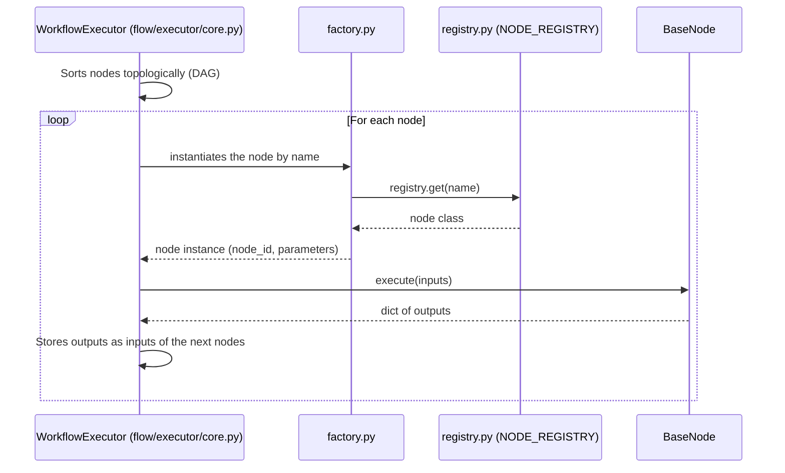
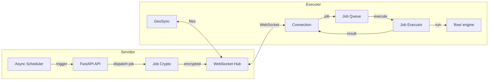

# Contributing Guide — Atlans

A complete guide for developers who want to contribute to Atlans, a platform for geospatial workflows with distributed execution through executors.

## Contents

- [License and contributor agreement](#license-and-contributor-agreement)
- [Environment Setup](#environment-setup)
- [Project Structure](#project-structure)
- [Git Workflow](#git-workflow)
- [Backend (FastAPI)](#backend-fastapi)
- [Workflow Engine (flow/)](#workflow-engine-flow)
- [Executor System](#executor-system)
- [Frontend (Next.js)](#frontend-nextjs)
- [Database](#database)
- [Code Conventions](#code-conventions)
- [Tests](#tests)
- [Continuous Integration (CI) and Releases](#continuous-integration-ci-and-releases)
- [PR Checklist](#pr-checklist)

---

## License and contributor agreement

Atlans is distributed under the [AGPL-3.0-only](LICENSE), and the project's holder
also offers it under other terms. That is why every contribution comes in under the
[contributor agreement (CLA)](CLA.md): you remain the owner of what you wrote and
give the holder a broad license to use it, and the holder commits to also
distributing it as free software.

Version 1.0, of October 2, 2026.
Write in your first PR, in the description or in a comment:

> I have read CLA.md, version 1.0, and I agree to it.

A PR without the acceptance does not get in.

Whatever comes from third parties goes in with its origin and license, and the license
has to be compatible with the AGPL-3.0:

- **A file copied into the repository** (code, font, icon): the license text
  next to it and an entry in `IN_REPOSITORY`, in
  `scripts/avisos_de_terceiros.py`.
- **A new npm or PyPI dependency**: after updating the lock, run
  `python scripts/avisos_de_terceiros.py`. The [THIRD-PARTY-NOTICES.md](THIRD-PARTY-NOTICES.md)
  gains the package, and the "To review" section points out a license outside
  the compatible ones (`COMPATIVEIS`, in the same script).

---

## Environment Setup

### 1. Prerequisites

| Tool | Minimum version |
|---|---|
| Docker | 24+ |
| Docker Compose | v2+ |
| Git | 2.x |
| Node.js (local frontend dev) | 24 (the LTS of the CI and of the image; the suite requires 22 or later) |
| Python (local backend dev) | 3.12 |

### 2. Clone and configure

```bash
git clone https://github.com/seu-usuario/atlans.git atlans
cd atlans
cp .env.example .env
```

### 3. Generating secrets

Edit `.env` and generate the sensitive values:

```bash
# REDIS_PASSWORD — Redis password
python -c "import secrets; print(secrets.token_hex(32))"

# AUTH_SECRET — NextAuth secret
openssl rand -base64 32

# APP_SECRET — the API's internal secret
python -c "import secrets; print(secrets.token_urlsafe(48))"

# FERNET_KEY — encryption of credentials in the database
python -c "from cryptography.fernet import Fernet; print(Fernet.generate_key().decode())"

# EXECUTOR_SIGNING_KEY — seed of the Ed25519 key that signs the jobs and that the
# executors pin at enrollment. REQUIRED: if empty, no executor enrolls
# (503 on /executores/server-public-key) and no job is dispatched. `make
# bootstrap` generates it; by hand:
openssl rand -base64 32
```

### 4. Start the services

```bash
# Full stack in dev mode (hot-reload in the API and frontend)
make up-dev

# Backend only
docker compose --profile dev up -d api redis

# Frontend only (local dev outside Docker)
cd web && npm install && npm run dev
```

| Service | URL |
|---|---|
| Frontend | http://localhost:3000 |
| API (Swagger) | http://localhost:8000/docs |
| MinIO Console | http://localhost:9001 |

### 5. Logs

```bash
make logs                       # all services
docker compose logs -f api      # API only
# The executor is NOT part of the main docker-compose.yml — it lives in
# docker-compose.executor.yml. To follow its logs:
docker compose -f docker-compose.executor.yml logs -f
```

### 6. Pre-commit hooks

Every commit goes through `detect-secrets` (blocks PATs/JWTs/API keys) and
basic sanitizers (trailing whitespace, EOF, valid YAML). The hooks are
`repo: local`: they run the pre-commit, detect-secrets and pre-commit-hooks from
`requirements-dev.txt`, pinned and hashed (see "Python dependencies"). Install
once per clone, in the environment where you run `git commit` (Linux, macOS or
Windows; the backend environment, with both locks, already works):

```bash
pip install --require-hashes -r requirements-dev.txt
pre-commit install
```

After that, `git commit` runs the hooks automatically. To run them
manually on all files: `pre-commit run --all-files`.

If detect-secrets flags a false positive (example key in a test
fixture, legitimate SHA-256 hash), there are two options:

1. **Update the baseline** — if it is a legitimate secret that has always existed:
   ```bash
   detect-secrets scan --baseline .secrets.baseline
   git add .secrets.baseline
   ```
2. **Mark it inline** — if it is a one-off case:
   ```python
   API_KEY_EXAMPLE = "sk-example123..."  # pragma: allowlist secret
   ```

The CI runs the same scan as a safety net — commits made without a local
`pre-commit install` are still blocked in the PR.

---

## Project Structure

```
atlans/
├── app/                            # FastAPI backend
│   ├── main.py                     # Entry point — registers routers, middleware, lifespan
│   ├── api/
│   │   ├── dependencies.py         # Injectable dependencies (get_db, get_current_user)
│   │   └── routers/                # One file per domain
│   │       ├── auth_router.py          # Registration, login, refresh, /me
│   │       ├── workflows_router.py     # Workflow CRUD, export/import, execution
│   │       ├── executores_router.py    # Executor CRUD, enrollment, install.sh
│   │       ├── executor_ws_router.py   # Executor WebSocket (endpoint; facade of the package)
│   │       ├── executor_ws/            # WS protocol, queue, results and orphans
│   │       ├── credentials_router.py   # CRUD of encrypted credentials
│   │       ├── schedules_router.py     # Schedules (cron, interval, rrule)
│   │       ├── drive_router.py         # File upload/download (MinIO)
│   │       ├── observability_router.py # Run metrics, runs-by-day
│   │       ├── log_workflows_router.py # Real-time log WebSocket
│   │       ├── nodes_router.py         # Catalog of available nodes
│   │       ├── workspace_router.py     # Workspace CRUD
│   │       ├── workflow_groups_router.py # Workflow groups
│   │       ├── artifacts_router.py     # Artifacts generated by runs
│   │       ├── portal_router.py        # Public map portal
│   │       ├── health_router.py        # /ping, healthcheck
│   │       ├── telemetry_router.py     # Usage telemetry
│   │       └── webhook_router.py       # Receives external webhooks
│   ├── core/
│   │   ├── config.py               # Environment variables (os.getenv), validated on import
│   │   ├── db.py                   # Async SQLAlchemy engine + session
│   │   ├── storage.py              # MinIO integration (S3-compatible)
│   │   ├── async_scheduler.py      # Async scheduler for schedules
│   │   ├── executor_connections.py # Registry of executor WebSocket connections
│   │   ├── job_crypto.py           # Job encryption (X25519 + AES-GCM)
│   │   ├── run_result_consumer.py  # Processes results received from the executors
│   │   ├── drive_events.py         # File synchronization events
│   │   ├── rate_limiter.py         # Per-endpoint rate limiting
│   │   ├── rbac.py                 # Role-based access control
│   │   ├── constants.py            # Global constants
│   │   ├── exceptions.py           # Custom exceptions
│   │   ├── authorization/          # Authorization middleware and guards
│   │   ├── credentials/            # DSN builders per type (PostgreSQL, S3...)
│   │   ├── scheduling/             # Scheduling strategies
│   │   └── utils/                  # JWT, logging, error handlers
│   ├── models/                     # SQLAlchemy models (ORM)
│   │   ├── base.py                 # Declarative base + mixins
│   │   ├── user.py                 # User (auth)
│   │   ├── workspace.py            # Multi-tenant workspace
│   │   ├── workspace_member.py     # Workspace members
│   │   ├── workflow.py             # Workflow definition (DAG JSON)
│   │   ├── workflow_run.py         # A run of a workflow
│   │   ├── workflow_version.py     # Workflow versioning
│   │   ├── workflow_group.py       # Workflow groups/folders
│   │   ├── schedule.py             # Schedule
│   │   ├── credential.py           # Encrypted credential
│   │   ├── executor.py                # Registered executor
│   │   ├── artifact.py             # Generated artifact
│   │   └── ...                     # Other domain models
│   ├── schemas/                    # Pydantic schemas (request/response)
│   ├── services/                   # Business logic
│   │   ├── workflow_service.py     # Workflow orchestration
│   │   ├── executor_service.py     # Executor management and job dispatch
│   │   ├── credential_service.py   # CRUD + encryption of credentials
│   │   ├── schedule_service.py     # Schedule CRUD
│   │   ├── node_service.py         # Node catalog and validation
│   │   └── ...
│   ├── crud/                       # Generic CRUD operations
│   └── extensoes/                  # What an installation has beyond the core (docs/architecture.md)
│       └── __init__.py             # The registry: each subpackage is an extension, wired in by registrar()
│
├── flow/                           # DAG execution engine
│   ├── executor/                   # Execution engine package
│   │   ├── core.py                 # WorkflowExecutor.run() — traversal + execution of the nodes
│   │   ├── node_manager.py         # Instantiates and manages the run's nodes
│   │   ├── edge_resolver.py        # Resolves edges (inputs ← outputs of the predecessors)
│   │   ├── events.py               # Emission of node_events during the run
│   │   ├── rendering.py            # Parameter rendering (Jinja) per node
│   │   ├── pin.py                  # Output pins (cache of node results)
│   │   └── spill.py                # Spill of large outputs to MinIO
│   ├── factory.py                  # Instantiates a node from its registered name
│   ├── registry.py                 # NODE_REGISTRY: name → class (via @register_node + auto-discovery)
│   ├── core/
│   │   └── graph.py                # Representation and validation of the DAG graph
│   ├── nodes/
│   │   ├── base.py                 # BaseNode base class
│   │   ├── action/                 # HTTP, transformation, geocoding, scripts
│   │   ├── spatial/                # GeoPandas operations (buffer, clip, dissolve, voronoi...)
│   │   ├── datasource/             # Readers (PostGIS, GeoJSON, Shapefile, WFS, CSV...)
│   │   ├── outputs/                # Outputs (file, S3, PostGIS, webhook, e-mail, artifact)
│   │   ├── control/                # Flow (conditional, loop, switch, sub-workflow, merge)
│   │   └── trigger/                # Triggers (schedule, webhook, file, workflow, geofence)
│   ├── utils/                      # Engine helpers
│   │   ├── geo_helpers.py          # Geospatial utility functions
│   │   ├── expression_service.py   # Evaluation of Jinja/Python expressions
│   │   ├── circuit_breaker.py      # Circuit breaker for external calls
│   │   ├── get_asyncpg_pool.py     # asyncpg connection pool
│   │   ├── artifact_helpers.py     # Helpers for artifact generation
│   │   ├── publisher/              # Publishing of node events
│   │   └── ...
│   └── metrics/
│       └── collector.py            # Collection of run metrics
│
├── executor/                          # External executor (distributed execution)
│   ├── main.py                     # Executor entry point
│   ├── config.py                   # Configuration via env vars
│   ├── connection.py               # WebSocket client (reconnect, heartbeat, mTLS)
│   ├── crypto.py                   # X25519/Ed25519/AES-GCM
│   ├── job_executor.py             # Runs flow/ locally
│   ├── job_queue.py                # Job queue with back-pressure
│   ├── job_validator.py            # Validation of received jobs
│   ├── event_publisher.py          # Publishes node events via WebSocket
│   ├── utils.py                    # Utilities (URL conversion, host aliases)
│   └── sync/                       # GeoSync — file synchronization
│       ├── manager.py              # Main orchestrator
│       ├── scanner.py              # Scanner of local datasets
│       ├── watcher.py              # File watcher (inotify/fsevents)
│       ├── uploader.py             # Upload to the Drive
│       ├── downloader.py           # Download from the Drive
│       ├── manifest.py             # Local manifest (sync state)
│       ├── validator.py            # Dataset validation
│       ├── metadata.py             # Extraction of geospatial metadata
│       ├── trigger.py              # Synchronization triggers
│       └── ...
│
├── web/                            # Next.js 16 frontend
│   ├── app/
│   │   ├── (auth)/                 # Login and registration (no authentication)
│   │   ├── (dashboard)/            # Protected pages (editor, admin, observability)
│   │   ├── (portal)/               # Public map portal
│   │   └── layout.tsx              # Root layout
│   ├── app/components/
│   │   ├── workflow/               # Visual editor (XYFlow), node configuration
│   │   ├── credentials/            # Credential CRUD
│   │   ├── projects/               # Workflow list and filters
│   │   ├── sidebar/                # Side navigation
│   │   ├── ui/                     # Reusable shadcn/ui components
│   │   └── shared/                 # Shared components
│   ├── context/                    # React contexts (FlowContext, etc.)
│   ├── extensoes/                  # What an installation has beyond the core (docs/architecture.md)
│   │   ├── index.ts                # The registry: the core reads EXTENSOES from here, and only from here
│   │   └── instaladas.ts           # This installation's extensions (the free distribution: nenhuma.ts)
│   ├── hooks/                      # Custom hooks (useExecuteWorkflow, etc.)
│   ├── service/                    # HTTP client (GisFlowService.ts) and the single home of types (types.ts)
│   ├── auth.ts                     # NextAuth configuration
│   └── proxy.ts                    # Route protection (Next's middleware)
│
├── catalogo/                       # Source catalog: versioned copy of the geoservice Vault (docs/sources.md)
│   ├── README.md                   # The format of the notes and how to update them
│   └── geoservicos/                # One folder per institution (note, Camadas.md, Atributos.md)
│
├── alembic/                        # Database migrations
│   ├── env.py
│   └── versions/                   # Migration files
│
├── tests/                          # Automated tests
│   ├── conftest.py                 # Global fixtures
│   ├── unit/                       # Unit tests
│   ├── integration/                # Integration tests
│   └── extensoes/                  # The tests of each extension (app/extensoes), outside the core; only exists when there is one
│
├── docker-compose.yml              # Main stack (API, Redis, MinIO, frontend)
├── docker-compose.executor.yml        # Executor stack (distribution to clients)
├── Dockerfile.api                  # Backend build
├── Dockerfile.executor                # Executor build
├── Makefile                        # Shortcuts (up-dev, logs, etc.)
├── alembic.ini                     # Alembic configuration
├── requirements.in                 # Direct Python dependencies of the backend (edit here)
├── requirements.txt                # Lock generated from the .in, with hashes (what the image and the CI install)
├── requirements-dev.in/.txt        # Dev tools outside the image (ruff, pip-audit, detect-secrets, pre-commit, pip-tools)
├── ruff.toml                       # Python lint rules (CI)
└── pytest.ini                      # pytest configuration
```

---

## Git Workflow

### Standard flow

```bash
# 1. Create a branch from main
# Repo convention: the commit type + a short slug (e.g. feat/dashboard-periodo).
git checkout main && git pull
git checkout -b feat/nome-da-funcionalidade

# 2. Develop and commit in small steps
git add <arquivos>
git commit -m "feat: descrição curta do que foi feito"

# 3. Keep the branch up to date
git fetch origin
git rebase origin/main

# 4. Open the PR when it is ready
```

### Conventional Commits

All commits must follow the [Conventional Commits](https://www.conventionalcommits.org/) standard:

| Prefix | When to use | Example |
|---|---|---|
| `feat:` | New feature | `feat: adicionar nó de dissolve espacial` |
| `fix:` | Bug fix | `fix: corrigir timeout no WebSocket do executor` |
| `docs:` | Documentation only | `docs: atualizar guia de contribuição` |
| `refactor:` | Restructuring without a change in behavior | `refactor: extrair lógica de dispatch para service` |
| `test:` | Tests | `test: adicionar testes unitários para buffer node` |
| `chore:` | Maintenance (deps, CI, configs) | `chore: atualizar dependências do frontend` |
| `perf:` | Performance improvement | `perf: usar asyncpg pool no database_query` |
| `desktop:` | Changes/bump of the desktop app (Electron) | `desktop: v2.15.0` |
| `executor:` | Executor-specific changes | `executor: ocultar no Windows os arquivos internos` |

**Optional scope:** `feat(executor): suportar sync bidirecional`

---

## Backend (FastAPI)

### Adding an endpoint

1. Create or edit the router in `app/api/routers/`:

```python
# app/api/routers/exemplo_router.py
from fastapi import APIRouter, Depends
from sqlalchemy.ext.asyncio import AsyncSession

from app.api.dependencies import get_db, get_current_user
from app.models.user import User

router = APIRouter(prefix="/exemplo", tags=["exemplo"])


@router.get("/")
async def listar(
    db: AsyncSession = Depends(get_db),
    current_user: User = Depends(get_current_user),
) -> list[dict]:
    """Retorna todos os exemplos do workspace."""
    ...
```

2. Register the router in `app/main.py`:

```python
from app.api.routers.exemplo_router import router as exemplo_router
app.include_router(exemplo_router)
```

### Adding a model

1. Create the file in `app/models/`
2. Inherit from `Base` (imported from `app/core/db.py`)
3. Use `id_hash: str` as the primary key (generated via `uuid4().hex`)
4. Include `created_at` and `updated_at` with `server_default`
5. Add `workspace_id` if the resource belongs to a workspace

```python
# app/models/exemplo.py
from sqlalchemy import Column, String, DateTime, func
from app.models.base import Base


class Exemplo(Base):
    __tablename__ = "exemplos"

    id_hash = Column(String, primary_key=True)
    workspace_id = Column(String, nullable=False, index=True)
    name = Column(String, nullable=False)
    created_at = Column(DateTime(timezone=True), server_default=func.now())
    updated_at = Column(DateTime(timezone=True), onupdate=func.now())
```

### Adding a Pydantic schema

- Input and output schemas live in `app/schemas/`
- Use `model_validator(mode="after")` for cross-field validation
- Response schemas define `model_config = ConfigDict(from_attributes=True)`

```python
# app/schemas/exemplo.py
from pydantic import BaseModel, ConfigDict


class ExemploCreate(BaseModel):
    name: str


class ExemploResponse(BaseModel):
    model_config = ConfigDict(from_attributes=True)

    id_hash: str
    name: str
    workspace_id: str
```

### Adding a service

- Business logic lives in `app/services/`, never directly in the router
- Services receive an `AsyncSession` and return models or dicts
- Domain errors raise `HTTPException` with the appropriate status and message

### API error format

All errors follow a standardized format (via `app/core/utils/error_handlers.py`):

```jsonc
// HTTP exceptions (400, 401, 403, 404, 429)
{ "error": "http_exception", "message": "Descrição legível.", "status_code": 400 }

// Pydantic validation errors (422)
{ "error": "validation_error", "message": "Validation failed", "details": [...] }

// Internal error (500)
{ "error": "internal_server_error", "message": "Unexpected error occurred" }
```

---

## Workflow Engine (flow/)

The `flow/` engine executes DAGs **inside the executors** — never in the API process. The server imports `flow/` only for metadata (registry, `description()`), schema simulation (`simulate()`) and validation of the sub-workflow contract. Nodes have no access to the server's database, MinIO or Redis: everything goes through HTTP endpoints authenticated by mTLS (`/drive/executor-*`, `/internal/*`) and pre-signed URLs.

### Lifecycle of a node



1. The `WorkflowExecutor` (`flow/executor/core.py`, method `run()`) does a topological traversal of the DAG defined in the workflow JSON
2. For each node, `factory.py` looks up the `NODE_REGISTRY` (`registry.py`) and instantiates the corresponding class with `(node_id, parameters)`
3. The instance receives the user's parameters in the constructor (accessible via `self.parameters` / `self.get_param()`); the `inputs` (outputs of the predecessor nodes) arrive in `execute()`
4. The `execute(self, inputs)` method runs the logic and returns a dict of outputs — CPU-bound nodes implement `execute_sync(self, inputs)` (see below)
5. The outputs become available as inputs to the following nodes in the DAG

### Creating a new node

1. Create the file in the appropriate category inside `flow/nodes/` and decorate the class with `@register_node`. The node is discovered **automatically** — `registry.auto_discover_nodes()` scans `flow/nodes/` on import and triggers the decorators; you do **not** edit `registry.py` manually.

```python
# flow/nodes/spatial/meu_no.py
from typing import Any, Dict

from flow.nodes.base import BaseNode
from flow.registry import register_node


@register_node
class MeuNoNode(BaseNode):
    """Descrição do que o nó faz."""

    @classmethod
    def description(cls) -> Dict[str, Any]:
        # Metadata for discovery and for generating the interface in the editor.
        return {
            "name": "MeuNo",                  # UNIQUE registration key (no spaces)
            "alias": "Meu Nó",                # name displayed in the editor
            "description": "O que o nó faz.",
            "type": "spatial",                # trigger|action|spatial|datasource|output|control
            "properties": [
                {
                    "name": "parametro",
                    "type": "number",         # string|number|boolean|object|select
                    "default": 100,
                    "description": "Meu parâmetro",
                },
            ],
        }

    async def execute(self, inputs: Dict[str, Any]) -> Dict[str, Any]:
        self.validate()                       # applies the defaults declared in properties
        gdf = self.get_first_gdf(inputs)      # or self.get_input_gdf(inputs, "chave")
        param = self.get_param_float("parametro", 100)
        # ... logic ...
        return {"result": gdf}
```

Notes on `BaseNode` (`flow/nodes/base.py`):

- **Parameters** come from the constructor (`__init__(self, node_id, parameters)`) and are read through `self.get_param()`, `get_param_float()`, `get_param_int()`, `get_param_bool()` — **not** through a `config` argument to `execute`.
- **`execute(self, inputs)`** receives only the `inputs`. For **CPU-bound** nodes (geopandas/pandas/shapely), prefer implementing `execute_sync(self, inputs)`: `BaseNode.execute()` already dispatches it to a thread (`asyncio.to_thread`), keeping the executor's event loop free for heartbeat, events and `cancel`. Override `execute` directly when the node awaits asynchronous I/O (asyncpg, httpx).
- **`self.validate()`** applies the `properties` defaults; call it at the start of `execute`.
- Input helpers: `get_first_gdf(inputs)` and `get_input_gdf(inputs, "chave")` fetch and validate GeoDataFrames with clear error messages.

2. The frontend loads the node's schema automatically via `GET /nodes/` — in most cases there is no need to create a visual component.

### Node categories

| Category | Directory | Examples |
|---|---|---|
| **spatial** | `flow/nodes/spatial/` | buffer, clip, dissolve, intersection, voronoi, spatial_join |
| **datasource** | `flow/nodes/datasource/` | database_query, read_geojson, read_shapefile, wfs |
| **action** | `flow/nodes/action/` | http_request, field_transformer, geocode, python_script |
| **outputs** | `flow/nodes/outputs/` | save_to_postgis, save_geojson, send_webhook, artifact_output |
| **control** | `flow/nodes/control/` | conditional, loop, switch, merge, sub_workflow |
| **trigger** | `flow/nodes/trigger/` | schedule_trigger, webhook_trigger, geofence_trigger |

### Executor — features

- **Metrics:** `flow/metrics/collector.py` collects execution time, row count and errors per node
- **Circuit Breaker:** `flow/utils/circuit_breaker.py` protects external calls (HTTP, database) against cascading failures
- **asyncpg pools:** `flow/utils/get_asyncpg_pool.py` reuses connections across runs

---

## Executor System

Workflow execution in Atlans is **fully distributed through executors**. There is no Celery — the executors connect via WebSocket, receive encrypted jobs, run `flow/` locally and return results.

### Architecture



### Where an executor runs

The server stack does not start any executor: the first one is enrolled through the
dashboard and runs wherever you want, including on the same host (`executor/README.md`).

| Way | Where it runs | Use case |
|---|---|---|
| **Docker** | Any machine with Docker (`install.sh` served by the dashboard, or `docker-compose.executor.yml`) | The default path: servers, VMs, the stack's own host |
| **Native Python** | A machine with Python 3.12 (`python -m executor`) | Access to internal databases and local data, development |
| **Desktop** | The user's machine (Electron app, Windows) | Local data, prototyping, individual use |

To the server, an executor is `default` (serves any workspace) or
`dedicated` (only the workspaces it has been assigned to) — `docs/architecture.md`.

### Job dispatch

1. The user clicks "Executar" (Run) or a schedule fires
2. `executor_service.py` selects the target executor (by workspace, capacity or assignment)
3. `job_crypto.py` encrypts the workflow payload (X25519 + AES-256-GCM)
4. The encrypted job is sent via WebSocket to the executor
5. The executor decrypts it, runs `flow/` and returns the result
6. `run_result_consumer.py` processes the result and updates the `WorkflowRun`

### Real-time events

During execution, the executor sends a `node_event` for each processed node. These events are relayed via WebSocket to the frontend, letting the canvas show progress node by node in real time.

Full executor documentation: [`executor/README.md`](executor/README.md)

---

## Frontend (Next.js)

### Development commands

Run from `web/` (scripts in `web/package.json`):

```bash
npm run dev         # development server (next dev, hot-reload)
npm run lint        # ESLint (eslint app lib extensoes) — runs in CI
npm run typecheck   # tsc --noEmit
npm run typecheck:nucleo  # the core without any extension, without deleting anything (tsconfig.nucleo.json)
npm test            # Vitest (vitest run) — runs in CI
npm run test:nucleo # the suite without any extension, without deleting anything (vitest --mode nucleo)
npm run build       # production build (next build) — runs in CI
```

### Route structure (App Router)

The frontend uses the Next.js 16 **App Router** with route groups:

| Group | Authentication | Content |
|---|---|---|
| `(auth)/` | None | Login, registration |
| `(dashboard)/` | NextAuth (JWT) | Workflow editor, executors, credentials, observability |
| `(portal)/` | Public | Portal of published maps |

### API calls

Use `GisFlowService.ts` as the centralized HTTP client:

```typescript
// web/service/GisFlowService.ts
async getExemplo(workspaceId: string): Promise<IExemplo[]> {
  const res = await this.api.get(`/exemplo/`, {
    headers: { "x-workspace-id": workspaceId },
  });
  return res.data;
}
```

### Handling HTTP errors

```typescript
} catch (err) {
  const axiosErr = err as AxiosError<{
    error?: string;
    message?: string;
    details?: { msg: string }[];
  }>;
  const data = axiosErr.response?.data;

  if (!axiosErr.response) {
    // No network
  } else if (data?.error === "validation_error" && Array.isArray(data.details)) {
    const msgs = data.details.map((d) => d.msg).join(" | ");
    toast.error(msgs);
  } else {
    toast.error(data?.message ?? "Erro inesperado.");
  }
}
```

### Visual editor components

| Directory | Responsibility |
|---|---|
| `web/app/components/workflow/` | Visual editor (XYFlow), canvas, configuration panel |
| `web/app/components/credentials/` | Credential CRUD |
| `web/app/components/projects/` | Workflow list, search and filters |
| `web/app/components/ui/` | Reusable shadcn/ui components |

The configuration schema of each node is loaded dynamically via `GET /nodes/` — for most nodes there is no need to hand-code fields in the frontend.

### Authentication token

The JWT access token is in `session.user.access_token` (configured in `web/auth.ts`). **Never** use `session.accessToken`.

---

## Database

### Stack

- **PostgreSQL** with the **PostGIS** extension
- **SQLAlchemy 2.x** with an async engine (`asyncpg`)
- **Alembic** for migrations

### Creating a migration

```bash
# Generates an automatic migration from the models
alembic revision --autogenerate -m "add tabela_exemplos"

# Applies pending migrations
alembic upgrade head

# Reverts the last migration
alembic downgrade -1
```

### Async pattern — avoiding DetachedInstanceError

> This is the most common bug in the project. Always extract ORM attributes **inside** the `async with get_session_async()` block, before the session closes.

```python
# WRONG — DetachedInstanceError when accessing user.id_hash outside the session
async with get_session_async() as session:
    user = await session.get(User, user_id)
# user.id_hash  <-- ERROR! the session has already closed

# CORRECT — extract the values inside the block
async with get_session_async() as session:
    user = await session.get(User, user_id)
    user_id_hash = user.id_hash
    user_name = user.name
# use user_id_hash and user_name here
```

### Lazy relationships

When accessing lazy relationships in an async context, use `selectinload` or `joinedload` in the query:

```python
from sqlalchemy.orm import selectinload

stmt = select(Workflow).options(selectinload(Workflow.runs)).where(...)
result = await session.execute(stmt)
```

---

## Code Conventions

### Python

| Rule | Detail |
|---|---|
| Lint | `ruff check .` (pyflakes rules, in `ruff.toml`; `pip install -r requirements-dev.txt`). The CI runs the same before `pytest` and fails on an unused import, an undefined name or an unused variable. There is no formatter: follow the style of the existing code (~100 chars/line as a reference). The pre-commit applies only file hygiene (trailing whitespace, EOF, line endings) |
| Type hints | Required on parameters and return values of public functions |
| Async | All I/O must be `async`. Never use `requests` — use `httpx` |
| Logging | `get_logger(__name__)` from `app/core/utils/logger` or `logging.getLogger(__name__)` |
| Exceptions | Never `except Exception: pass`. Always log or re-raise |
| Parallelism | Prefer `asyncio.gather()` over sequential `await` calls |
| Comments | **Brazilian Portuguese** |
| Imports | stdlib, third-party, local (separated by a blank line) |

### TypeScript / React

| Rule | Detail |
|---|---|
| Formatting | **ESLint** (project configuration) |
| Components | Functional with hooks, no classes |
| Typing | Interfaces for all objects (`web/service/types.ts`, the single home). Avoid `any` |
| Comments | **Brazilian Portuguese** |
| State management | React contexts (`web/context/`), no Redux |
| CSS | Tailwind CSS + shadcn/ui |

---

## Tests

### Structure

```
tests/
├── conftest.py                    # Global fixtures (db, client, auth)
├── unit/
│   ├── test_nodes.py              # Tests of the flow/ nodes
│   ├── test_storage.py            # Storage tests (MinIO)
│   ├── test_sync_manager.py       # GeoSync tests
│   └── test_workflow_crud.py      # Workflow CRUD tests
├── integration/                   # Integration tests (executor, crypto, image maps)
├── extensoes/                     # Those of each extension; the core does not import them (only exists when there is one)
└── test_workflow_happy_paths.py   # End-to-end workflow tests
```

### Running

```bash
# ── Backend (pytest) ──
# All tests
pytest

# Unit tests only
pytest tests/unit/

# Verbose, last failed
pytest -vv --lf

# A specific test — test_nodes.py groups the cases into classes (TestBufferNode, ...)
pytest "tests/unit/test_nodes.py::TestBufferNode" -v

# ── Frontend (Vitest) ──
cd web && npm test          # vitest run — this is what the CI runs
cd web && npm run test:nucleo  # the same suite without the extensions (web/extensoes), without deleting anything
cd web && npm run test:watch

# ── Desktop (Vitest) ──
cd desktop && npm test      # vitest run — this is what the CI runs
```

### Writing tests

- Use the `conftest.py` fixtures for the database and authentication
- Node tests: instantiate the node with `(node_id, parameters)` and call `execute(inputs)` (the parameters go in the constructor, not in `execute`). Metadata is inspected via `Node.description()`
- API tests: use httpx's `AsyncClient` with the FastAPI app

```python
# tests/unit/test_nodes.py
from flow.nodes.spatial.buffer import BufferNode


async def test_buffer_executa_com_distancia():
    # Node metadata (the registry uses description()['name']).
    assert BufferNode.description()["name"] == "Buffer"

    # Parameters in the constructor; inputs in execute().
    node = BufferNode("buffer-1", {"distance": 100, "distanceUnit": "meters"})
    result = await node.execute({"input": gdf_fixture})

    assert "output" in result
```

---

## Continuous Integration (CI) and Releases

### What the CI validates (`.github/workflows/ci.yml`, on every push/PR to `main`)

| Job | What it runs |
|---|---|
| **Secrets scan (detect-secrets)** | `detect-secrets scan --baseline .secrets.baseline` — fails if a new secret appears outside the baseline |
| **Backend (Python)** | `pip install --require-hashes --only-binary=:all: -r requirements.txt -r requirements-dev.txt` → `ruff check .` → `pytest tests/ -v` (Python 3.12; includes `test_locks_python.py`, which checks the locks). There is no Python formatter in the CI |
| **Backend without extensions (core)** | the same dependencies → `bash scripts/sem_extensoes.sh` (deletes `app/extensoes/<nome>/` and `tests/extensoes/`, the cut of the free distribution) → `pytest tests/ -q`: the server core on its own (`docs/architecture.md`, Extensions). With no extension at all in the repository (the public copy), the job ends at the "Há extensões?" (Are there extensions?) step: it would be identical to the one above |
| **Dependency audit (informational)** | `scripts/idade_dos_locks.py` (versions in the Python locks less than 14 days old or yanked from PyPI); `pip-audit` on the API lock and on the executor lock (read directly, with `--disable-pip`); `npm audit --omit=dev` in `web/` and in `desktop/`. It does not block: each finding becomes a warning on the PR and the report goes to the run summary |
| **Frontend (Next.js)** | `npm ci` → `npm run lint` → `npm test` (Vitest) → `npm run build` (Node 24; the `build` copies Monaco to `public/monaco`) |
| **Frontend without extensions (core)** | `npm ci` → `bash ../scripts/sem_extensoes.sh` (deletes `web/extensoes/<nome>/` and `web/__tests__/extensoes/` and empties the list of installed ones) → `npm run typecheck` → `npm test` → `npm run build`: the web core as the free distribution runs it (`docs/architecture.md`, Web extensions). It also ends at "Há extensões?" when there are none |
| **Desktop (typecheck + tests + lock)** | `npm run typecheck` → `npm test` (Vitest) → `npm run python:lock:check`, which installs the executor lock into a Windows CPython (Windows, Node 24) |

### Python dependencies (hashed locks)

Each `.in` is the source, the thing you edit; the `.txt` next to it is the LOCK generated from it, with all
dependencies (direct and transitive) pinned and the hash of each file:

| Source | Lock | Who installs it |
|---|---|---|
| `requirements.in` | `requirements.txt` | the API image and the CI |
| `requirements-dev.in` | `requirements-dev.txt` | the CI and developers (ruff, pip-audit, detect-secrets, pre-commit, pip-tools, uv) |
| `executor/requirements-full.in` | `executor/requirements-full.txt` | the executor image (and the quickstart) and the desktop app's embedded runtime |
| `executor/requirements.in` | `executor/requirements.txt` | manual installation through the CLI |

Everything installs with `--require-hashes`: a file different from the reviewed one (swapped on PyPI
or along the way) does not install, and no version gets into the build without having gone through a PR.
The images also use `--only-binary=:all:`, so no `setup.py` runs in the build.

To change a dependency:

1. Edit the `.in` (exact version, `==`, like the rest of the file).
2. Regenerate the locks on Linux x86_64 with Python 3.12, the platform of the image and of the CI:
   `python scripts/travar_python.py`. Outside Linux, through Docker (the command is in the
   script's header).
3. Commit the `.in` and the `.txt` files. `tests/unit/test_locks_python.py` checks that the
   locks match the sources (in both directions: what came in and what went out), that
   every line has a hash and that the same package has the same version in all of them. The CI's
   Desktop job checks that the executor lock installs on Windows.

The script applies the 14-day quarantine to what the resolver picks on its own (the
transitive ones). A version already pinned and newer than that (it came from a Dependabot
or security PR, reviewed) stays valid, but only that one: nothing newer comes in with it,
and it is not downgraded. At the end, every version that changed has its date checked on PyPI; if
any breaks the cutoff, the script undoes everything. What you pinned by hand in the `.in` goes in at the
requested version (it is a decision): check the publication date before pinning a
freshly released version. Do not run `pip-compile` directly: it skips the quarantine.

Dependabot bumps what is in the `.in` files (and the transitive ones with a security flaw,
when security updates are turned on). The other transitive ones stay where
they are until someone runs `python scripts/travar_python.py --renovar`, which
re-resolves them with the same quarantine. It is worth doing this from time to time, in a PR of its own.

### npm dependencies (no install scripts)

`web/.npmrc` and `desktop/.npmrc` turn on `ignore-scripts=true`: no package runs
code during `npm install`/`npm ci` — not in the CI, not in the image build, not on your
machine. It was through these scripts that the 2025 npm worms stole tokens and
republished themselves. The version and hash (`integrity`) of each package are already pinned in
`package-lock.json`, and `npm ci` installs exactly that.

- The packages here that had an install script do not need it. In esbuild,
  `@tailwindcss/oxide` and unrs-resolver it is a fallback for downloading the native
  binary, which arrives through the optional dependencies. In sharp it only compiles from source
  (the prebuilt binary comes from `@img/sharp-*`). In fsevents, macOS-only, the
  compiled binary already ships inside the package.
- Electron does not need it: since version 44, it downloads the binary the first time it is
  called, checking the SHA-256 against the package's `checksums.json`. The desktop's `npm run dev`
  does this in a visible step (or `npm run electron:binario`). Packaging
  downloads Electron on its own.
- Side effect: npm also does not run the `pre`/`post` hooks of `npm run`. Do not
  use `prebuild`/`predev`; call the step in the script itself, as the web's `build` does
  with `copiar-monaco.mjs` and `copiar-maplibre.mjs`.
- A new package that really needs its install script: run it explicitly
  (like Electron's) and write down why.

### Dependabot PRs

[`.github/dependabot.yml`](.github/dependabot.yml) opens PRs once a month (on the 1st),
and only with versions published at least 14 days earlier (30 for a major version). The cadence
and the quarantine exist because of supply-chain attacks: a malicious version
is usually discovered and pulled within hours or a few days, and whoever updates as soon as
it comes out is the one who installs it. `tests/unit/test_ci_workflow.py` holds this policy in place, so
shortening the wait is an explicit decision, not a configuration detail. Each PR
goes through the CI like any other.

- **Python:** the configuration at `/` reads the `.in` → `.txt` pairs (API, dev, full
  and minimal executor), which Dependabot regenerates with pip-compile. The same version
  goes up in all of them in the same PR, and minor versions and patches come in one PR a month. The
  14-day wait applies to the package it updates; the transitive ones that pip-compile brings
  along come in at the newest version of the day. The CI's "Versões recentes nos locks Python"
  (Recent versions in the Python locks) step lists the ones less than 14 days old. It compiles each `.in` without
  the script's constraint, so `requirements-dev.txt` and `executor/requirements.txt` lose,
  in the PR, the `# via` annotations that cite it: it is only a comment, and the next
  `travar_python.py` puts them back.
- **npm for `web/` and `desktop/`:** minor versions grouped; a major version comes on its own.
- **GitHub Actions:** grouped, with a 30-day wait for any version: for
  actions, Dependabot does not accept a separate wait per version type.

**Before approving.** Opening the PR exposes nothing: Dependabot's PR CI runs with a
read-only token and without the repository's secrets. The risk lies in the merge, which takes
the package into the production image, and in whoever installs the branch on their own machine.

1. Read the release notes and check whether the change matches what they describe. For
   Python, start with what the CI's "Versões recentes nos locks Python" step listed:
   that is what came in without quarantine.
2. Compare what was published between the current version and the new one. On npm:
   `npm diff --diff=<pacote>@<atual> --diff=<pacote>@<nova>`. On PyPI: download both
   wheels with `pip download <pacote>==<versão> --no-deps --only-binary=:all:`, unpack them
   and compare the folders.
3. Look for the signs of an attack:
   - a new install script (`preinstall`/`postinstall` on npm);
   - obfuscated code, or minified where it was not before;
   - access to the network, to environment variables or to files beyond what the package does;
   - a new dependency nobody knows;
   - a changed maintainer;
   - a version without provenance when the previous ones had it (on npm,
     `npm audit signatures` checks signatures and attestations of what was installed).
4. When in doubt, close the PR. Dependabot does not reopen the same version and comes back with the
   next one, which will have spent more time exposed to those who look for this kind of thing.

A green CI does not prove that the new library works, only that the tests did not catch it.
bcrypt 5.0 went in green and broke every login: password hashing went through passlib
1.7.4, which raises an error with it, and no test called the real hash (passlib
was removed later; the hash calls bcrypt directly). For a major version,
check the breaking-change notes against how the project uses the package.

Four situations call for a human hand:

- **The Desktop job failed at `python:lock:check`.** The new version has no wheel for
  Windows (`win_amd64`, `cp312`), or asks there for a dependency that the lock, resolved
  on Linux, does not have. `desktop/README.md` ("Troubleshooting") says what to do
  in each case.
- **`test_same_version_in_all_locks` failed.** Dependabot regenerates each lock
  on its own, and a transitive dependency may have come out at different versions. Run
  `python scripts/travar_python.py` on the PR branch and commit the locks.
- **numpy, pandas or pyproj.** They are pinned at the version production has run since the
  switch to Python 3.12. Each one comes in a PR of its own, which is a migration: run the
  suite and the example workflows before approving. The pandas jump to 3.x stays
  ignored: it changes the behavior of the nodes (copy-on-write and the new string dtype).
- **Base images (Python, Node).** Dependabot does not touch them. The Python version lives
  in four places (the two Dockerfiles, the CI and `desktop/python-runtime.json`) and
  is bumped by hand, together with `.python-version`.

**Security** updates come separately and wait neither for the month nor for the quarantine,
when "Dependabot security updates" is turned on in the repository's Settings → Code security.
There the flaw is already public, and waiting costs more. They go through the same
review before the merge.

### Releases (triggered by tag / push)

| Workflow | Trigger | Output |
|---|---|---|
| `desktop-windows.yml` | tag `desktop/v*` | GitHub Release with the NSIS installer (Windows x64) + `.blockmap` + `latest.yml` |
| `executor-docker.yml` | tag `executor/v*` | GitHub Release with `atlans-executor-docker-amd64.tar.gz` |

Deployment is up to each installation ([docs/operations.md](docs/operations.md#update-the-installation));
the installation maintained by the holder has a workflow of its own, documented separately.

---

## PR Checklist

Before opening a Pull Request, check:

- [ ] The branch is up to date with `main` (`git rebase origin/main`)
- [ ] The code follows the project's style (frontend: `npm run lint`; backend: `ruff check .` — no mandatory formatter, follow the existing code)
- [ ] Type hints on all public Python functions
- [ ] No credentials, keys or secrets in the code
- [ ] `.env.example` updated if new variables were added
- [ ] New nodes decorated with `@register_node` (automatic discovery — do not edit `flow/registry.py`)
- [ ] New models have a corresponding Alembic migration
- [ ] New endpoints have a Pydantic request and response schema
- [ ] Tests passing: `pytest` (backend) and, if you touched `web/` or `desktop/`, `npm test` in the corresponding folder
- [ ] The PR description explains **what** was done and **why**
- [ ] On the first PR: the acceptance of the [CLA](CLA.md) in the description
- [ ] New dependency: license compatible with the AGPL-3.0 (`python scripts/avisos_de_terceiros.py`)
- [ ] If you changed the API, the Swagger schemas are correct (`/docs`)
- [ ] If you added a node, state: type, category, parameters and behavior
