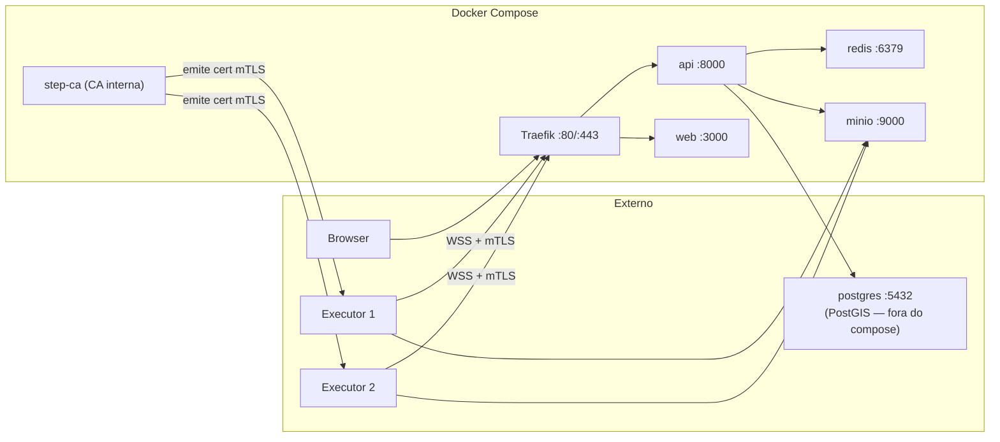
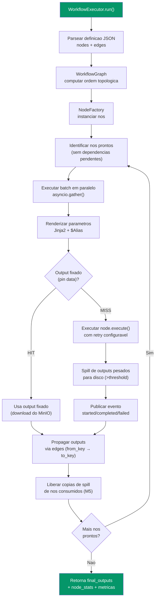
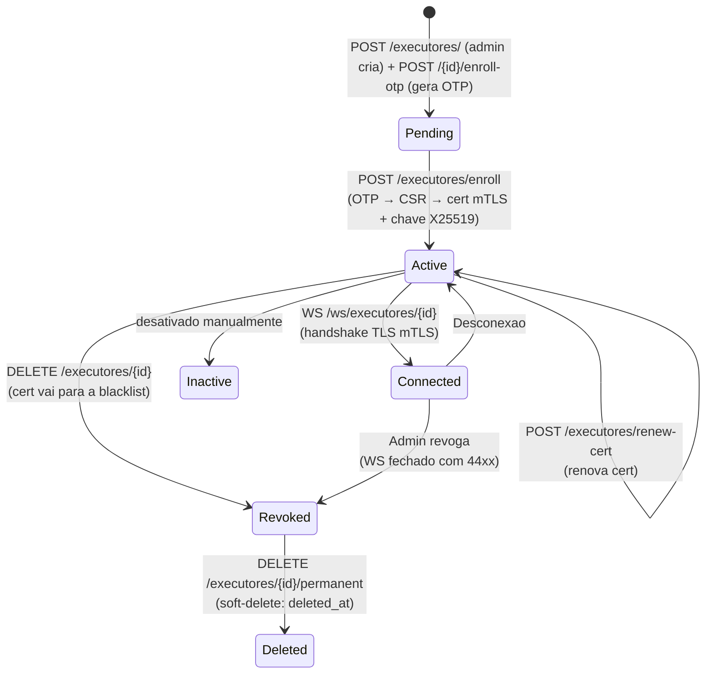
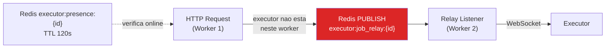
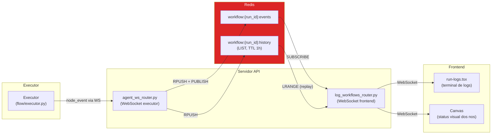
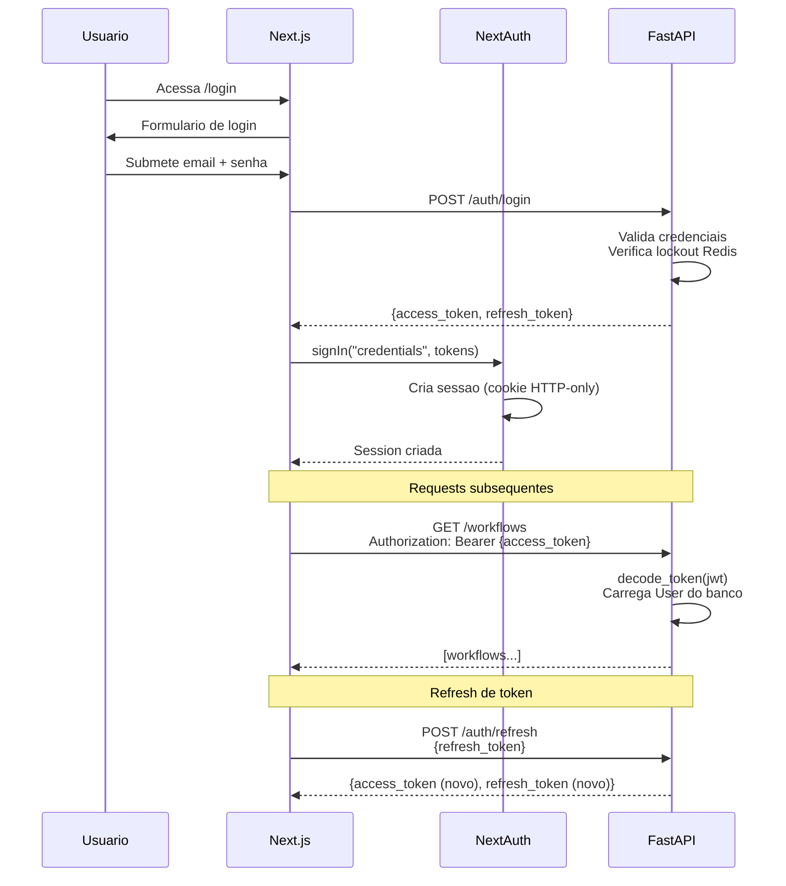
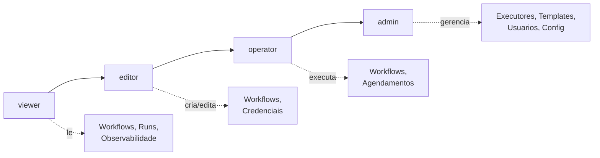
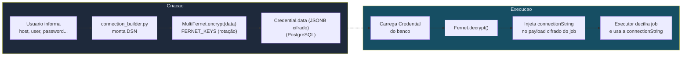
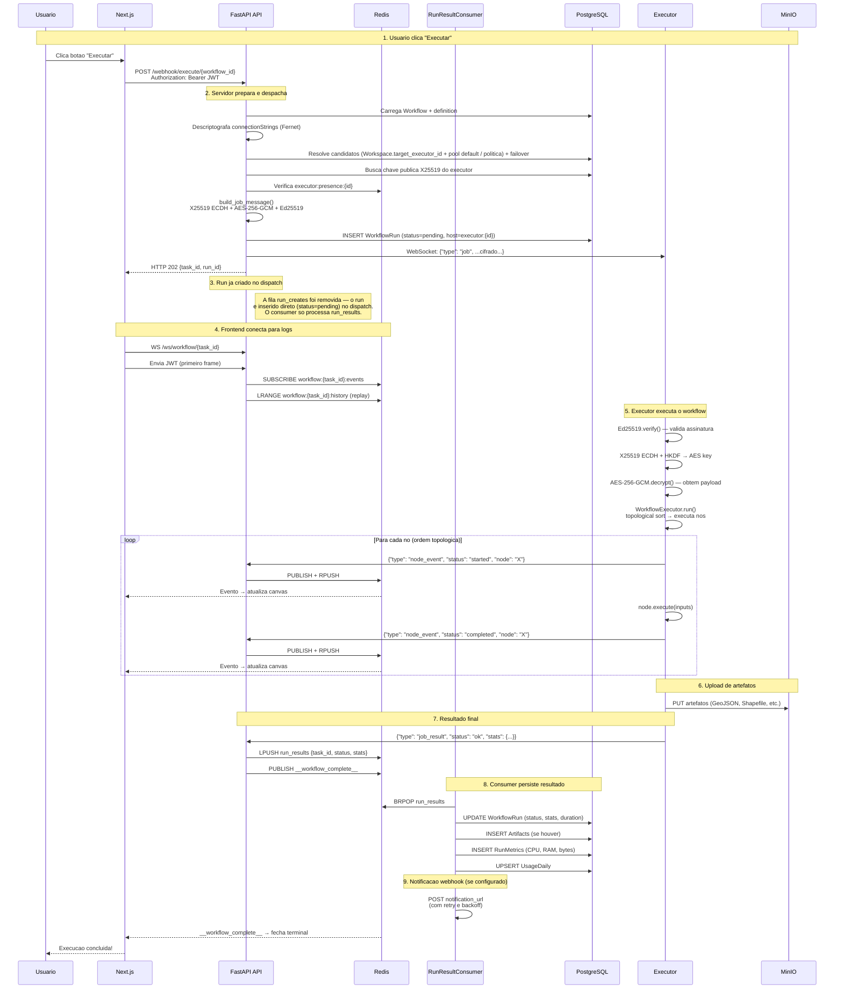

# Arquitetura do Atlans

Documentação completa da arquitetura do Atlans — plataforma distribuída de orquestração de workflows geoespaciais (GIS).

---

## Sumário

- [Visao Geral da Arquitetura](#visao-geral-da-arquitetura)
- [Servicos e Infraestrutura](#servicos-e-infraestrutura)
- [Camada API (FastAPI)](#camada-api-fastapi)
- [Motor de Workflows (flow/)](#motor-de-workflows-flow)
- [Sistema de Executores](#sistema-de-executores)
- [Agendamento (AsyncScheduler)](#agendamento-asyncscheduler)
- [Eventos em Tempo Real](#eventos-em-tempo-real)
- [Autenticacao e Autorizacao](#autenticacao-e-autorizacao)
- [Multi-tenancy (Workspaces)](#multi-tenancy-workspaces)
- [Gestao de Credenciais](#gestao-de-credenciais)
- [Armazenamento (MinIO)](#armazenamento-minio)
- [Banco de Dados](#banco-de-dados)
- [Frontend (Next.js)](#frontend-nextjs)
- [Aplicativo Desktop (Electron)](#aplicativo-desktop-electron)
- [Fluxo Completo de Execucao](#fluxo-completo-de-execucao)

---

## Visao Geral da Arquitetura

O Atlans e uma plataforma de orquestracao de workflows geoespaciais que segue uma arquitetura orientada a executores. Diferente de sistemas tradicionais baseados em filas (Celery), a execucao de workflows e delegada a **executores externos** conectados via WebSocket, com comunicacao criptografada de ponta a ponta.


### Principios Arquiteturais

| Principio | Implementacao |
|-----------|---------------|
| **Sem Celery** | Executores WebSocket substituem workers Celery; AsyncScheduler substitui Celery Beat |
| **Criptografia E2E** | Jobs cifrados com X25519 (ECDH efemero) + AES-256-GCM; assinados com Ed25519 |
| **Forward Secrecy** | Cada job usa par efemero X25519 descartado apos envio |
| **Multi-tenancy** | Isolamento por `workspace_id` em todos os recursos |
| **Async-first** | SQLAlchemy async (asyncpg), Redis async, loop de eventos asyncio |
| **Back-pressure** | Executores reportam capacidade; servidor respeita limites antes de despachar |

---

## Servicos e Infraestrutura

| Servico | Tecnologia | Porta | Responsabilidade |
|---------|-----------|-------|------------------|
| `api` | FastAPI + Uvicorn | 8000 | API REST, WebSocket (logs + executores), autenticacao, roteamento, scheduler, consumer |
| `redis` | Valkey 8 (compatível com Redis; `REDIS_IMAGE`) | 6379 (só na rede interna) | Pub/sub de eventos, fila `run_results`, presenca de executores, locks distribuidos e idempotencia, lockout de login |
| `minio` | MinIO (S3-compatible) | 9000/9001 | Artefatos de execucao, Drive de workspace, camadas do Portal |
| `traefik` | Traefik v3 | 80/443 | Proxy reverso, TLS termination, roteamento por Host, **mTLS dos executores** (valida cert do cliente contra a CA interna) |
| `step-ca` | smallstep/step-ca v0.27 | - (rede interna) | CA interna (PKI) que emite/renova os certificados mTLS dos executores no enrollment |
| `web` | Next.js 16 (App Router) | 3000 | Interface do usuario (editor visual, dashboard, admin) |
| `executor` | Python (externo) | - | Executa workflows localmente, conecta via WebSocket (mTLS) ao servidor |

> **PostgreSQL + PostGIS não é um serviço do `docker-compose`.** O banco é externo —
> `DATABASE_URL` aponta para uma instância PostgreSQL 15 + PostGIS gerenciada fora do
> stack (conexão direta, sem pgbouncer). As tabelas são criadas/migradas pelo Alembic
> (`alembic upgrade head`), nunca por `create_all`.



---

## Camada API (FastAPI)

### Estrutura de Roteamento

```
app/main.py
├── Middleware: CORS, SecurityHeaders (CSP/HSTS/X-Frame-Options/nosniff), GZip (>1KB)
│   (o rate limiter slowapi é aplicado por rota via decorator + exception handler)
├── Exception handlers: HTTP, validation, rate limit, domain, generico
├── Background tasks (lifespan; a lista é `_tarefas_de_fundo()`, e os laços periódicos
│   │   com lock Redis usam `laco_periodico` de app/core/tarefas_periodicas.py):
│   ├── RunResultConsumer (BRPOP run_results — a fila run_creates foi removida)
│   ├── AsyncScheduler (loop de agendamentos)
│   ├── ArtifactCleanup (limpeza periodica de artefatos)
│   ├── StorageReconciliation (reconcilia DB × MinIO: size_bytes, multipart, drift)
│   ├── Catálogo de fontes (importação no arranque + verificação periódica dos endpoints)
│   ├── overdue_acks_monitor (jobs enviados sem ACK do executor)
│   ├── orphan_runs_watchdog (falha runs cujo executor perdeu presença no Redis)
│   └── as das extensões (ver abaixo)
└── Routers montados com prefixo:
    ├── /auth                     → auth_router.py (login, register, refresh, me,
    │                                verify-email, resend-verification, forgot/reset-password, logout)
    ├── /workflows                → workflows_router.py (CRUD, duplicar, move + move/preview, versoes)
    ├── /workflows/{id}/schedules → schedules_router.py (PUT de um agendamento: pausar/retomar, editar)
    ├── /webhook                  → webhook_router.py (execucao de workflows)
    ├── /credentials              → credentials_router.py (credenciais criptografadas)
    ├── /workspaces               → workspace_router.py (workspaces CRUD, target_executor_id)
    ├── /executores               → executores_router.py (gestao de executores, enroll OTP/mTLS, set-default)
    ├── /nodes                    → nodes_router.py (catalogo de nos)
    ├── /observability            → observability_router.py (metricas e historico)
    ├── /artifacts                → artifacts_router.py (artefatos) + portal_router.py (/artifacts/portal, /artifacts/tiles)
    ├── /drive                    → drive_router.py (arquivos) + executor_drive_router (upload via executor)
    ├── /workflow-groups          → workflow_groups_router.py
    ├── /telemetry                → telemetry_router.py (WebSocket /ws/telemetry)
    ├── /admin/health             → health_router.py (whitelist de webhook, storage e purga — role admin)
    ├── /admin/users              → admin_users_router.py (gestao de usuarios)
    ├── /admin/nodes              → admin_nodes_router.py (habilita/desabilita nodes)
    ├── /admin/workflows          → admin_workflows_router.py (ativa/desativa workflows)
    ├── /admin/workspaces         → admin_workspaces_router.py (lixeira: restore/purge)
    ├── /admin/drive              → drive_admin_router.py (config de Drive)
    ├── /internal/send-email      → internal_email_router.py (envio via Resend, auth por cert do executor)
    ├── /internal/change-detector → change_detector_router.py (hash store do node ChangeDetector)
    ├── /mcp                      → app/mcp (rota exata, autenticacao por token pessoal)
    ├── /ws/workflow/{run_id}     → log_workflows_router.py (WebSocket de logs)
    ├── /ws/executores/{id}       → executor_ws_router.py + executor_ws/ (WebSocket de executores, auth mTLS)
    └── as rotas das extensões, depois das do núcleo (ver abaixo)
```

### Extensões (`app/extensoes`)

O que uma instalação tem além do núcleo. Cada subpacote de `app/extensoes/` é uma extensão, e o
núcleo nunca a importa pelo nome: na primeira chamada a `registro()`, cada uma é importada e a
`registrar(registro)` dela pendura no registro as rotas, as tarefas de fundo, o plano e o teto do
assistente de cada pessoa (`app/services/teto_do_assistente.py`), se há algo a vender, pastas de
modelos de e-mail e campos a mais no painel do modelo do assistente. Os modelos SQLAlchemy dela
moram em `<extensão>/modelos` e entram no metadata por `importar_modelos()`
(`app/models/__init__.py`). As tabelas deles moram no `<extensão>/schema.sql` (DROP + CREATE, como
o `scripts/init_schema.sql` do núcleo), que a base zero do alembic roda depois do script do núcleo
(`esquemas()`); o núcleo não cria tabela de extensão.

Sem extensão nenhuma (a distribuição livre), cada ponto de encaixe tem um padrão: ninguém tem
plano, o teto é `ASSISTENTE_TETO_DE_TOKENS_POR_DIA` e não há o que vender. Três coisas prendem a
fronteira:

- `tests/unit/test_fronteira_das_extensoes.py` falha se o núcleo cita uma extensão pelo nome (num
  import, absoluto ou relativo, numa cadeia de atributos ou num texto, como um alvo de patch), e
  prova que a API sobe com `ATLANS_SEM_EXTENSOES=1` sem carregar o código de nenhuma;
- `scripts/sem_extensoes.sh` faz o corte da distribuição livre: apaga a pasta de cada extensão e os
  testes delas;
- o job **Backend sem extensões (núcleo)** do CI roda o corte e, depois, a suíte inteira do núcleo.

Os testes de uma extensão moram em `tests/extensoes/<extensão>/`. Os avisos que um serviço de
fora manda a uma extensão (um provedor de pagamento, por exemplo) chegam em `/webhooks/<serviço>`:
a regra pública do Traefik (`api-rest-public`) já leva esse prefixo à API.

O web tem o registro dele, com o mesmo desenho (ver
[Extensões do web](#extensões-do-web-webextensoes)).

### Dependencias Injetaveis

| Dependencia | Retorna | Uso |
|-------------|---------|-----|
| `get_db` | `AsyncSession` | Sessao SQLAlchemy async por request |
| `get_current_user` | `User` | Valida JWT do header `Authorization` |
| `get_user_workspace_ids` | `list[str]` | IDs de TODOS os workspaces dos quais o usuario e membro |
| `verify_workspace_access(ws_id, ids)` | — | Falha (403) se o `workspace_id` do recurso nao esta na lista do usuario |
| `workflow_com_papel(minimo)` | `Workflow` | Resolve o workflow por `id_hash` (404 antes de 403) e exige o papel mínimo no `workspace_id` dele |
| `require_admin` | `User` | Garante role `admin` (alias de `require_role(Role.ADMIN)`) |
| `require_role(Role)` | `User` | Garante role minimo (viewer/editor/operator/admin) |

> **Não existe** header `x-workspace-id` nem dependência `get_workspace`. O escopo de
> workspace é passado como **query param `workspace_id`** (ou vem do próprio recurso
> resolvido) e conferido contra as memberships do usuário via `verify_workspace_access`.

### Ciclo de Vida de uma Request


### Formato de Erros Padronizado

Todos os erros passam por handlers centralizados em `app/core/utils/error_handlers.py`:

```json
// HTTPException (400, 401, 403, 404, 429)
{ "error": "http_exception", "message": "Mensagem legivel.", "status_code": 400 }

// Erro de validacao Pydantic (422)
{ "error": "validation_error", "message": "Validation failed", "details": [...] }

// Erro de dominio (AtlasBaseError) — "error" e o `error_code` especifico da excecao
{ "error": "<error_code>", "message": "Descricao do erro de negocio", "status_code": 422 }

// Erro interno (500)
{ "error": "internal_server_error", "message": "Unexpected error occurred" }
```

---

## Motor de Workflows (flow/)

O motor de workflows e o nucleo computacional do Atlans. Ele roda **dentro dos executores** (nao no servidor API), processando DAGs de nos geoespaciais.

### Componentes

| Arquivo | Responsabilidade |
|---------|-----------------|
| `registry.py` | Mapa `name → classe`. Descoberta automatica via `pkgutil.walk_packages` sobre `flow/nodes/` |
| `factory.py` | `NodeFactory` — instancia a classe correta a partir do `name` do no na definicao JSON |
| `executor/core.py` | `WorkflowExecutor` — orquestra o DAG: ordem topologica, batch paralelo, retry, pin, spill, propagacao, eventos |
| `executor/node_manager.py` | `NodeManager` — instancia e guarda os nos e suas definicoes |
| `executor/edge_resolver.py` | Semantica de aresta (`from_key`/`to_key`/spread), no run e na simulacao de schema |
| `executor/rendering.py` | Renderizacao de parametros (Jinja2 + `$Alias`) |
| `executor/pin.py` | Pin de outputs no MinIO (upload/download do artefato de pin) |
| `executor/spill.py` | Spill-to-disk de outputs pesados (Parquet em `/tmp`) para conter pico de RAM |
| `nodes/base.py` | `BaseNode` — contrato abstrato com helpers de parametros, inputs e retry (`get_retry_params`) |
| `core/graph.py` | `WorkflowGraph` — topological sort, incoming/outgoing, filtro de nos isolados, alcancabilidade a partir de triggers (+ ancestrais) e descarte de arestas orfas |
| `utils/publisher/` | `WorkflowEventPublisher` (ABC) — publica eventos de progresso via Redis pub/sub |
| `metrics/collector.py` | `MetricsCollector` — coleta metricas de CPU, RAM, features, bytes por no |

### Registro Automatico de Nos

O `registry.py` importa recursivamente todos os modulos em `flow/nodes/` ao inicializar. Basta decorar a classe com `@register_node` — que **valida o description inteiro na importacao** (`flow/nodes/contrato.py`): categoria, tipos de propriedade, campos de saida tipados e chaves conhecidas. No malformado derruba o CI com a causa exata em vez de virar defeito visual na tela.

```python
@register_node
class MeuNo(BaseNode):
    @classmethod
    def description(cls) -> dict:
        return {
            "name": "MeuNo",
            "alias": "Meu No Customizado",
            "type": "action",              # categoria (6 valores fechados)
            "properties": [...],           # widgets do form (14 tipos; required/placeholder)
            "outputs": [                   # fonte UNICA da saida: campos tipados
                {"name": "output", "type": "geodataframe", "description": "..."},
            ],
        }

    async def execute(self, inputs: dict) -> dict:
        # logica do no
        return {"output": resultado}
```

O contrato completo (vocabularios, `port`/`branches`, `inputs` tipados) esta em
`docs/creating-nodes.md`; o editor deriva handles, tooltip, asterisco de obrigatorio e o
`isValidConnection` do gesto **do mesmo catalogo** (`GET /nodes`).

### Categorias de Nos

Os exemplos abaixo são nomes de **módulo** (arquivo). O `name` registrado é PascalCase —
ex.: `webhook_trigger` → `WebhookTrigger`, `field_transformer` → `SetFields`, `data_output`
→ `DataOutput`. São 63 nós no total.

| Categoria | Diretorio | Exemplos |
|-----------|-----------|----------|
| **Trigger** | `flow/nodes/trigger/` | `webhook_trigger`, `schedule_trigger`, `file_trigger`, `geofence_trigger`, `sub_workflow_input` |
| **Datasource** | `flow/nodes/datasource/` | `database_query`, `database_spatial_query`, `read_geojson`, `read_shapefile`, `read_geoparquet`, `read_csv_with_coords`, `wfs`, `data_input` |
| **Spatial** | `flow/nodes/spatial/` | `buffer`, `centroid`, `clip`, `union`, `intersection`, `difference`, `symmetric_difference`, `dissolve`, `spatial_join`, `transform_crs`, `compute_area`, `compute_bbox`, `simplify`, `validate_geometry`, `voronoi`, `convex_hull`, `heatmap`, `partition`, `aggregate`, `spatial_filter`, `filter_by_geometry_type` |
| **Action** | `flow/nodes/action/` | `http_request`, `field_transformer` (→`SetFields`), `attribute_filter`, `attribute_join`, `overlap_percentage`, `geocode`, `python_script`, `sort`, `remove_duplicates` |
| **Control** | `flow/nodes/control/` | `conditional`, `merge`, `loop`, `sub_workflow`, `jinja_branch`, `switch`, `change_detector` |
| **Output** | `flow/nodes/outputs/` | `save_geojson`, `save_to_postgis`, `save_to_postgres`, `save_to_shapefile`, `save_to_geoparquet`, `save_to_s3`, `send_email`, `send_webhook`, `publish_map`, `data_output`, `response_node`, `sub_workflow_output` |

### Fluxo de Execucao do Executor



### Sistema de Expressoes

O executor suporta expressoes Jinja2 e aliases nos parametros dos nos:

- **Jinja2**: `{{ nodes.MeuNo.outputs.campo }}` — acessa outputs de nos anteriores
- **$Alias**: `$MeuNo.campo` — atalho para referenciar outputs pelo alias do no
- **Funcoes built-in**: `{{ now() }}`, `{{ uuid() }}`, acesso a `env`

### Pin de Outputs (pinned data)

Em vez de um cache Redis de nós, o executor suporta **pin** de outputs: o resultado de
um nó é persistido no MinIO (`pin-cache/{workspace_id}/{task_id}/…`) e reutilizado em
execuções futuras, pulando a execução do nó.

1. O servidor envia `pinned_outputs` + `pin_metadata` no envelope do job (colunas
   `workflows.pinned_outputs` / `pin_metadata`). **`pin_metadata` é a autorização**:
   só entra no envelope o nó que tem par lá, porque essa coluna é escrita
   exclusivamente pelo pin explícito de quem está usando. Entrada em
   `pinned_outputs` sem par é órfã — resto de nó apagado, de fluxo restaurado, de
   unpin incompleto — e não é despachada nem quando `pin_metadata` está vazia.
   Despachar órfã era pior do que parece: a validade é lida de
   `pin_metadata[node_id]`, então uma órfã com `__pin_s3_key__` **nunca expiraria**
   (`_safe_pinned_outputs`, `app/services/workflow_execution_service.py`).
2. No run, `_resolve_pin_data()` verifica expiração (`expires_at`) e baixa o artefato do
   MinIO; um pin marcado (com metadata) mas ainda vazio dispara **auto-pin** — o output é
   gravado no MinIO e a nova ref volta ao servidor em `__updated_pinned_outputs__`.
3. Um evento `completed` com `cache_hit: true` (e `duration_ms: 0`) é publicado quando o
   output veio do pin.

> **Não existe `NODE_CACHE_TTL` nem cache Redis por nó.** Essa feature foi substituída
> pelo pin (armazenamento em MinIO).

A linha de cache de um nó é única por `(workflow_hash, node_id)` entre as fixadas —
`uq_artifact_pin_por_no`, índice parcial em `artifacts`. Sem ele, dois runs do mesmo
fluxo terminando juntos inseriam cada um a sua e toda leitura seguinte encontrava
duas. O `_upsert_pin_artifact` ainda colapsa o que encontrar (a base que não rodou
`alembic upgrade head` continua sem o índice) e trata a colisão do INSERT num
SAVEPOINT — a transação em jogo é a que persiste o resultado da execução.

### Spill-to-Disk

Outputs pesados (GeoDataFrames acima de um limiar de tamanho) são gravados como Parquet em
disco (`_spill_to_disk`) e re-hidratados sob demanda quando um filho os consome. As escritas
são blindadas contra cancelamento (`asyncio.shield`) e drenadas (`_drain_spills`) antes de o
`_cleanup_spill` remover o diretório do run, evitando Parquet órfão em `/tmp`.

### Liberacao de Memoria (M5)

O executor rastreia quantos filhos ainda precisam consumir o output de cada nó
(`remaining_consumers`). Quando o último filho consome, `_free_node_outputs` libera as
**cópias**: o Parquet de spill em disco e a cópia relida do `_spill_cache`. O payload real
em `named[alias]` / `final_outputs` **permanece** (alimenta o contexto Jinja `{{ Alias.x }}`
de nós posteriores) e só morre com o processo — a economia de RAM aqui é parcial e proposital.

---

## Sistema de Executores

O sistema de executores e o mecanismo de execucao distribuida do Atlans. Executores sao processos externos que conectam ao servidor via WebSocket, recebem jobs criptografados e executam workflows localmente.

### Tipos de Executor

Um executor tem `executor_type` = `default` **ou** `dedicated`, mais uma flag `is_default`.
A "visibilidade" não é um tipo próprio — decorre de `is_default` e das atribuições:

| Config | Descricao | Visibilidade |
|------|-----------|-------------|
| **Pool padrão** (`is_default = true`) | Executores da plataforma. Recebem os workflows cujo workspace não define `target_executor_id`. **Múltiplos são permitidos** (via `POST /executores/set-default` e `/unset-default`). | Todos os usuarios |
| **Dedicated** ligado a workspace | `Workspace.target_executor_id` aponta para ele — executor primário do tenant. | Membros do workspace |
| **Dedicated** atribuído a usuários | Vinculado a usuários via `user_executor_assignments` (admin). Isolamento / cargas sensíveis. | Apenas usuarios atribuidos |

### Ciclo de Vida do Executor



### Protocolo de Enrollment e Conexao (OTP + mTLS)

Executores **não** usam API key nem token JWT. A confiança é estabelecida por
**certificado mTLS** emitido por uma **CA interna** (serviço `step-ca`):

1. **Criação** — admin faz `POST /executores/` → executor em `pending`.
2. **OTP** — `POST /executores/{id}/enroll-otp` gera um one-time password (tabela
   `executor_enrollment_otp`).
3. **Enrollment** — o executor faz `POST /executores/enroll` com o OTP; o servidor emite um
   **certificado mTLS** (via step-ca) e registra a **chave pública X25519** do executor
   (usada só para cifrar o payload dos jobs). Status → `active`.
4. **Conexão** — `WS /ws/executores/{id}`. O **Traefik** valida o client cert contra a CA
   interna no handshake TLS e injeta `X-Forwarded-Tls-Client-Cert-Info` (CN + serial). O
   handler (`validate_executor_mtls`) exige CN = `executor-{id}`, `status=active`, serial ==
   `cert_serial` no DB, e serial fora da blacklist Redis. Falha → WS aceito e fechado com
   código `44xx`.
5. **Renovação** — `POST /executores/renew-cert` roda antes de expirar; `GET
   /executores/ca-bundle` distribui o root cert da CA. O cert novo só é gravado se o
   executor continua ativo e com o serial que apresentou (um UPDATE condicional): uma
   revogação feita enquanto o step-ca assinava prevalece, o cert novo vai para a blacklist e
   a resposta é 409. Limite de 6 por hora e 30 por dia, por executor (o CN do cert).
6. **Heartbeat/capacity** — já conectado, o executor envia `heartbeat` e `capacity` (~30s),
   renovando o TTL de presença no Redis (`executor:presence:{id}`, 120s).
7. **A tela de executores** — cada worker da API segura só os WebSockets que conectaram nele,
   então `GET /executores`, `/executores/my` e `/executores/{id}` leem de onde todos os
   workers enxergam, inclusive o worker do WebSocket: presença e capacidade num MGET do Redis
   (`executor:presence:{id}` e `executor:capacity:{id}`, esta publicada pelo worker do
   WebSocket), e `executor_version`, `system_info` e `last_seen_at` do banco. A versão e o
   `system_info` são gravados no primeiro handshake da conexão; o `system_info` só aparece
   nas rotas de admin. A versão do executor Docker é gravada na imagem no build — a do
   produto, a mesma do app desktop, mais o commit do checkout, lido do próprio `.git`
   (`2.15.0+3f02f44`, ver `executor/versao.py`) — e vence o `EXECUTOR_VERSION` do `.env`;
   o desktop declara a dele por `EXECUTOR_VERSION`. A coluna da tela corta a versão longa
   e mostra a inteira no `title`. `last_seen_at` é gravado no enrollment, no início de cada sessão e no
   fim dela (o último contato, e só se for posterior ao que está gravado), não na renovação
   do cert: online, ele é o "no ar desde"; offline, o "visto há". As revogações
   (`DELETE /executores/{id}`, `DELETE /executores/admin/executores/{id}/cert`,
   `POST /admin/users/{id}/revoke-all-executores` e a suspensão/exclusão da conta do
   operador) terminam todas em `executor_service.concluir_revogacoes`, depois do commit:
   blacklist do cert, aviso aos donos de nível principal esvaziado e o fechamento do
   WebSocket em qualquer worker, pelo relay. As do executor inteiro (todas menos a do cert)
   passam antes por `revogar_executor`, que o tira dos níveis da política. O aviso pode se
   perder (Redis reiniciando, listener da sessão
   reconectando); por isso cada sessão também confere no banco, a cada 60 s, se ainda vale —
   executor ativo e com cert — e fecha com 4403 se não (`_vigiar_revogacao`). A renovação
   troca o serial sem zerá-lo, então não derruba a sessão que a fez.

> A cifra do **payload** dos jobs continua sendo X25519 + AES-256-GCM + assinatura Ed25519
> (ver abaixo) — independente do mTLS, que protege o **canal** WebSocket.

### Criptografia de Jobs (X25519 + Ed25519)

Cada job enviado ao executor e cifrado com forward secrecy e assinado digitalmente:

```mermaid
flowchart LR
    subgraph Servidor
        EPHEMERAL["Gera par efemero<br/>X25519"]
        ECDH["ECDH: ephemeral_priv<br/>x agent_pub → shared_secret"]
        HKDF["HKDF-SHA256<br/>shared_secret + nonce → AES key"]
        AES["AES-256-GCM<br/>cifra payload"]
        SIGN["Ed25519.sign()<br/>envelope + ephemeral_pub + ciphertext"]
        MSG["Mensagem final:<br/>envelope + ephemeral_pub<br/>+ ciphertext + signature"]
    end

    subgraph Executor
        VERIFY["Ed25519.verify()<br/>valida assinatura do servidor"]
        ECDH2["ECDH: agent_priv<br/>x ephemeral_pub → shared_secret"]
        HKDF2["HKDF-SHA256<br/>shared_secret + nonce → AES key"]
        DECRYPT["AES-256-GCM<br/>decifra payload"]
    end

    EPHEMERAL --> ECDH --> HKDF --> AES --> SIGN --> MSG
    MSG -->|"WebSocket"| VERIFY --> ECDH2 --> HKDF2 --> DECRYPT

    style Servidor fill:#1e293b,color:#e2e8f0
    style Executor fill:#164e63,color:#e2e8f0
```



**Formato da mensagem cifrada:**

```json
{
  "envelope": {
    "job_id":          "uuid4",
    "target_executor_id": "id_hash do executor",
    "workspace_id":    "id_hash do workspace",
    "job_type":        "run_workflow",
    "issued_at":       "ISO8601",
    "expires_at":      "ISO8601 (padrao: +5 min)",
    "nonce":           "32 bytes hex (256 bits)"
  },
  "ephemeral_public":  "base64 (chave publica X25519 efemera)",
  "ciphertext":        "base64 (gcm_nonce_12B || ciphertext || tag_GCM)",
  "signature":         "base64 (Ed25519 sobre canonical_bytes)"
}
```

**Garantias de seguranca:**

- **Forward secrecy**: par efemero X25519 descartado apos cada job
- **Integridade**: Ed25519 sobre `envelope_json(sorted) | ephemeral_pub_b64 | ciphertext_b64`
- **Confidencialidade**: AES-256-GCM com chave derivada via HKDF (salt = nonce do envelope)
- **Expiacao**: `expires_at` no envelope (padrao 5 minutos, configuravel via `EXECUTOR_JOB_TTL_SECONDS`)
- **Replay protection**: nonce unico de 256 bits por job

### Protocolo de Mensagens WebSocket

| Direcao | Tipo | Payload | Descricao |
|---------|------|---------|-----------|
| Executor → Servidor | `heartbeat` | `{}` | Mantem conexao viva; renova TTL Redis |
| Executor → Servidor | `capacity` | `{queued, running, max_concurrent, max_queue}` | Reporta carga atual (back-pressure) |
| Executor → Servidor | `job_result` | `{job_id, status, output, error, stats, run_id}` | Resultado final do job |
| Executor → Servidor | `node_event` | `{run_id, node, status, timestamp, ...}` | Evento de progresso por no |
| Executor → Servidor | `sync_event` | `{event, dataset, progress, timestamp}` | Evento de sincronizacao de arquivos |
| Executor → Servidor | `handshake` | `{agent_version}` | Identificacao pos-conexao |
| Executor → Servidor | `ack` | `{job_id, status}` | O job chegou e entrou na fila local; promove o run de `pending` para `running` |
| Executor → Servidor | `inventario` | `{ativos, resultados, truncado}` | Na conexao e a cada 60s: jobs que o executor TEM (ver Reconciliacao) |
| Servidor → Executor | `job` | `{envelope, ephemeral_public, ciphertext, signature}` | Job cifrado |
| Servidor → Executor | `error` | `{reason, ...}` | Recusa de uma mensagem do executor; ele registra em WARNING |

### Escolha do executor

Nao ha fila central no servidor. A cada disparo, `_resolve_candidates`
(`app/services/workflow_execution_service.py`) monta a lista de candidatos em
niveis — dedicado do workspace (ou os niveis da politica, com
`EXECUTOR_POLICY_ROUTING=on`) e depois o pool padrao — e `_dispatch_job` tenta um
por um ate algum aceitar. Se nenhum aceita, o run fecha como `failed`
(`no_executor`); nada fica esperando um executor liberar.

Dentro de cada nivel, a ordem sai da situacao de cada executor
(`_situacoes`/`_chave_de_ordem`):

```python
carga  = runs pending/running do host no banco   # a declarada so se a contagem falhar
vagas  = menor entre max_concurrent declarado e o teto do banco
fila   = menor entre max_queue declarado e o teto do banco
livres = vagas - carga
cheio  = is_full da capacidade declarada, ou carga >= vagas + fila
```

1. **Com vaga livre** — o job comeca na hora. Sorteio ponderado pelas vagas
   livres: quem tem 4 livres sai na frente duas vezes mais que quem tem 2.
2. **Sem vaga, com lugar na fila local** — o job vai esperar em alguma fila:
   menor `(carga + 1) / vagas` primeiro.
3. **Cheios** — pelo relatorio do executor (o `send_job` recusaria; e onde cai o
   executor em drenagem, que se anuncia cheio) ou pela contagem (a fila local
   dele recusaria o job DEPOIS de o envio ser aceito, e o run falharia sem
   failover). Vao por ultimo: so sao tentados se nao houver outro.

Por que cada parte:

- **Contada pelo servidor**: runs `pending`/`running` com `host` =
  `executor:{id}`. Muda no instante do despacho (o INSERT do run, com o host, e
  commitado antes de o job sair) e e a mesma para todos os workers: um despacho
  ve os que terminaram de despachar antes dele. Conta tambem runs que o banco
  ainda acha vivos mas o executor ja perdeu, ate a reconciliacao pelo
  inventario fecha-los — isso so empurra o executor para tras, nunca o faz
  recusar.
- **Declarada**: o `capacity` que o executor manda a cada 10 s — local se o
  WebSocket esta neste worker, senao a copia publicada no Redis
  (`executor:capacity:{id}`, lida numa ida so, MGET, para todos os candidatos).
  Como carga ela era cega nos outros workers da API (executor contava zero) e
  defasada: com ate 10 s, fazia executor recem-liberado parecer ocupado. Agora
  serve para "cheio", para as vagas e como reserva quando a contagem nao sai.
- **A consulta** roda num SAVEPOINT aberto na conexao da sessao. No Postgres, um
  erro nela (lock, timeout) abortaria a transacao do request e derrubaria o
  INSERT do run; com o savepoint, a ordem cai para a declarada e o despacho
  segue. Na conexao, e nao com `Session.begin_nested()`, para nao descarregar
  (flush) o que a sessao tem pendente. So erro do driver vira degradacao;
  conexao perdida e bug sobem.
- O **sorteio** entre quem tem vaga existe por causa das decisoes
  **simultaneas**: requisicoes concorrentes e os varios workers partem do mesmo
  retrato (nenhum INSERT entre elas), e com o minimo estrito todas escolhiam o
  mesmo executor. O sorteio as espalha na proporcao da folga, e pelo retrato do
  servidor nunca poe um executor sem vaga na frente de um com vaga. Ainda
  assim, uma rajada simultanea pode passar da folga de alguem: o excesso espera
  na fila local dele, e o que passar da fila local e recusado — o run falha.
- **Vagas e fila pelo menor valor**: o executor pode subir com menos vagas que
  o teto do banco, e antes do primeiro `capacity` o worker que segura o
  WebSocket so tem um valor provisorio; pelo menor, todos os workers enxergam o
  mesmo tamanho.

Na fila local do executor os jobs rodam por prioridade e, entre iguais, na ordem
de chegada (`_QueueItem.seq` em `executor/job_queue.py`). O servidor nao manda
prioridade, entao na pratica e FIFO.

### Back-Pressure

O servidor verifica a capacidade reportada pelo executor antes de despachar um job:

```python
is_full = (queued + running) >= (max_concurrent + max_queue)
```

Se o executor esta cheio, `send_job()` retorna `False` e o dispatch tenta o
proximo candidato; so quando todos recusam o run fecha como `failed` e o cliente
recebe 503.

### Relay via Redis Pub/Sub (Multi-Worker)

Em ambientes com multiplos workers Uvicorn (`--workers N`), o WebSocket de um executor pode estar em um worker diferente do que recebe o request HTTP de execucao:



### Limpeza de Runs Orfaos

Quando um executor desconecta inesperadamente, o servidor:
1. Busca todos os `WorkflowRun` com `status=running` e `host=executor:{id}`
2. Marca como `failed` com mensagem "Executor desconectou durante a execucao"
3. Publica evento `__workflow_complete__` (failed) no Redis para cada run orfao
4. O frontend recebe o evento e exibe o erro ao usuario

### Reconciliacao pelo inventario do executor

O servidor so descobria um run perdido quando o executor desconectava — em 22/09
o titan seguiu conectado com tres runs que nunca recebeu, e eles ficaram "Em
andamento" ate ele cair, 16 min depois. Agora o executor manda, na conexao e a
cada minuto, um `inventario` com os jobs `ativos` (fila, semaforo, execucao) e
os com `resultados` ainda nao confirmados. Para cada inventario (no maximo um a
cada 30 s por executor, sempre restrito aos runs com o `host` dele):

1. `pending` que o executor tem vira `running` (ACK perdido).
2. Run que o servidor ja fechou (`cancelled`/`failed`) e o executor segue
   rodando recebe `cancel`.
3. Run `pending`/`running` com mais de 3 min que o executor NAO tem vira
   `failed` (`executor_lost`; `dispatch` se nunca saiu de `pending`) — exceto se
   o `job_result` dele acabou de chegar (chave `executor:{id}:results:{job}`,
   TTL 300 s), caso em que o consumer ainda vai grava-lo, ou se o job ainda
   esta a caminho (ACK pendente vivo, TTL 600 s: um envio que estourou o prazo
   segue escoando). Inventario `truncado` nao fecha nada por ausencia, nem o
   que chega nos primeiros 45 s de uma conexao: o inbox da conexao ANTERIOR
   pode ainda estar drenando o `job_result` de um run que terminou antes da
   queda. Todo run fechado aqui recebe `cancel`: se o job ainda chegar, o
   cancel vem logo atras dele pelo mesmo socket.

O inventario passa pela drenadora da conexao, na mesma fila do `job_result`:
um resultado enviado antes do inventario e gravado antes de ele ser conferido.
Entre conexoes essa ordem nao vale, e o executor cobre o intervalo: um
resultado enviado segue em `resultados` por 90 s depois do envio (o outbox o
apaga assim que o `send` retorna), ocupando so o espaco que sobra e sem marcar
`truncado` — num executor movimentado ele desligaria a reconciliacao. Outbox
ilegivel manda o inventario `truncado`: uma lista vazia afirmaria "nada
pendente".

Dois resultados do mesmo run que passem juntos pela checagem do WS (o
verdadeiro e um tardio) nao se sobrescrevem mais no consumer: o run e lido com
`FOR UPDATE` e o primeiro desfecho gravado vale; reentrega do MESMO desfecho
(dead letter) segue como antes, sem recontar o uso.

No executor, o diario em disco (`jobs_em_voo`, no SQLite do outbox) fecha o
outro lado: um job aceito so sai de la quando o resultado dele entra no outbox,
e o que sobrar no boot vira falha com a causa provavel (reinicio abrupto; a mais
comum e falta de memoria, com o limite do container).

Cancelar um run cujo executor esta fora do ar fecha o run no servidor
(`cancelled`); cancelar um job que o executor nao tem devolve um resultado
`cancelled` e deixa uma lapide de 10 min contra a chegada atrasada do job — a
menos que o resultado dele esteja a caminho (outbox, fila em memoria ou enviado
ha pouco): ai o job terminou, e um `cancelled` por cima seria mentira.
Todo run que o SERVIDOR fecha (falha no despacho, cancelado antes de sair,
cancelado com o executor fora do ar, orfao, nao entregue, perdido na
reconciliacao) passa por `fechamento_de_run.fechar_runs`: UPDATE condicional no
status — um desfecho ja gravado (o job_result, o cancelamento do usuario) nunca
e sobrescrito nem contado de novo —, contabilizacao no usage_daily e o
`__workflow_complete__` por `run_events_service.publicar_conclusao`, uma vez por
run — sem ele o painel aberto seguia girando.

### Run preso em `pending` ("Na fila")

O dispatch grava o run como `pending` — ja com o host do executor escolhido —
antes de enviar, e o promove para `running` quando `send_job` retorna. Um worker
que morre nessa janela deixava o run em "Na fila" para sempre (incidente de
22/09). Tres defesas:

1. **ACK promove.** O `ack` do executor promove `pending` → `running` (UPDATE
   condicional em status e host), por qualquer worker. O UPDATE do proprio
   dispatch aceita `pending` ou `running`, porque o ACK costuma chegar antes do
   commit dele.
2. **Varredura.** O `orphan_runs_watchdog` fecha como `failed`/`dispatch` todo
   run em `pending` ha mais de 10 min sem ACK ("nao chegou a rodar"),
   contabiliza no `usage_daily`, publica o `__workflow_complete__` e manda
   `cancel` ao host por garantia. Excecao: o host online que nao manda
   inventario (executor anterior a ele — marca `executor:{id}:inventario`,
   renovada a cada inventario) nao tem como promover um job cujo ACK se perdeu
   junto com o worker que despachou; para os runs dele a varredura espera 6 h,
   o teto de duracao de um job com folga. Presenca desconhecida tambem espera.
3. **Prazo de envio.** Quem manda ao WebSocket do executor espera com prazo
   (30 s + 1 s por 512 KB) — antes, uma conexao parada segurava o envio (e o
   agendador daquele worker) ate o ping timeout de 10 min.

   Cada socket tem uma **fila de saida com um unico escritor** (`_Saida`): o
   `--ws websockets` do uvicorn (fixado no compose) escreve o frame inteiro e
   so entao espera o drain, e o drain nao aceita dois esperando — dois
   escritores levantavam AssertionError com o frame ja no buffer. O escritor
   escreve em ordem, sem prazo sobre o drain; quem manda espera o proprio
   desfecho (um Future — o cancelamento do escritor nunca vaza para ele) com um
   prazo que conta o que esta na frente: o que falta do envio em curso e os
   bytes da fila a 512 KB/s (a base de 30 s entra uma vez so; somada por
   mensagem, 40 eventos pequenos prendiam um cancel por 20 minutos).

   | Desfecho | Significa | Quem manda |
   |---|---|---|
   | `enviado` | saiu inteiro | segue |
   | `escoando` | a escrita comecou e passou do prazo; o frame esta no buffer | entregue sem confirmacao (ACK pendente; sem failover, que faria dois executores rodarem o job) |
   | `ocupado` | o prazo acabou ainda na fila, ou o envio em curso ja estava atrasado; nada foi escrito | recusa: o dispatch tenta o proximo candidato |
   | `fechando` | o socket esta sendo fechado | recusa; se o socket foi **substituido** (takeover, posse perdida), cai no relay e a sessao nova entrega |

   Enquanto uma escrita passa do proprio prazo (link abaixo do piso), nada novo
   entra na fila (quem manda recebe `ocupado` na hora; drive events sao
   descartados — o GeoSync ressincroniza), a conexao fica fora do despacho
   direto e o escritor liga a marca `executor:parada:{id}` no Redis, que faz os
   outros workers recusarem o relay; ela e desligada quando a escrita termina e
   limpa quando o executor reconecta. A conexao NAO e derrubada: um executor
   vivo com link lento perdia a presenca e o watchdog fechava todos os runs
   dele como orfaos. Conexao morta de verdade cai pelo timeout do heartbeat e
   pela presenca. As respostas de erro do loop de recebimento so enfileiram,
   sem esperar a vez: esse loop e o unico que renova a presenca.

   O listener do relay so enfileira e segue (atende tambem o marker de close).
   Quem publicou ja deu o job por entregue, entao o run e fechado na hora como
   `dispatch` quando o job nao sai: nao teve a vez na fila, estava na fila
   quando o socket comecou a fechar, bateu num socket morto, ou chegou a um
   socket que fecha sem ter sido substituido (heartbeat, erro de protocolo, o
   executor desconectando — o handler marca a saida como fechando ja no inicio
   do teardown, antes de drenar a fila de entrada). Mas so quando nenhuma outra
   sessao pode te-lo recebido: a posse (`executor:conn_owner:{id}`) ainda e
   desta sessao, ou de ninguem. Com a posse de outra sessao — o executor
   reconectou noutro worker — ela pode te-lo entregue, e fechar o run faria o
   inventario mandar parar o job em execucao: fica para a reconciliacao.

   Toda sessao nova anuncia o takeover, com ou sem dono anterior no Redis (a
   posse de uma sessao que ainda esta fechando pode vencer no meio do close), e
   o aviso sai ANTES de o listener dela subscrever: o que foi publicado antes
   fica so com a sessao antiga, que ao receber o aviso sabe que a fila dela so
   existia ali e a da por nao entregue; o que chega depois, a sessao nova
   entrega. Janela aceita: um job publicado entre o aviso e a inscricao do
   listener novo (uma ida e volta ao Redis) nao sai por nenhuma das duas, e a
   reconciliacao fecha o run quando o ACK pendente vence.

   Todo close de socket de executor passa por `fechar_ws_do_executor`: marca a
   saida como fechando (criando-a, se nada saiu ainda por aquele socket),
   cancela a espera do escritor (o que ele ja escreveu sai antes do frame de
   close) e roda o close numa tarefa propria, que chega ao abort mesmo que
   quem pediu (o unregister espera no maximo 2 s) desista de esperar.

Cancelar com o envio do `cancel` falhando so fecha o run no servidor quando a
presenca do executor esta comprovadamente ausente; com ele vivo (chave de
assinatura ausente, relay reiniciando, Redis com erro) segue o 503 de sempre.
Um run fechado por deducao do servidor (`failed` com `executor_lost` ou
`dispatch`) e corrigido pelo resultado verdadeiro que ja estava na fila; um
desfecho real ou o cancelamento do usuario, nao.

---

## Agendamento (AsyncScheduler)

O `AsyncScheduler` substituiu o Celery Beat como mecanismo de agendamento. E um loop asyncio que roda dentro do processo da API como background task.

### Funcionamento


### Estrategias de Agendamento

| Estrategia | Campo | Exemplo | Biblioteca |
|-----------|-------|---------|-----------|
| **cron** | `cron_expression` | `"0 6 * * *"` (todo dia as 6h) | `croniter` |
| **interval** | `interval` + `unit` | `60` + `minutes` (a cada 1 hora) | Built-in (timedelta) |
| **rrule** | `rrule_expression` | `"RRULE:FREQ=WEEKLY;BYDAY=MO,WE,FR"` | `python-dateutil` |

### Concorrencia Segura (SELECT FOR NO KEY UPDATE SKIP LOCKED)

Em ambientes com multiplos workers Uvicorn, cada worker tem sua instancia do scheduler. O `SELECT ... FOR NO KEY UPDATE SKIP LOCKED` (`with_for_update(skip_locked=True, key_share=True)`) garante que apenas um worker processa cada schedule por ciclo. É `FOR NO KEY UPDATE` (não `FOR UPDATE`) de propósito: evita um auto-deadlock com o `FOR KEY SHARE` que o `INSERT` de `WorkflowRun` (FK `schedule_id`) pede na mesma linha.

- Se outro worker ja travou a linha, `scalar_one_or_none()` retorna `None`
- Sem bloqueio, sem duplicacao, sem overhead de lock distribuido

---

## Eventos em Tempo Real

O sistema de eventos conecta a execucao de workflows nos executores ao frontend em tempo real, usando Redis pub/sub como barramento.

### Arquitetura de Eventos



### Canais Redis

| Canal / Chave | Tipo | Uso |
|---------------|------|-----|
| `workflow:{run_id}:events` | Pub/Sub | Eventos em tempo real (node_started, node_completed, node_failed, __workflow_complete__) |
| `workflow:{run_id}:history` | List (TTL 1h) | Replay de eventos para clientes que conectam apos o inicio |
| `executor:job_relay:{agent_id}` | Pub/Sub | Relay de jobs entre workers Uvicorn |
| `executor:presence:{agent_id}` | String (TTL 120s) | Presenca online do executor |
| `executor:{agent_id}:drive_events` | Pub/Sub | Eventos de mudanca no Drive do workspace |
| `executor:{agent_id}:sync_events` | Pub/Sub | Eventos de sincronizacao de datasets |
| `run_results` | List (fila) | Resultado final de execucao (BRPOP pelo consumer). **Não há mais `run_creates`** — o `WorkflowRun` é criado (status=pending) direto no dispatch |
| `run_dead_letter` | List | Itens nao processaveis para analise manual |
| `webhook_response:{run_id}` | List (TTL 5min) | Resposta sincrona do ResponseNode para webhook |
| `login_failed:{username}` | String (TTL 15min) | Contador de falhas de login |
| `login_locked:{username}` | String (TTL 15min) | Flag de bloqueio por forca bruta |

### Eventos Publicados por No

| Evento (status) | Quando | Dados Extras |
|--------|--------|-------------|
| `started` | Antes de `node.execute()` | `node_name`, `node_type`, `nodes_total` |
| `completed` | Apos `node.execute()` com sucesso (ou pin) | `duration_ms`, `output_keys`, `output_columns`, `cache_hit` (true no pin) |
| `failed` | Quando `node.execute()` lanca excecao | `duration_ms`, `error`, `error_category`, `retryable`, `traceback` |
| `skipped` | No de ramo nao selecionado (branch) | — |
| `debug` | Em debug_mode, apos cada no | Resumo de inputs/outputs |
| `__workflow_complete__` | Ao final do workflow | `status`, `duration_ms`, `error` |

> Não há evento `cached` distinto: o output de pin é publicado como `completed` com
> `cache_hit: true` e `duration_ms: 0`.

### Conexao WebSocket do Frontend (Logs)

```
WebSocket: ws://localhost:8000/ws/workflow/{task_id}
```

1. Cliente conecta via WebSocket
2. Envia JWT como **primeiro frame de texto** (token nao exposto na URL)
3. Servidor valida; rejeita com codigo `4401` se invalido
4. Servidor faz replay dos eventos ja publicados (via `LRANGE` no history)
5. Assina o canal Redis e encaminha eventos em tempo real

```javascript
ws.onopen = () => ws.send(session.user.access_token)
```

---

## Autenticacao e Autorizacao

### Fluxo de Autenticacao (JWT)



### Tokens JWT

| Token | Duracao | Uso |
|-------|---------|-----|
| **Access token** | 30 minutos (fixo em `jwt_utils`) | Autenticacao de requests API |
| **Refresh token** | 2 dias (rotacao de familia) | Renovacao do access token |

> `APP_SECRET` é o segredo de **assinatura HMAC** dos JWTs (obrigatório), não a duração do
> token. **Executores não usam JWT** — a conexão WebSocket é autenticada por **mTLS**
> (ver "Protocolo de Enrollment e Conexao").

**Path do token na sessao NextAuth:** `session.user.access_token` (definido no callback de sessao em `web/auth.ts`).

### RBAC (Role-Based Access Control)

Hierarquia de roles do menor para o maior:



| Role | Permissoes |
|------|-----------|
| `viewer` | Leitura de workflows, observabilidade, runs |
| `editor` | viewer + criar/editar/deletar workflows e credenciais |
| `operator` | editor + executar workflows e gerenciar agendamentos |
| `admin` | operator + gerenciar executores, node templates, usuarios, configuracoes |

### Protecao contra Forca Bruta

| Camada | Mecanismo | Limite |
|--------|-----------|--------|
| IP | slowapi rate limiter | 5 req/min no `/auth/login` (e `/auth/register`) |
| Username | Redis lockout | 5 falhas → bloqueio 15 min (`login_failed` / `login_locked`) |

---

## Multi-tenancy (Workspaces)

Cada usuario pertence a um ou mais workspaces. Todos os recursos sao isolados por `workspace_id`.


O escopo de workspace é passado como **query param `workspace_id`** (ou vem do próprio recurso resolvido, ex.: `workflow_com_papel`) e conferido contra as memberships do usuário por `verify_workspace_access` / `get_user_workspace_ids`. Não há header `x-workspace-id` nem dependência `get_workspace`.

### Modelo de Isolamento

- **Workflows**: `workspace_id` obrigatorio; queries sempre filtram por workspace
- **Credenciais**: a tabela `credentials` tem `owner_id` **e** um `workspace_id`
  (nullable). A resolucao em runtime aceita apenas credenciais cujos donos tem acesso
  ao workspace do workflow (`workspace_credential_owners`)
- **Agendamentos**: vinculados ao workspace do workflow
- **Artefatos/Drive**: particionados por workspace no MinIO (`artifacts/{workspace_id}/...`)
- **Execucoes**: `WorkflowRun.workspace_id` e gravado no despacho e nunca muda. E
  por ele que a observabilidade autoriza o acesso ao historico — nao pelo
  workspace atual do workflow, que pode ter mudado (ver abaixo)
- **Executores**: o pool padrão (`is_default`) é visível a todos; executores `dedicated` respeitam o workspace (`target_executor_id`) e/ou a atribuição a usuários

### Mover um Workflow entre Workspaces

`POST /workflows/{id_hash}/move` troca o tenant do workflow preservando o
`id_hash`. E rota propria porque o `PUT` nao pode aceitar `workspace_id`: la a
autorizacao seria resolvida contra o workspace ANTERIOR a mudanca. Exige papel
`admin` ou `owner` **nos dois** workspaces.

A operacao **nao falha** por dependencia quebrada — devolve um relatorio de
avisos (`warnings`) com o que deixa de funcionar no destino: credenciais cujo
dono nao alcanca o novo workspace, sub-fluxos e arquivos de Drive que ficaram
para tras, troca de executor, `notification_url` fora da allowlist.

O que muda sempre, por ser consequencia da troca de tenant:

| Campo | Efeito | Porque |
|---|---|---|
| `schedules.active` + no `ScheduleTrigger` | desligado | nao disparar sozinho no destino antes de alguem revisar |
| `portal_access` / `portal_shared_with` | `disabled` / `null` | a lista compartilhada nomeia membros do tenant antigo |
| `group_id` | `null` | `WorkflowGroup` pertence ao workspace de origem |
| `pinned_outputs` / `pin_metadata` | limpos | as s3_keys estao sob `pin-cache/{ws_origem}/` e sao ilegiveis no destino |

Historico (execucoes, artefatos, metricas) **permanece no workspace de origem** —
os objetos vivem sob `artifacts/{ws_origem}/` e nao ha copia entre prefixos.
`POST /workflows/{id_hash}/move/preview` devolve o mesmo relatorio sem gravar.

---

## Gestao de Credenciais

Credenciais (strings de conexao, chaves de API) sao armazenadas **criptografadas** com Fernet no banco de dados.

### Fluxo de Criptografia



### Seguranca

- Chave Fernet obrigatória via `FERNET_KEYS` (lista, permite rotação) ou `FERNET_KEY`
  (base64url de 32 bytes); usa `MultiFernet` — `encrypt()` usa a 1ª chave, `decrypt()`
  tenta todas na ordem
- Credenciais sao descriptografadas apenas no momento do despacho ao executor
- A connectionString e injetada **dentro do payload cifrado** (X25519 + AES-256-GCM)
- O executor nunca recebe a `credential_id` — apenas a string de conexao ja resolvida

**Tipos suportados:** PostgreSQL, MySQL, S3, HTTP (API Key, Bearer Token).

### Segredo nao se grava na definition

O unico lugar de credencial e a tabela `credentials`, cifrada. A `definition` do workflow guarda
o **`credential_id`** — uma referencia —, e o servidor injeta o valor numa **copia** no despacho
(`app/services/credential_resolver.py`), copia que morre com a execucao. A definition persistida
nunca deve conter o valor.

As bordas de escrita **recusam com 422** quem tentar: `POST /workflows` e `PUT /workflows/{id}`
na REST, mais as tres tools de construcao do servidor MCP. Todas chamam a mesma funcao,
`definition_contem_segredo`
(`app/core/utils/redacao.py`), que varre a definition inteira e devolve os **caminhos** dos
campos — a mensagem de recusa nomeia o campo e **nunca** o valor.

A tool `validate_workflow` do MCP tambem recusa, embora nao grave: o segredo ja viajou por
transporte e log, e recusar ali faz o problema aparecer antes do save.

**A recusa cobre tambem os cabecalhos livres** (`Authorization`, `x-api-key`, `cookie`,
`proxy-authorization`), e isso e **decisao de produto, nao consequencia tecnica**: quem precisa
mandar token em header cria uma credencial (o caminho existe — tipo HTTP, campo `http_auth`).
Registrado aqui para que ninguem "conserte" abrindo excecao.

**Medicao que embasou a decisao** (2026-09-14, base de producao): 31 workflows vivos, 286 nos,
56 com `credential_id` em 9 workflows, e **zero** segredos gravados — nem em `workflows`, nem em
`workflow_versions`. A plataforma ja operava credential-only na pratica; a guarda transformou em
invariante um estado que era verdade por convencao, sem recusar nada do que existia.

#### O que a guarda recusa sem ser credencial (medido, e aceito)

A regra casa por **nome de chave**, e existem mapas onde a chave e **dado do usuario**, nao nome
de campo de configuracao. Uma revisao montou 30 definitions realistas, com as propriedades reais
dos nos, e mediu quatro padroes legitimos que sao recusados:

| padrao | caminho acusado |
|---|---|
| bind nomeado `:token` numa query SQL, com valor literal em `queryParams` | `queryParams.token` |
| renomear uma COLUNA chamada `senha` | `renameFields.senha` |
| `WebhookTrigger` declarando o formato do payload que recebe | `payload_schema.token` |
| `HttpRequest` com token de paginacao num `body` JSON | `body.token` |

**Sao recusas deliberadas, nao defeitos.** Nesses quatro casos a saida e a mesma do resto: usar
uma credencial em vez do valor literal. Quem topar com um deles vai ver um 422 nomeando o caminho
exato — e a resposta certa e trocar por `credential_id`, nao afrouxar a regra.

**O que NAO foi feito, e por que.** Isentar esses mapas da regra por nome resolveria os quatro,
e foi considerado. Nao foi adotado por dois motivos: um token de verdade colado em `body` ou
`queryParams` passaria a entrar em silencio; e a deteccao ficaria **mais estreita que a redacao**,
que continua redigindo `params_schema.token` e afins — exatamente o que
`app/core/utils/redacao.py` proibe por escrito, porque "a borda aceita o que a entrega depois
apaga".

`tests/unit/test_guarda_segredo_na_escrita.py` fixa os quatro. Se um deles deixar de ser recusado,
o teste quebra — e a mensagem diz que mudar isso e decisao de produto, nao conserto de bug.

#### Duas correcoes que a mesma revisao provocou

- `_residuo_literal` (`flow/utils/definition_lint.py`) juntava os pedacos da string **com nada**,
  colando linhas de um texto livre e fabricando um `host:usuario@dominio` que ninguem escreveu —
  o corpo de um e-mail e comentarios de um `PythonScript` eram acusados de guardar senha. A
  assimetria denunciava: a MESMA URL com caminho no fim passava. Passa a juntar com espaco.
- `POST /workflows/validate` rodava a guarda sobre o modelo Pydantic ja podado, e era portanto
  **mais permissiva que a escrita**: o usuario passava na validacao e era recusado no save. Passou
  a rodar sobre o corpo cru (a rota saiu depois, por nao ter chamador; a validacao segue no MCP).

---

## Armazenamento (MinIO)

O MinIO e usado como backend de armazenamento compativel com S3 para tres funcoes:

### Casos de Uso

| Funcao | Prefixo S3 | Descricao |
|--------|-----------|-----------|
| **Artifacts** | `artifacts/{workspace_id}/{run_id}/` | Artefatos produzidos por execucoes (GeoJSON, Shapefile, GeoParquet; PNG/JPG/PDF da carta imagem) |
| **Drive** | `drive/{workspace_id}/` | Arquivos do workspace (upload manual ou sincronizados com executores) |
| **Portal** | `portal/{workspace_id}/` | Camadas publicadas para visualizacao publica |

### Configuracao

| Variavel | Padrao | Descricao |
|----------|--------|-----------|
| `MINIO_ENDPOINT` | `http://minio:9000` | Endpoint interno (server-side) |
| `MINIO_EXTERNAL_ENDPOINT` | = `MINIO_ENDPOINT` | Endpoint externo (pre-signed URLs acessiveis por executores/browsers) |
| `MINIO_ROOT_USER` | (obrigatória, sem default; o compose para sem ela) | Credencial de acesso |
| `MINIO_ROOT_PASSWORD` | (obrigatória, sem default; o compose para sem ela) | Credencial de acesso |
| `MINIO_BUCKET` | `atlans-drive` | Nome do bucket principal |
| `MINIO_PRESIGN_EXPIRY` | `3600` sem a variavel; o `.env.example` grava `900` | Validade de URLs pre-assinadas (segundos) |

### Operacoes

O modulo `app/core/storage.py` fornece:
- `upload()` — upload de conteudo em bytes
- `download()` — download do conteudo completo
- `presigned_put()` / `presigned_get()` — URLs pre-assinadas (usam endpoint externo)
- `head()` — metadados do objeto (size, etag, content_type)
- `delete()` — remocao de objetos
- `ensure_bucket()` — cria bucket no startup se nao existir

### Sincronizacao com Executores

Artefatos com `destination: "drive"` sao registrados na tabela `WorkspaceFile` (Drive) em vez de `Artifact`, permitindo sincronizacao automatica com executores via eventos no canal `executor:{id}:drive_events`. O valor padrao `destination: "artifacts"` registra apenas na tabela `Artifact` (download via API).

---

## Banco de Dados

### PostgreSQL + PostGIS

O Atlans usa PostgreSQL com extensao PostGIS para operacoes geoespaciais. As migrations sao gerenciadas pelo **Alembic** (nao por `create_all`).

**Base zero (F3 da simplificação).** Existe UMA revisão alembic
(`alembic/versions/20260924_0001_base_zero.py`, id `9ed006ca1660`), cujo corpo
é o próprio `scripts/init_schema.sql` — a migração lê e executa o arquivo,
tirando apenas os comandos sobre `alembic_version` e as linhas de comentário.
Consequências práticas:

- **Banco novo**: `alembic upgrade head` (à mão: a API não migra sozinha, e o
  entrypoint automático foi removido em 2026-05 — ver o comentário no
  Dockerfile.api) ou `psql -f scripts/init_schema.sql` — os dois produzem o
  mesmo banco, com o mesmo carimbo (o `psql` sem os schemas das extensões, que
  vão à parte). Um deploy que confira `alembic current` × `heads` antes de
  subir segue funcionando sem mudança.
- **Mudança de schema enquanto nada está em produção**: edita-se o
  `init_schema.sql` (e o model) e recria-se o banco — os testes
  `test_init_schema_bootstrap.py` e `test_base_zero.py` prendem arquivo,
  models e revisão uns aos outros. Quando houver produção de verdade, a
  primeira migração incremental volta a nascer por cima da base zero.
- **Banco criado pela cadeia antiga** (carimbo anterior ao squash): o schema é
  o mesmo; rode uma vez `alembic stamp --purge 9ed006ca1660` para trocar o
  carimbo, ou resete do zero com o script. Nenhum caminho automático purga um
  banco com dados: com o carimbo antigo o alembic falha ANTES de tocar em
  qualquer coisa, e a própria revisão recusa rodar num banco que tenha tabelas
  sem carimbo (a mensagem aponta o stamp e o reset deliberado).

### Principais Tabelas

| Tabela | Descricao |
|--------|-----------|
| `users` | Usuarios (id_hash, username, email, hashed_password, role) |
| `workspaces` | Workspaces (id_hash, name, owner_id) |
| `workspace_members` | Vinculo usuario ↔ workspace com role |
| `workflows` | Definicao do workflow (name, definition JSON, workspace_id, group_id, pinned_outputs, portal_access). **Não** tem `target_agent_id` — o roteamento é por `Workspace.target_executor_id` |
| `workflow_versions` | Historico de versoes da definicao |
| `workflow_runs` | Cada execucao (task_id, status, host, start_time, end_time, duration_seconds, node_stats) |
| `workflow_groups` | Agrupamento logico de workflows |
| `schedules` | Agendamentos (strategy, cron_expression, interval, unit, rrule_expression, next_run_at) |
| `credentials` | Credenciais criptografadas (Fernet) por workspace |
| `executors` | Executores registrados (id_hash, name, status, executor_type, is_default, public_key, cert_serial/fingerprint, capabilities, max_concurrent_jobs, max_queue_size) |
| `workspace_executors` | Política de roteamento executor ↔ workspace (tiers / modo) |
| `executor_enrollment_otp` | OTPs de enrollment de executores (one-time) |
| `user_executor_assignments` | Vinculo usuario ↔ executor (para executores `dedicated`) |
| `artifacts` | Artefatos produzidos por execucoes (s3_key, format, features, expires_at) |
| `workspace_files` | Arquivos do Drive do workspace |
| `portal_layers` | Camadas publicadas no portal |
| `portal_features` | Features individuais de camadas do portal |
| `workflow_run_metrics` | Metricas de execucao (CPU, RAM, bytes, spatial) |
| `node_run_metrics` | Metricas por no (duration, features, geometry_type, CRS) |
| `usage_daily` | Resumo diario de uso por workspace |
| `system_config` | Configuracoes globais chave-valor |
| `audit_events` | Trilha de auditoria de ações sensíveis |
| `allowed_file_extensions` | Extensões permitidas no Drive (config) |
| `platform_file_settings` | Limites / configuração de arquivos da plataforma |

### Conexao Async

O projeto usa `asyncpg` como driver e `SQLAlchemy` com `AsyncSession`. Pool de conexoes configuravel:

| Variavel | Padrao | Descricao |
|----------|--------|-----------|
| `POOL_SIZE` | 10 | Conexoes simultaneas no pool |
| `MAX_OVERFLOW` | 5 | Conexoes extras temporarias |
| `POOL_TIMEOUT` | 30 | Segundos de espera por conexao |
| `POOL_RECYCLE` | 1800 | Reciclagem de conexoes (30 min) |
| `POOL_PRE_PING` | true | Verifica conexao antes de usar |
| `DB_STATEMENT_TIMEOUT` | 60 | Segundos ate o Postgres cancelar um comando (0 desliga) |
| `DB_COMMAND_TIMEOUT` | 90 | Segundos ate o asyncpg desistir da resposta (0 desliga) |
| `ECHO_SQL` | false | Log de queries SQL |

---

## Frontend (Next.js)

### Tecnologias

- **Next.js 16** (App Router)
- **React 19** com Server Components
- **Radix UI** (primitivos) + **Tailwind CSS 4** como camada de componentes (**não** usa MUI)
- **Zustand** para estado de UI (stores em `web/app/stores/`)
- **@xyflow/react (XYFlow)** para o editor visual de DAGs
- **@tanstack/react-virtual** para virtualizacao de listas grandes
- **NextAuth v5** para autenticacao (cookie HTTP-only)
- **TypeScript** em todo o codigo

### Roteamento

```
app/
├── (auth)/              # Sem autenticacao. As CINCO so REDIRECIONAM para a Home com o
│   ├── login/           #   modal de entrada (/?entrar=1, /?cadastro=1, /?verificar=1&token=,
│   ├── register/        #   /?recuperar=1, /?redefinir=1&token=). Ficam de pe porque e o que
│   ├── forgot-password/ #   esta escrito nos e-mails ja enviados. Nenhuma e mais uma pagina.
│   ├── reset-password/
│   └── verify-email/
├── (portal)/            # Portal publico (camadas publicadas, sem login)
└── (dashboard)/         # Protegido por proxy.ts (NextAuth) — exceto a Home `/`, que abre sem sessao
    ├── projects/            # Projetos (workflows)
    ├── workflow/[id]/       # Editor visual
    ├── credentials/         # Gerenciamento de credenciais
    ├── workspaces/          # Gerenciamento de workspaces
    ├── observability/       # Metricas e historico
    ├── artifacts/           # Artefatos de execucao
    ├── drive/               # Arquivos do workspace
    ├── executores/          # Gerenciamento de executores
    └── admin/               # Usuarios, nodes, workspaces (lixeira), config
```

### Estado Global

Estado de UI é majoritariamente gerenciado por **stores Zustand** (`web/app/stores/`),
complementadas por alguns React Contexts:

| Store / Contexto | O que gerencia |
|----------|---------------|
| `workflowExecutionStore` (Zustand) | Estado de execução do workflow (status dos nós em tempo real) |
| `canvasViewStore` (Zustand) | Estado de visualização do canvas |
| `runPanelStore` (Zustand) | Painel de runs / logs |
| `workflowCatalogStore` / `workflowSaveStore` / `subflowDrilldownStore` (Zustand) | Catálogo, salvamento e drill-down de sub-fluxos |
| `useFlowContext` | Grafo DAG do workflow em edicao (nos, arestas) |
| `useCredentialsContext` | Lista de credenciais do workspace |
| `WorkspaceContext` / `ThemeContext` | Workspace ativo / tema claro-escuro |
| ~~`useProjectsContext`~~ (removido) | A lista de Projetos vive no hook `use-projetos-dados`; os diálogos recebem o workflow por prop |

### Extensões do web (`web/extensoes`)

O par do registro do servidor (ver [Extensões](#extensões-appextensoes)). O núcleo nunca importa
uma extensão pelo nome: ele lê `EXTENSOES` de `@/extensoes`, e cada extensão é a descrição do que
pendura em cada ponto de encaixe (`web/extensoes/tipos.ts`):

| Ponto de encaixe | Onde o núcleo o desenha | Sem extensão |
|---|---|---|
| `camadas` | uma vez na casca (`SidebarRoot`), nas duas cascas: modais e efeitos globais | nada |
| `itensDaConta` | no menu da conta (`user-sidebar.tsx`), depois de Configurações, com a paleta do portal | o menu é Tema, Configurações e Log out |
| `ofertaDaCota` | ao lado do aviso de cota cheia (`aviso-de-cota.tsx`), nas três superfícies que o mostram | o aviso fica sozinho |
| `painelDoModelo` | envolve o seletor do modelo do assistente na administração (`modelo-do-assistente.tsx`), e soma uma frase à apresentação da seção | só o seletor |

Quem lista as extensões presentes é `web/extensoes/instaladas.ts`; na distribuição livre a lista
é vazia. Os arquivos soltos de `web/extensoes/` são o registro, e são núcleo; cada subpasta é
uma extensão. Uma peça pesada que só uma tela usa entra sob demanda (`lazy`), porque o registro
mora na casca, que toda rota carrega.

Cada peça de extensão passa por um limite de erro (`LimiteDaExtensao`): se ela quebrar ao
desenhar (um defeito dela, ou o pedaço sob demanda que não chegou), o lugar mostra o que o
núcleo mostraria sem extensão, e o erro vai para o console com o nome dela. No painel do modelo,
isso mantém o seletor e o «Voltar ao padrão do ambiente», que são a saída de emergência da tela.

O que prende a fronteira:

- o job **Frontend sem extensões (núcleo)** do CI roda o `scripts/sem_extensoes.sh` (apaga as
  extensões e os testes delas e esvazia a lista das instaladas) e, depois, o typecheck, a suíte e
  o build de sempre;
- `web/__tests__/fronteira-das-extensoes.test.ts` falha se um arquivo do núcleo (ou um teste
  dele) cita uma extensão pelo nome. Os caminhos saem da árvore sintática do TypeScript: imports,
  exports, `import()`, `require` e os `vi.mock` e parentes, com ou sem comentário no meio;
- para conferir na sua máquina sem apagar nada: `npm run typecheck:nucleo` (`tsconfig.nucleo.json`)
  e `npm run test:nucleo` apontam a lista das instaladas para a vazia (`nenhuma.ts`).

Os testes de uma extensão moram em `web/__tests__/extensoes/<extensão>/`.

### Editor Visual

O editor usa `@xyflow/react` para renderizar o DAG interativo:

- **Nos visuais** → `web/app/components/workflow/custom-nodes/`
- **Arestas** → `web/app/components/workflow/custom-edges/`
- **Painel lateral** → `web/app/components/workflow/nodes-configuration/`
- **Paleta de nos** → `web/app/components/workflow/drawer/`

O schema de configuracao de cada no e carregado via `GET /nodes/` — o frontend gera os campos do formulario dinamicamente a partir do schema `properties`.

#### Aparencia dos Nos (Card Visual)

Cada no e renderizado como um card `158x60px` com:
- **Stripe colorida** a esquerda — cor pelo `type` (trigger=violeta, action=azul, spatial=esmeralda, datasource=ambar, output=rosa, control=laranja)
- **Secao de icone** — background com 10% de opacidade da cor do tipo
- **Secao de texto** — alias do no + label da categoria
- **Toolbar flutuante** — aparece ao hover (editar, copiar, excluir)
- **Indicador de status** — ring externo (azul=rodando, verde=concluido, vermelho=falhou)

#### Arestas

Arestas usam `getSmoothStepPath` e sao coloridas conforme o status:

| Estado | Cor | Efeito |
|--------|-----|--------|
| Rodando (`started`) | Azul | Animacao de dashes fluindo |
| Concluido (`completed`) | Verde | Solido |
| Falhou (`failed`) | Vermelho | Solido |
| Handle `true` (Conditional) | Verde | Solido |
| Handle `false` (Conditional) | Vermelho | Solido |
| Sem status | Cinza (`slate-400`) | Solido |

#### Fluxo de Autenticacao no Frontend

```mermaid
sequenceDiagram
    participant B as Browser
    participant MW as proxy.ts
    participant NA as NextAuth
    participant API as FastAPI

    B->>MW: Acessa rota protegida
    MW->>NA: Verifica sessao
    alt Sessao valida
        NA-->>MW: session.user.access_token
        MW-->>B: Renderiza pagina
        B->>API: Request com Authorization header
    else Sessao expirada
        NA->>API: POST /auth/refresh
        API-->>NA: Novos tokens
        NA-->>MW: Sessao renovada
    else Sem sessao
        MW-->>B: Redirect /?entrar=1&callbackUrl=... (a Home com o modal de entrada); em `/` a Home renderiza anonima
    end
```

---

## Aplicativo Desktop (Electron)

O diretório `desktop/` é um shell **Electron** (processos `main` / `preload` / `renderer`,
build via Vite, empacotamento via `electron-builder`) que **carrega a interface web a partir
de uma URL remota** — a da instalação, gravada no build (`ATLANS_DESKTOP_UI_URL`, ver
`desktop/scripts/enderecos.mjs`) — e não embute o frontend: é uma casca sobre o `web/`
hospedado. Guardas de mesma-origem (`ehOrigemInterna`) permitem o host dessa URL e o `api.`
dele, e bloqueiam origens externas (ex.: `docs.` do mesmo domínio, domínios de terceiros).

---

## Fluxo Completo de Execucao

Diagrama end-to-end de um usuario executando um workflow pelo editor:



### Resumo do Fluxo de Dados

```
Usuario → Next.js → FastAPI → [cifra job] → WebSocket → Executor
                                                            ↓
                                                     Executor (DAG)
                                                            ↓
                                                   node_events → Redis → Frontend (tempo real)
                                                            ↓
                                                   job_result → Redis → Consumer → PostgreSQL
                                                            ↓
                                                   artefatos → MinIO
```

---

## Variaveis de Ambiente

| Variavel | Obrigatoria | Descricao |
|----------|------------|-----------|
| `DATABASE_URL` | Sim | URL de conexao PostgreSQL (asyncpg) |
| `REDIS_URL` | Nao | URL Redis (padrao: `redis://redis:6379/0`) |
| `APP_SECRET` | Sim | Secret para JWT e assinatura HMAC |
| `FERNET_KEYS` / `FERNET_KEY` | Sim | Chave(s) Fernet para criptografia de credenciais (`FERNET_KEYS` = lista, permite rotação via MultiFernet) |
| `EXECUTOR_SIGNING_KEY` | Nao* | Chave Ed25519 para assinar jobs (*obrigatoria para despacho a executores) |
| `MINIO_ENDPOINT` | Nao | Endpoint MinIO interno (padrao: `http://minio:9000`) |
| `MINIO_EXTERNAL_ENDPOINT` | Nao | Endpoint MinIO externo para pre-signed URLs |
| `MINIO_ROOT_USER` | Sim* | Credencial MinIO (*obrigatória para operações de storage; sem default) |
| `MINIO_ROOT_PASSWORD` | Nao | Credencial MinIO |
| `MINIO_BUCKET` | Nao | Bucket principal (padrao: `atlans-drive`) |
| `ALLOWED_ORIGINS` | Nao | Origens CORS separadas por virgula (padrao: `*`) |
| `EXECUTOR_POLICY_ROUTING` | Nao | `on`/`off` (padrao `off`) — ativa roteamento por política de workspace; senão, roteamento legado (target_executor_id + pool default) |
| `EXECUTOR_JOB_TTL_SECONDS` | Nao | Validade de jobs em segundos (padrao: 300) |
| `POOL_SIZE` | Nao | Tamanho do pool de conexoes (padrao: 10) |
| `MAX_OVERFLOW` | Nao | Conexoes extras temporarias (padrao: 5) |
| `DB_STATEMENT_TIMEOUT` | Nao | Prazo de cada comando no Postgres, em segundos (padrao: 60; 0 desliga) |
| `DB_COMMAND_TIMEOUT` | Nao | Prazo do asyncpg pela resposta, em segundos (padrao: 90; 0 desliga) |
| `ECHO_SQL` | Nao | Log de queries SQL (padrao: false) |
| `EMAIL_BACKEND` | Nao | Transporte dos e-mails (verificacao, reset de senha, alertas, node SendEmail): `resend`, `smtp` ou `log`. Vazio = Resend com a chave, SMTP com o host, log sem nenhum dos dois. Valor desconhecido, `smtp` sem `SMTP_HOST` ou `resend` sem a chave impedem a API de subir |
| `RESEND_API_KEY` | Nao | API key do Resend |
| `SMTP_HOST` / `SMTP_PORT` | Nao | Servidor SMTP. Porta vazia = a do modo (587, 465 ou 25) |
| `SMTP_SEGURANCA` | Nao | `starttls` (padrao), `ssl` ou `nenhuma`; outro valor impede a API de subir |
| `SMTP_USERNAME` / `SMTP_PASSWORD` | Nao | Login no SMTP. Sem usuario, nao ha login |
| `EMAIL_FROM` | Nao | Remetente de todo e-mail (padrao: `Atlans <noreply@host do FRONTEND_URL>`). `RESEND_FROM_EMAIL`, o nome antigo, continua valendo |
| `EXIGIR_EMAIL_VERIFICADO` | Nao | `false` deixa entrar sem o e-mail verificado, para instalacao sem transporte (padrao: `true`). Com transporte, o convite para workspace continua exigindo a conta verificada |
| `FRONTEND_URL` | Nao | URL do frontend para links em emails (padrao: `http://localhost:3000`) |
| `EMAIL_VERIFY_TOKEN_TTL` | Nao | TTL do token de verificacao de email em minutos (padrao: 1440) |
| `PASSWORD_RESET_TOKEN_TTL` | Nao | TTL do token de reset de senha em minutos (padrao: 30) |
