# Atlans Architecture

Complete documentation of the architecture of Atlans — a distributed platform for geospatial (GIS) workflow orchestration.

---

## Contents

- [Architecture Overview](#architecture-overview)
- [Services and Infrastructure](#services-and-infrastructure)
- [API Layer (FastAPI)](#api-layer-fastapi)
- [Workflow Engine (flow/)](#workflow-engine-flow)
- [Executor System](#executor-system)
- [Scheduling (AsyncScheduler)](#scheduling-asyncscheduler)
- [Real-Time Events](#real-time-events)
- [Authentication and Authorization](#authentication-and-authorization)
- [Multi-tenancy (Workspaces)](#multi-tenancy-workspaces)
- [Credential Management](#credential-management)
- [Storage (MinIO)](#storage-minio)
- [Database](#database)
- [Frontend (Next.js)](#frontend-nextjs)
- [Desktop App (Electron)](#desktop-app-electron)
- [Complete Execution Flow](#complete-execution-flow)

---

## Architecture Overview

Atlans is a geospatial workflow orchestration platform that follows an executor-oriented architecture. Unlike traditional queue-based systems (Celery), workflow execution is delegated to **external executors** connected over WebSocket, with end-to-end encrypted communication.

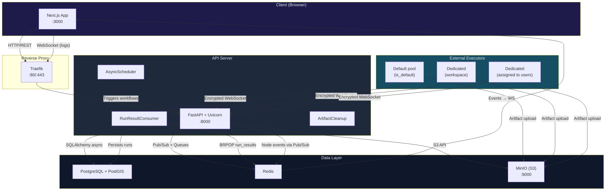

### Architectural Principles

| Principle | Implementation |
|-----------|---------------|
| **No Celery** | WebSocket executors replace Celery workers; AsyncScheduler replaces Celery Beat |
| **E2E Encryption** | Jobs encrypted with X25519 (ephemeral ECDH) + AES-256-GCM; signed with Ed25519 |
| **Forward Secrecy** | Each job uses an ephemeral X25519 pair discarded after sending |
| **Multi-tenancy** | Isolation by `workspace_id` on every resource |
| **Async-first** | SQLAlchemy async (asyncpg), async Redis, asyncio event loop |
| **Back-pressure** | Executors report capacity; the server respects the limits before dispatching |

---

## Services and Infrastructure

| Service | Technology | Port | Responsibility |
|---------|-----------|-------|------------------|
| `api` | FastAPI + Uvicorn | 8000 | REST API, WebSocket (logs + executors), authentication, routing, scheduler, consumer |
| `redis` | Valkey 8 (Redis-compatible; `REDIS_IMAGE`) | 6379 (internal network only) | Event pub/sub, `run_results` queue, executor presence, distributed locks and idempotency, login lockout |
| `minio` | MinIO (S3-compatible) | 9000/9001 | Run artifacts, workspace Drive, Portal layers |
| `traefik` | Traefik v3 | 80/443 | Reverse proxy, TLS termination, Host-based routing, **executor mTLS** (validates the client cert against the internal CA) |
| `step-ca` | smallstep/step-ca v0.27 | - (internal network) | Internal CA (PKI) that issues/renews the executors' mTLS certificates at enrollment |
| `web` | Next.js 16 (App Router) | 3000 | User interface (visual editor, dashboard, admin) |
| `executor` | Python (external) | - | Runs workflows locally, connects to the server over WebSocket (mTLS) |

> **PostgreSQL + PostGIS is not a `docker-compose` service.** The database is external —
> `DATABASE_URL` points to a PostgreSQL 15 + PostGIS instance managed outside the
> stack (direct connection, no pgbouncer). Tables are created/migrated by Alembic
> (`alembic upgrade head`), never by `create_all`.

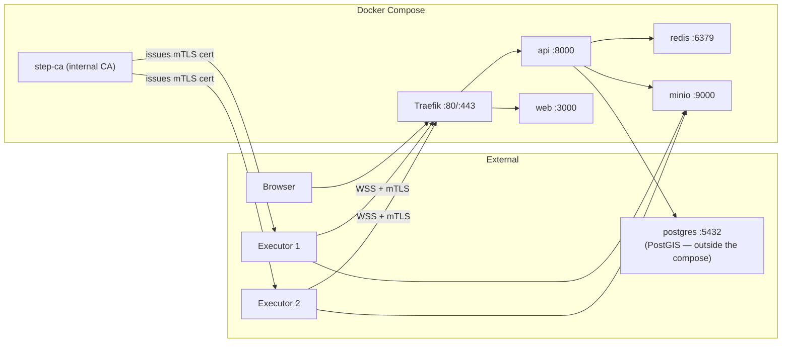

---

## API Layer (FastAPI)

### Routing Structure

```
app/main.py
├── Middleware: CORS, SecurityHeaders (CSP/HSTS/X-Frame-Options/nosniff), GZip (>1KB)
│   (the slowapi rate limiter is applied per route via decorator + exception handler)
├── Exception handlers: HTTP, validation, rate limit, domain, generic
├── Background tasks (lifespan; the list is `_tarefas_de_fundo()`, and the periodic loops
│   │   with a Redis lock use `periodic_loop` from app/core/tarefas_periodicas.py):
│   ├── RunResultConsumer (BRPOP run_results — the run_creates queue was removed)
│   ├── AsyncScheduler (schedule loop)
│   ├── ArtifactCleanup (periodic artifact cleanup)
│   ├── StorageReconciliation (reconciles DB × MinIO: size_bytes, multipart, drift)
│   ├── Source catalog (import at startup + periodic endpoint checks)
│   ├── overdue_acks_monitor (jobs sent without an ACK from the executor)
│   ├── orphan_runs_watchdog (fails runs whose executor lost presence in Redis)
│   └── those of the extensions (see below)
└── Routers mounted with a prefix:
    ├── /auth                     → auth_router.py (login, register, refresh, me,
    │                                verify-email, resend-verification, forgot/reset-password, logout)
    ├── /workflows                → workflows_router.py (CRUD, duplicate, move + move/preview, versions)
    ├── /workflows/{id}/schedules → schedules_router.py (PUT of a schedule: pause/resume, edit)
    ├── /webhook                  → webhook_router.py (workflow execution)
    ├── /credentials              → credentials_router.py (encrypted credentials)
    ├── /workspaces               → workspace_router.py (workspaces CRUD, target_executor_id)
    ├── /executores               → executores_router.py (executor management, enroll OTP/mTLS, set-default)
    ├── /nodes                    → nodes_router.py (node catalog)
    ├── /observability            → observability_router.py (metrics and history)
    ├── /artifacts                → artifacts_router.py (artifacts) + portal_router.py (/artifacts/portal, /artifacts/tiles)
    ├── /drive                    → drive_router.py (files) + executor_drive_router (upload via executor)
    ├── /workflow-groups          → workflow_groups_router.py
    ├── /telemetry                → telemetry_router.py (WebSocket /ws/telemetry)
    ├── /admin/health             → health_router.py (webhook whitelist, storage and purge — admin role)
    ├── /admin/users              → admin_users_router.py (user management)
    ├── /admin/nodes              → admin_nodes_router.py (enables/disables nodes)
    ├── /admin/workflows          → admin_workflows_router.py (activates/deactivates workflows)
    ├── /admin/workspaces         → admin_workspaces_router.py (trash: restore/purge)
    ├── /admin/drive              → drive_admin_router.py (Drive config)
    ├── /internal/send-email      → internal_email_router.py (sending via Resend, auth by executor cert)
    ├── /internal/change-detector → change_detector_router.py (hash store of the ChangeDetector node)
    ├── /mcp                      → app/mcp (exact route, personal access token authentication)
    ├── /ws/workflow/{run_id}     → log_workflows_router.py (logs WebSocket)
    ├── /ws/executores/{id}       → executor_ws_router.py + executor_ws/ (executors WebSocket, mTLS auth)
    └── the extensions' routes, after the core's (see below)
```

### Extensions (`app/extensoes`)

What an installation has beyond the core. Each subpackage of `app/extensoes/` is an extension, and the
core never imports one by name: on the first call to `registro()`, each one is imported and its
`registrar(registro)` hangs on the registry the routes, the background tasks, each person's plan and
assistant ceiling (`app/services/teto_do_assistente.py`), whether there is something to sell, email
template folders and extra fields in the assistant model panel. Its SQLAlchemy models
live in `<extensão>/modelos` and enter the metadata through `importar_modelos()`
(`app/models/__init__.py`). Their tables live in `<extensão>/schema.sql` (DROP + CREATE, like
the core's `scripts/init_schema.sql`), which the alembic zero base runs after the core's script
(`esquemas()`); the core does not create extension tables.

With no extension at all (the free distribution), each plug-in point has a default: nobody has a
plan, the ceiling is `ASSISTENTE_TETO_DE_TOKENS_POR_DIA` and there is nothing to sell. Three things hold
the boundary in place:

- `tests/unit/test_fronteira_das_extensoes.py` fails if the core mentions an extension by name (in an
  import, absolute or relative, in an attribute chain or in a string, such as a patch target), and
  proves that the API starts with `ATLANS_SEM_EXTENSOES=1` without loading the code of any of them;
- `scripts/sem_extensoes.sh` makes the free-distribution cut: it deletes each extension's folder and
  their tests;
- the CI job **Backend sem extensões (núcleo)** (Backend without extensions (core)) runs the cut and,
  then, the core's entire suite.

An extension's tests live in `tests/extensoes/<extensão>/`. The notifications an outside service
sends to an extension (a payment provider, for example) arrive at `/webhooks/<serviço>`:
the public Traefik rule (`api-rest-public`) already routes that prefix to the API.

The web has its own registry, with the same design (see
[Web extensions](#web-extensions-webextensoes)).

### Injectable Dependencies

| Dependency | Returns | Usage |
|-------------|---------|-----|
| `get_db` | `AsyncSession` | Async SQLAlchemy session per request |
| `get_current_user` | `User` | Validates the JWT from the `Authorization` header |
| `get_user_workspace_ids` | `list[str]` | IDs of ALL the workspaces the user is a member of |
| `verify_workspace_access(ws_id, ids)` | — | Fails (403) if the resource's `workspace_id` is not in the user's list |
| `workflow_com_papel(minimo)` | `Workflow` | Resolves the workflow by `id_hash` (404 before 403) and requires the minimum role in its `workspace_id` |
| `require_admin` | `User` | Ensures the `admin` role (alias of `require_role(Role.ADMIN)`) |
| `require_role(Role)` | `User` | Ensures a minimum role (viewer/editor/operator/admin) |

> **There is no** `x-workspace-id` header nor a `get_workspace` dependency. The workspace
> scope is passed as the **query param `workspace_id`** (or comes from the resolved resource
> itself) and checked against the user's memberships via `verify_workspace_access`.

### Lifecycle of a Request

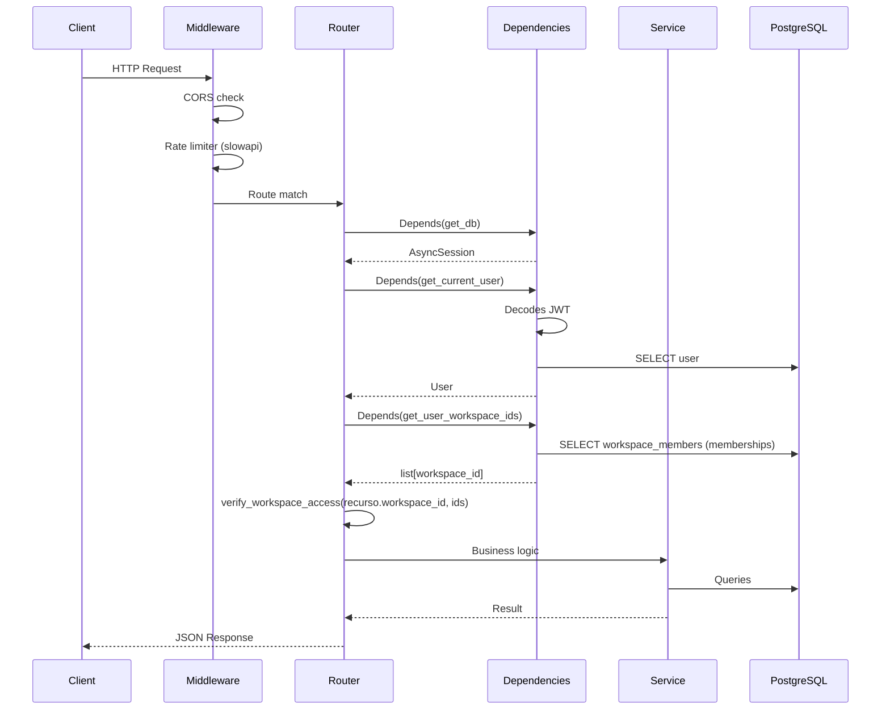

### Standardized Error Format

All errors go through centralized handlers in `app/core/utils/error_handlers.py`:

```json
// HTTPException (400, 401, 403, 404, 429)
{ "error": "http_exception", "message": "Mensagem legivel.", "status_code": 400 }

// Erro de validacao Pydantic (422)
{ "error": "validation_error", "message": "Validation failed", "details": [...] }

// Erro de dominio (AtlasBaseError) — "error" e o `error_code` especifico da excecao
{ "error": "<error_code>", "message": "Descricao do erro de negocio", "status_code": 422 }

// Erro interno (500)
{ "error": "internal_server_error", "message": "Unexpected error occurred" }
```

---

## Workflow Engine (flow/)

The workflow engine is the computational core of Atlans. It runs **inside the executors** (not on the API server), processing DAGs of geospatial nodes.

### Components

| File | Responsibility |
|---------|-----------------|
| `registry.py` | Map `name → classe`. Automatic discovery via `pkgutil.walk_packages` over `flow/nodes/` |
| `factory.py` | `NodeFactory` — instantiates the right class from the node's `name` in the JSON definition |
| `executor/core.py` | `WorkflowExecutor` — orchestrates the DAG: topological order, parallel batch, retry, pin, spill, propagation, events |
| `executor/node_manager.py` | `NodeManager` — instantiates and holds the nodes and their definitions |
| `executor/edge_resolver.py` | Edge semantics (`from_key`/`to_key`/spread), in the run and in the schema simulation |
| `executor/rendering.py` | Parameter rendering (Jinja2 + `$Alias`) |
| `executor/pin.py` | Pinning outputs in MinIO (upload/download of the pin artifact) |
| `executor/spill.py` | Spill-to-disk of heavy outputs (Parquet in `/tmp`) to contain RAM peaks |
| `nodes/base.py` | `BaseNode` — abstract contract with helpers for parameters, inputs and retry (`get_retry_params`) |
| `core/graph.py` | `WorkflowGraph` — topological sort, incoming/outgoing, filtering of isolated nodes, reachability from triggers (+ ancestors) and discarding of orphan edges |
| `utils/publisher/` | `WorkflowEventPublisher` (ABC) — publishes progress events via Redis pub/sub |
| `metrics/collector.py` | `MetricsCollector` — collects CPU, RAM, features and bytes metrics per node |

### Automatic Node Registration

`registry.py` recursively imports every module in `flow/nodes/` at initialization. All it takes is decorating the class with `@register_node` — which **validates the entire description at import time** (`flow/nodes/contrato.py`): category, property types, typed output fields and known keys. A malformed node breaks CI with the exact cause instead of becoming a visual defect on screen.

```python
@register_node
class MeuNo(BaseNode):
    @classmethod
    def description(cls) -> dict:
        return {
            "name": "MeuNo",
            "alias": "Meu No Customizado",
            "type": "action",              # category (6 closed values)
            "properties": [...],           # form widgets (14 types; required/placeholder)
            "outputs": [                   # SINGLE source of the output: typed fields
                {"name": "output", "type": "geodataframe", "description": "..."},
            ],
        }

    async def execute(self, inputs: dict) -> dict:
        # node logic
        return {"output": resultado}
```

The complete contract (vocabularies, `port`/`branches`, typed `inputs`) is in
`docs/creating-nodes.md`; the editor derives handles, tooltip, the required asterisk and the
gesture's `isValidConnection` **from the same catalog** (`GET /nodes`).

### Node Categories

The examples below are **module** (file) names. The registered `name` is PascalCase —
e.g.: `webhook_trigger` → `WebhookTrigger`, `field_transformer` → `SetFields`, `data_output`
→ `DataOutput`. There are 64 nodes in total.

| Category | Directory | Examples |
|-----------|-----------|----------|
| **Trigger** | `flow/nodes/trigger/` | `webhook_trigger`, `schedule_trigger`, `file_trigger`, `geofence_trigger`, `sub_workflow_input` |
| **Datasource** | `flow/nodes/datasource/` | `database_query`, `database_spatial_query`, `read_geojson`, `read_shapefile`, `read_geoparquet`, `read_csv_with_coords`, `wfs`, `data_input` |
| **Spatial** | `flow/nodes/spatial/` | `buffer`, `centroid`, `clip`, `union`, `intersection`, `difference`, `symmetric_difference`, `dissolve`, `spatial_join`, `transform_crs`, `compute_area`, `compute_bbox`, `simplify`, `validate_geometry`, `voronoi`, `convex_hull`, `heatmap`, `partition`, `aggregate`, `spatial_filter`, `filter_by_geometry_type` |
| **Action** | `flow/nodes/action/` | `http_request`, `field_transformer` (→`SetFields`), `attribute_filter`, `attribute_join`, `overlap_percentage`, `geocode`, `python_script`, `sort`, `remove_duplicates` |
| **Control** | `flow/nodes/control/` | `conditional`, `merge`, `loop`, `sub_workflow`, `jinja_branch`, `switch`, `change_detector` |
| **Output** | `flow/nodes/outputs/` | `save_geojson`, `save_to_postgis`, `save_to_postgres`, `save_to_shapefile`, `save_to_geoparquet`, `save_file`, `save_to_s3`, `send_email`, `send_webhook`, `publish_map`, `data_output`, `response_node`, `sub_workflow_output` |

### Executor Execution Flow

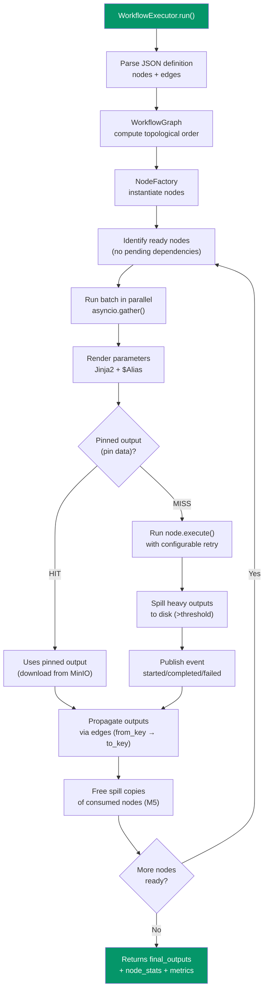

### Expression System

The executor supports Jinja2 expressions and aliases in node parameters:

- **Jinja2**: `{{ nodes.MeuNo.outputs.campo }}` — accesses outputs of previous nodes
- **$Alias**: `$MeuNo.campo` — shortcut to reference outputs by the node's alias
- **Built-in functions**: `{{ now() }}`, `{{ uuid() }}`, access to `env`

### Output Pinning (pinned data)

Instead of a Redis node cache, the executor supports **pinning** outputs: a node's result
is persisted in MinIO (`pin-cache/{workspace_id}/{task_id}/…`) and reused in
future runs, skipping the node's execution.

1. The server sends `pinned_outputs` + `pin_metadata` in the job envelope (columns
   `workflows.pinned_outputs` / `pin_metadata`). **`pin_metadata` is the authorization**:
   only a node that has a counterpart there goes into the envelope, because that column is written
   exclusively by the explicit pin of whoever is using it. An entry in
   `pinned_outputs` without a counterpart is an orphan — left over from a deleted node, a restored
   workflow, an incomplete unpin — and is not dispatched even when `pin_metadata` is empty.
   Dispatching an orphan was worse than it looks: validity is read from
   `pin_metadata[node_id]`, so an orphan with `__pin_s3_key__` **would never expire**
   (`_safe_pinned_outputs`, `app/services/workflow_execution_service.py`).
2. During the run, `_resolve_pin_data()` checks expiration (`expires_at`) and downloads the artifact from
   MinIO; a pin that is marked (with metadata) but still empty triggers an **auto-pin** — the output is
   written to MinIO and the new ref goes back to the server in `__updated_pinned_outputs__`.
3. A `completed` event with `cache_hit: true` (and `duration_ms: 0`) is published when the
   output came from the pin.

> **There is no `NODE_CACHE_TTL` and no per-node Redis cache.** That feature was replaced
> by the pin (storage in MinIO).

A node's cache row is unique per `(workflow_hash, node_id)` among the pinned ones —
`uq_artifact_pin_por_no`, a partial index on `artifacts`. Without it, two runs of the same
workflow finishing together each inserted their own, and every subsequent read found
two. `_upsert_pin_artifact` still collapses whatever it finds (a database that has not run
`alembic upgrade head` still lacks the index) and handles the INSERT collision in a
SAVEPOINT — the transaction at stake is the one that persists the run's result.

### Spill-to-Disk

Heavy outputs (GeoDataFrames above a size threshold) are written as Parquet to
disk (`_spill_to_disk`) and rehydrated on demand when a child consumes them. The writes
are shielded against cancellation (`asyncio.shield`) and drained (`_drain_spills`) before
`_cleanup_spill` removes the run's directory, avoiding orphan Parquet files in `/tmp`.

### Memory Release (M5)

The executor tracks how many children still need to consume each node's output
(`remaining_consumers`). When the last child consumes it, `_free_node_outputs` frees the
**copies**: the spill Parquet on disk and the re-read copy in `_spill_cache`. The real payload
in `named[alias]` / `final_outputs` **remains** (it feeds the Jinja context `{{ Alias.x }}`
of later nodes) and only dies with the process — the RAM savings here are partial and deliberate.

---

## Executor System

The executor system is Atlans's distributed execution mechanism. Executors are external processes that connect to the server over WebSocket, receive encrypted jobs and run workflows locally.

### Executor Types

An executor has `executor_type` = `default` **or** `dedicated`, plus an `is_default` flag.
"Visibility" is not a type of its own — it follows from `is_default` and from the assignments:

| Config | Description | Visibility |
|------|-----------|-------------|
| **Default pool** (`is_default = true`) | Platform executors. They receive the workflows whose workspace does not set `target_executor_id`. **Multiple are allowed** (via `POST /executores/set-default` and `/unset-default`). | All users |
| **Dedicated** bound to a workspace | `Workspace.target_executor_id` points to it — the tenant's primary executor. | Workspace members |
| **Dedicated** assigned to users | Bound to users via `user_executor_assignments` (admin). Isolation / sensitive workloads. | Assigned users only |

### Executor Lifecycle

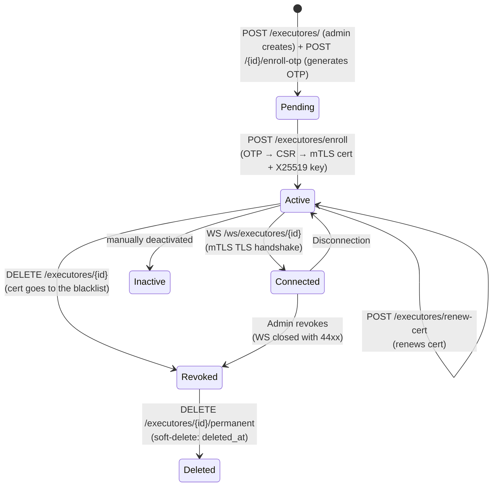

### Enrollment and Connection Protocol (OTP + mTLS)

Executors do **not** use an API key or a JWT token. Trust is established by an
**mTLS certificate** issued by an **internal CA** (the `step-ca` service):

1. **Creation** — an admin does `POST /executores/` → executor in `pending`.
2. **OTP** — `POST /executores/{id}/enroll-otp` generates a one-time password (table
   `executor_enrollment_otp`).
3. **Enrollment** — the executor does `POST /executores/enroll` with the OTP; the server issues an
   **mTLS certificate** (via step-ca) and records the executor's **X25519 public key**
   (used only to encrypt the jobs' payload). Status → `active`.
4. **Connection** — `WS /ws/executores/{id}`. **Traefik** validates the client cert against the internal
   CA in the TLS handshake and injects `X-Forwarded-Tls-Client-Cert-Info` (CN + serial). The
   handler (`validate_executor_mtls`) requires CN = `executor-{id}`, `status=active`, serial ==
   `cert_serial` in the DB, and a serial not in the Redis blacklist. Failure → WS accepted and closed with
   code `44xx`.
5. **Renewal** — `POST /executores/renew-cert` runs before expiry; `GET
   /executores/ca-bundle` distributes the CA's root cert. The new cert is only written if the
   executor is still active and has the serial it presented (a conditional UPDATE): a
   revocation made while step-ca was signing prevails, the new cert goes to the blacklist and
   the response is 409. Limit of 6 per hour and 30 per day, per executor (the cert's CN).
6. **Heartbeat/capacity** — once connected, the executor sends `heartbeat` and `capacity` (~30s),
   renewing the presence TTL in Redis (`executor:presence:{id}`, 120s).
7. **The executors screen** — each API worker holds only the WebSockets that connected to it,
   so `GET /executores`, `/executores/my` and `/executores/{id}` read from where all the
   workers can see, including the WebSocket's worker: presence and capacity in a Redis MGET
   (`executor:presence:{id}` and `executor:capacity:{id}`, the latter published by the
   WebSocket's worker), and `executor_version`, `system_info` and `last_seen_at` from the database. The version and
   `system_info` are written on the connection's first handshake; `system_info` only appears
   in the admin routes. The Docker executor's version is baked into the image at build time — the
   product's, the same as the desktop app's, plus the checkout's commit, read from `.git` itself
   (`2.15.0+3f02f44`, see `executor/versao.py`) — and it wins over the `EXECUTOR_VERSION` from `.env`;
   the desktop declares its own through `EXECUTOR_VERSION`. The screen's column truncates the long version
   and shows the whole one in the `title`. `last_seen_at` is written at enrollment, at the start of each session and at
   its end (the last contact, and only if it is later than what is recorded), not on cert
   renewal: online, it is the "up since"; offline, the "last seen". The revocations
   (`DELETE /executores/{id}`, `DELETE /executores/admin/executores/{id}/cert`,
   `POST /admin/users/{id}/revoke-all-executores` and the suspension/deletion of the
   operator's account) all end in `executor_service.complete_revocations`, after the commit:
   cert blacklist, a notice to the owners whose primary tier was emptied, and the closing of the
   WebSocket on any worker, through the relay. Those of the whole executor (all but the cert one)
   first go through `revogar_executor`, which removes it from the policy's tiers. The notice can be
   lost (Redis restarting, the session's listener
   reconnecting); that is why each session also checks the database, every 60 s, whether it is still valid —
   executor active and with a cert — and closes with 4403 if not (`_watch_revocation`). Renewal
   swaps the serial without clearing it, so it does not drop the session that did it.

> The encryption of the jobs' **payload** is still X25519 + AES-256-GCM + an Ed25519 signature
> (see below) — independent of mTLS, which protects the WebSocket **channel**.

### Job Encryption (X25519 + Ed25519)

Every job sent to the executor is encrypted with forward secrecy and digitally signed:

```mermaid
flowchart LR
    subgraph Servidor["Server"]
        EPHEMERAL["Generates ephemeral pair<br/>X25519"]
        ECDH["ECDH: ephemeral_priv<br/>x agent_pub → shared_secret"]
        HKDF["HKDF-SHA256<br/>shared_secret + nonce → AES key"]
        AES["AES-256-GCM<br/>encrypts payload"]
        SIGN["Ed25519.sign()<br/>envelope + ephemeral_pub + ciphertext"]
        MSG["Final message:<br/>envelope + ephemeral_pub<br/>+ ciphertext + signature"]
    end

    subgraph Executor
        VERIFY["Ed25519.verify()<br/>validates the server's signature"]
        ECDH2["ECDH: agent_priv<br/>x ephemeral_pub → shared_secret"]
        HKDF2["HKDF-SHA256<br/>shared_secret + nonce → AES key"]
        DECRYPT["AES-256-GCM<br/>decrypts payload"]
    end

    EPHEMERAL --> ECDH --> HKDF --> AES --> SIGN --> MSG
    MSG -->|"WebSocket"| VERIFY --> ECDH2 --> HKDF2 --> DECRYPT

    style Servidor fill:#1e293b,color:#e2e8f0
    style Executor fill:#164e63,color:#e2e8f0
```

**Encrypted message format:**

```json
{
  "envelope": {
    "job_id":          "uuid4",
    "target_executor_id": "id_hash do executor",
    "workspace_id":    "id_hash do workspace",
    "job_type":        "run_workflow",
    "issued_at":       "ISO8601",
    "expires_at":      "ISO8601 (padrao: +5 min)",
    "nonce":           "32 bytes hex (256 bits)"
  },
  "ephemeral_public":  "base64 (chave publica X25519 efemera)",
  "ciphertext":        "base64 (gcm_nonce_12B || ciphertext || tag_GCM)",
  "signature":         "base64 (Ed25519 sobre canonical_bytes)"
}
```

**Security guarantees:**

- **Forward secrecy**: ephemeral X25519 pair discarded after each job
- **Integrity**: Ed25519 over `envelope_json(sorted) | ephemeral_pub_b64 | ciphertext_b64`
- **Confidentiality**: AES-256-GCM with a key derived via HKDF (salt = the envelope's nonce)
- **Expiration**: `expires_at` in the envelope (default 5 minutes, configurable via `EXECUTOR_JOB_TTL_SECONDS`)
- **Replay protection**: unique 256-bit nonce per job

### WebSocket Message Protocol

| Direction | Type | Payload | Description |
|---------|------|---------|-----------|
| Executor → Server | `heartbeat` | `{}` | Keeps the connection alive; renews the Redis TTL |
| Executor → Server | `capacity` | `{queued, running, max_concurrent, max_queue}` | Reports current load (back-pressure) |
| Executor → Server | `job_result` | `{job_id, status, output, error, stats, run_id}` | Final result of the job |
| Executor → Server | `node_event` | `{run_id, node, status, timestamp, ...}` | Per-node progress event |
| Executor → Server | `sync_event` | `{event, dataset, progress, timestamp}` | File synchronization event |
| Executor → Server | `handshake` | `{agent_version}` | Post-connection identification |
| Executor → Server | `ack` | `{job_id, status}` | The job arrived and entered the local queue; promotes the run from `pending` to `running` |
| Executor → Server | `inventario` | `{ativos, resultados, truncado}` | On connection and every 60s: the jobs the executor HAS (see Reconciliation) |
| Server → Executor | `job` | `{envelope, ephemeral_public, ciphertext, signature}` | Encrypted job |
| Server → Executor | `error` | `{reason, ...}` | Rejection of a message from the executor; it logs it at WARNING |

### Choosing the executor

There is no central queue on the server. On every trigger, `_resolve_candidates`
(`app/services/workflow_execution_service.py`) builds the list of candidates in
tiers — the workspace's dedicated executor (or the policy's tiers, with
`EXECUTOR_POLICY_ROUTING=on`) and then the default pool — and `_dispatch_job` tries them
one by one until one accepts. If none accepts, the run closes as `failed`
(`no_executor`); nothing sits waiting for an executor to free up.

Within each tier, the order comes from each executor's situation
(`_executor_states`/`_sort_key`):

```python
carga  = runs pending/running do host no banco   # the declared one only if the count fails
vagas  = menor entre max_concurrent declarado e o teto do banco
fila   = menor entre max_queue declarado e o teto do banco
livres = vagas - carga
cheio  = is_full da capacidade declarada, ou carga >= vagas + fila
```

1. **With a free slot** — the job starts right away. Weighted draw by free
   slots: an executor with 4 free comes out ahead twice as often as one with 2.
2. **No slot, but room in the local queue** — the job will wait in some queue:
   lowest `(carga + 1) / vagas` first.
3. **Full** — by the executor's report (`send_job` would refuse; this is where an
   executor that is draining lands, since it announces itself as full) or by the count (its local queue
   would refuse the job AFTER the send was accepted, and the run would fail without
   failover). They go last: they are only tried if there is no other.

Why each part:

- **Counted by the server**: `pending`/`running` runs with `host` =
  `executor:{id}`. It changes at the instant of dispatch (the run's INSERT, with the host, is
  committed before the job goes out) and it is the same for all workers: a dispatch
  sees those that finished dispatching before it. It also counts runs that the database
  still thinks are alive but the executor has already lost, until reconciliation through the
  inventory closes them — that only pushes the executor back, it never makes it
  refuse.
- **Declared**: the `capacity` the executor sends every 10 s — local if the
  WebSocket is on this worker, otherwise the copy published in Redis
  (`executor:capacity:{id}`, read in a single round trip, MGET, for all candidates).
  As load it was blind on the other API workers (the executor counted as zero) and
  stale: at up to 10 s old, it made a freshly freed executor look busy. Now it
  serves for "full", for the slots and as a fallback when the count does not come out.
- **The query** runs in a SAVEPOINT opened on the session's connection. In Postgres, an
  error in it (lock, timeout) would abort the request's transaction and bring down the
  run's INSERT; with the savepoint, the order falls back to the declared one and the dispatch
  goes on. On the connection, and not with `Session.begin_nested()`, so as not to flush
  what the session has pending. Only a driver error becomes degradation;
  a lost connection and bugs propagate.
- The **draw** among those with a slot exists because of **simultaneous**
  decisions: concurrent requests and the several workers start from the same
  snapshot (no INSERT between them), and with a strict minimum they all picked the
  same executor. The draw spreads them in proportion to the headroom, and by the
  server's snapshot it never puts an executor without a slot ahead of one with a slot. Even
  so, a simultaneous burst can exceed someone's headroom: the excess waits
  in its local queue, and whatever exceeds the local queue is refused — the run fails.
- **Slots and queue by the lower value**: the executor may start with fewer slots than
  the database ceiling, and before the first `capacity` the worker holding the
  WebSocket only has a provisional value; by taking the lower, all workers see the
  same size.

In the executor's local queue, jobs run by priority and, among equals, in order
of arrival (`_QueueItem.seq` in `executor/job_queue.py`). The server does not send a
priority, so in practice it is FIFO.

### Back-Pressure

The server checks the capacity reported by the executor before dispatching a job:

```python
is_full = (queued + running) >= (max_concurrent + max_queue)
```

If the executor is full, `send_job()` returns `False` and the dispatch tries the
next candidate; only when all of them refuse does the run close as `failed` and the client
receive a 503.

### Relay via Redis Pub/Sub (Multi-Worker)

In environments with multiple Uvicorn workers (`--workers N`), an executor's WebSocket may be on a different worker from the one that receives the HTTP execution request:

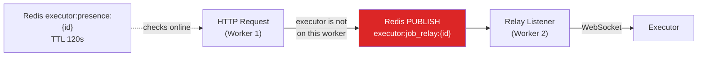

### Orphan Run Cleanup

When an executor disconnects unexpectedly, the server:
1. Fetches every `WorkflowRun` with `status=running` and `host=executor:{id}`
2. Marks them as `failed` with the message "Executor desconectou durante a execucao" (Executor disconnected during execution)
3. Publishes a `__workflow_complete__` (failed) event in Redis for each orphan run
4. The frontend receives the event and shows the error to the user

### Reconciliation through the executor's inventory

The server only found out about a lost run when the executor disconnected — on September 22
titan stayed connected with three runs it never received, and they stayed "Em
andamento" (In progress) until it dropped, 16 min later. Now the executor sends, on connection and
every minute, an `inventario` (inventory) with the `ativos` (active) jobs (queue, semaphore, execution) and
those with `resultados` (results) not yet confirmed. For each inventory (at most one
every 30 s per executor, always restricted to the runs with its `host`):

1. A `pending` run the executor has becomes `running` (lost ACK).
2. A run the server has already closed (`cancelled`/`failed`) and the executor is still
   running gets a `cancel`.
3. A `pending`/`running` run older than 3 min that the executor does NOT have becomes
   `failed` (`executor_lost`; `dispatch` if it never left `pending`) — except if
   its `job_result` has just arrived (key `executor:{id}:results:{job}`,
   TTL 300 s), in which case the consumer will still write it, or if the job is still
   on its way (live pending ACK, TTL 600 s: a send that blew past its deadline
   keeps draining). A `truncado` (truncated) inventory closes nothing by absence, nor does
   one that arrives in the first 45 s of a connection: the PREVIOUS connection's inbox
   may still be draining the `job_result` of a run that finished before the
   drop. Every run closed here gets a `cancel`: if the job still arrives, the
   cancel comes right behind it over the same socket.

The inventory goes through the connection's drainer, in the same queue as `job_result`:
a result sent before the inventory is written before the inventory is checked.
Between connections that ordering does not hold, and the executor covers the gap: a
sent result stays in `resultados` for 90 s after it is sent (the outbox
deletes it as soon as `send` returns), taking up only the space that is left and without marking
`truncado` — on a busy executor that would turn reconciliation off. An unreadable
outbox sends the inventory as `truncado`: an empty list would claim "nothing
pending".

Two results of the same run that pass the WS check together (the
real one and a late one) no longer overwrite each other in the consumer: the run is read with
`FOR UPDATE` and the first outcome written wins; redelivery of the SAME outcome
(dead letter) goes on as before, without counting the usage again.

On the executor, the on-disk journal (`jobs_em_voo`, in the outbox's SQLite) closes the
other side: an accepted job only leaves it when its result enters the outbox,
and whatever is left at boot becomes a failure with the probable cause (abrupt restart; the most
common is running out of memory, with the container's limit).

Cancelling a run whose executor is down closes the run on the server
(`cancelled`); cancelling a job the executor does not have returns a
`cancelled` result and leaves a 10-min tombstone against the late arrival of the job — unless
its result is on the way (outbox, in-memory queue or sent
a moment ago): then the job finished, and a `cancelled` on top would be a lie.
Every run the SERVER closes (dispatch failure, cancelled before going out,
cancelled with the executor down, orphan, not delivered, lost in
reconciliation) goes through `fechamento_de_run.fechar_runs`: a conditional UPDATE on the
status — an outcome already written (the job_result, the user's cancellation) is never
overwritten nor counted again —, accounting in usage_daily and the
`__workflow_complete__` through `run_events_service.publicar_conclusao`, once per
run — without it, an open panel kept spinning.

### Run stuck in `pending` ("Na fila")

The dispatch writes the run as `pending` — already with the chosen executor's host —
before sending, and promotes it to `running` when `send_job` returns. A worker
that died in that window left the run in "Na fila" (Queued) forever (incident of
September 22). Three defenses:

1. **ACK promotes.** The executor's `ack` promotes `pending` → `running` (a conditional
   UPDATE on status and host), from any worker. The dispatch's own UPDATE
   accepts `pending` or `running`, because the ACK usually arrives before its
   commit.
2. **Sweep.** `orphan_runs_watchdog` closes as `failed`/`dispatch` every
   run in `pending` for more than 10 min without an ACK ("did not get to run"),
   accounts for it in `usage_daily`, publishes the `__workflow_complete__` and sends
   `cancel` to the host just in case. Exception: an online host that does not send an
   inventory (an executor older than that feature — marker `executor:{id}:inventario`,
   renewed on every inventory) has no way to promote a job whose ACK was lost
   along with the worker that dispatched it; for its runs the sweep waits 6 h,
   the duration ceiling of a job with some margin. Unknown presence also waits.
3. **Send deadline.** Whoever sends to the executor's WebSocket waits with a deadline
   (30 s + 1 s per 512 KB) — before, a stalled connection held the send (and that
   worker's scheduler) until the 10-min ping timeout.

   Each socket has an **outgoing queue with a single writer** (`_Saida`): uvicorn's
   `--ws websockets` (pinned in the compose) writes the whole frame and
   only then waits for the drain, and the drain does not accept two waiters — two
   writers raised AssertionError with the frame already in the buffer. The writer
   writes in order, with no deadline on the drain; whoever sends waits for their own
   outcome (a Future — the writer's cancellation never leaks to them) with a
   deadline that counts what is ahead: what remains of the send in progress and the
   bytes in the queue at 512 KB/s (the 30 s base counts only once; added per
   message, 40 small events held a cancel for 20 minutes).

   | Outcome | Means | Sender |
   |---|---|---|
   | `enviado` | it went out whole | carries on |
   | `escoando` | the write started and passed the deadline; the frame is in the buffer | delivered without confirmation (pending ACK; no failover, which would make two executors run the job) |
   | `ocupado` | the deadline ran out while still in the queue, or the send in progress was already late; nothing was written | refusal: the dispatch tries the next candidate |
   | `fechando` | the socket is being closed | refusal; if the socket was **replaced** (takeover, lost ownership), it falls to the relay and the new session delivers |

   While a write is past its own deadline (link below the floor), nothing new
   enters the queue (the sender gets `ocupado` right away; drive events are
   discarded — GeoSync resyncs), the connection is left out of direct
   dispatch and the writer sets the `executor:parada:{id}` marker in Redis, which makes the
   other workers refuse the relay; it is unset when the write finishes and
   cleared when the executor reconnects. The connection is NOT dropped: a live
   executor with a slow link used to lose its presence and the watchdog closed all of its runs
   as orphans. A truly dead connection drops through the heartbeat timeout and
   through presence. The receive loop's error responses are only enqueued,
   without waiting their turn: that loop is the only one that renews presence.

   The relay listener only enqueues and moves on (it also handles the close marker).
   The publisher has already counted the job as delivered, so the run is closed right away as
   `dispatch` when the job does not go out: it did not get its turn in the queue, it was in the queue
   when the socket started closing, it hit a dead socket, or it reached a
   socket that is closing without having been replaced (heartbeat, protocol error, the
   executor disconnecting — the handler marks the outgoing queue as closing right at the start
   of the teardown, before draining the incoming queue). But only when no other
   session could have received it: ownership (`executor:conn_owner:{id}`) still belongs to
   this session, or to no one. With ownership held by another session — the executor
   reconnected on another worker — that session may have delivered it, and closing the run would make the
   inventory order the running job to stop: it is left for reconciliation.

   Every new session announces the takeover, with or without a previous owner in Redis (the
   ownership of a session that is still closing can expire in the middle of the close), and
   the notice goes out BEFORE its listener subscribes: whatever was published before
   stays only with the old session, which, on receiving the notice, knows that its queue only
   existed there and counts it as not delivered; whatever arrives afterwards, the new session
   delivers. Accepted window: a job published between the notice and the new listener's
   subscription (one round trip to Redis) does not go out through either, and
   reconciliation closes the run when the pending ACK expires.

   Every close of an executor socket goes through `fechar_ws_do_executor`: it marks the
   outgoing queue as closing (creating it, if nothing has gone out through that socket yet),
   cancels the writer's wait (what it has already written goes out before the close
   frame) and runs the close in a task of its own, which gets to the abort even if
   whoever asked (the unregister waits at most 2 s) gives up waiting.

Cancelling with the sending of the `cancel` failing only closes the run on the server when the
executor's presence is provably absent; with it alive (signing key
missing, relay restarting, Redis erroring) the usual 503 stands.
A run closed by the server's deduction (`failed` with `executor_lost` or
`dispatch`) is corrected by the real result that was already in the queue; a
real outcome or the user's cancellation is not.

---

## Scheduling (AsyncScheduler)

The `AsyncScheduler` replaced Celery Beat as the scheduling mechanism. It is an asyncio loop that runs inside the API process as a background task.

### How It Works

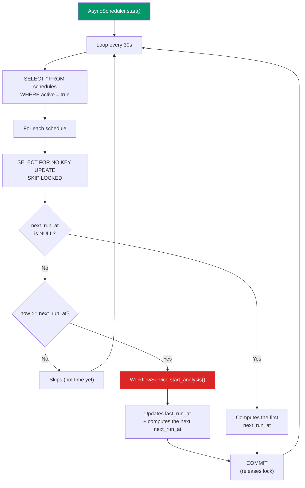

### Scheduling Strategies

| Strategy | Field | Example | Library |
|-----------|-------|---------|-----------|
| **cron** | `cron_expression` | `"0 6 * * *"` (every day at 6 a.m.) | `croniter` |
| **interval** | `interval` + `unit` | `60` + `minutes` (every 1 hour) | Built-in (timedelta) |
| **rrule** | `rrule_expression` | `"RRULE:FREQ=WEEKLY;BYDAY=MO,WE,FR"` | `python-dateutil` |

### Safe Concurrency (SELECT FOR NO KEY UPDATE SKIP LOCKED)

In environments with multiple Uvicorn workers, each worker has its own scheduler instance. `SELECT ... FOR NO KEY UPDATE SKIP LOCKED` (`with_for_update(skip_locked=True, key_share=True)`) ensures that only one worker processes each schedule per cycle. It is `FOR NO KEY UPDATE` (not `FOR UPDATE`) on purpose: it avoids a self-deadlock with the `FOR KEY SHARE` that the `INSERT` of `WorkflowRun` (FK `schedule_id`) requests on the same row.

- If another worker has already locked the row, `scalar_one_or_none()` returns `None`
- No blocking, no duplication, no distributed-lock overhead

---

## Real-Time Events

The event system connects the execution of workflows on the executors to the frontend in real time, using Redis pub/sub as the bus.

### Event Architecture

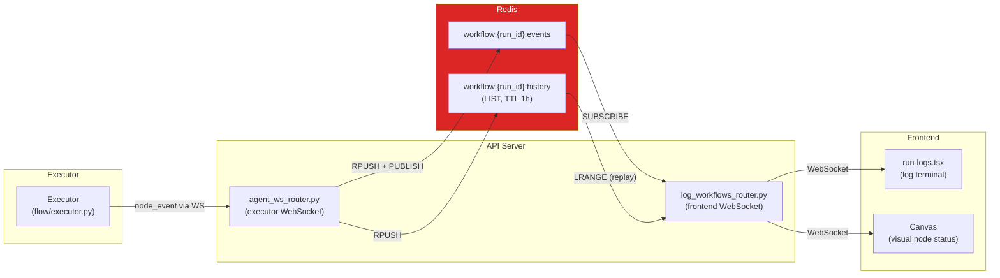

### Redis Channels

| Channel / Key | Type | Usage |
|---------------|------|-----|
| `workflow:{run_id}:events` | Pub/Sub | Real-time events (node_started, node_completed, node_failed, __workflow_complete__) |
| `workflow:{run_id}:history` | List (TTL 1h) | Event replay for clients that connect after the start |
| `executor:job_relay:{agent_id}` | Pub/Sub | Job relay between Uvicorn workers |
| `executor:presence:{agent_id}` | String (TTL 120s) | Executor online presence |
| `executor:{agent_id}:drive_events` | Pub/Sub | Change events in the workspace Drive |
| `executor:{agent_id}:sync_events` | Pub/Sub | Dataset synchronization events |
| `run_results` | List (queue) | Final run result (BRPOP by the consumer). **There is no `run_creates` anymore** — the `WorkflowRun` is created (status=pending) directly in the dispatch |
| `run_dead_letter` | List | Unprocessable items for manual analysis |
| `webhook_response:{run_id}` | List (TTL 5min) | Synchronous response from the ResponseNode for the webhook |
| `login_failed:{username}` | String (TTL 15min) | Login failure counter |
| `login_locked:{username}` | String (TTL 15min) | Brute-force lockout flag |

### Events Published per Node

| Event (status) | When | Extra Data |
|--------|--------|-------------|
| `started` | Before `node.execute()` | `node_name`, `node_type`, `nodes_total` |
| `completed` | After a successful `node.execute()` (or pin) | `duration_ms`, `output_keys`, `output_columns`, `cache_hit` (true on pin) |
| `failed` | When `node.execute()` raises an exception | `duration_ms`, `error`, `error_category`, `retryable`, `traceback` |
| `skipped` | Node on an unselected branch | — |
| `debug` | In debug_mode, after each node | Summary of inputs/outputs |
| `__workflow_complete__` | At the end of the workflow | `status`, `duration_ms`, `error` |

> There is no distinct `cached` event: the pin output is published as `completed` with
> `cache_hit: true` and `duration_ms: 0`.

### Frontend WebSocket Connection (Logs)

```
WebSocket: ws://localhost:8000/ws/workflow/{task_id}
```

1. The client connects via WebSocket
2. Sends the JWT as the **first text frame** (token not exposed in the URL)
3. The server validates it; rejects with code `4401` if invalid
4. The server replays the events already published (via `LRANGE` on the history)
5. Subscribes to the Redis channel and forwards events in real time

```javascript
ws.onopen = () => ws.send(session.user.access_token)
```

---

## Authentication and Authorization

### Authentication Flow (JWT)

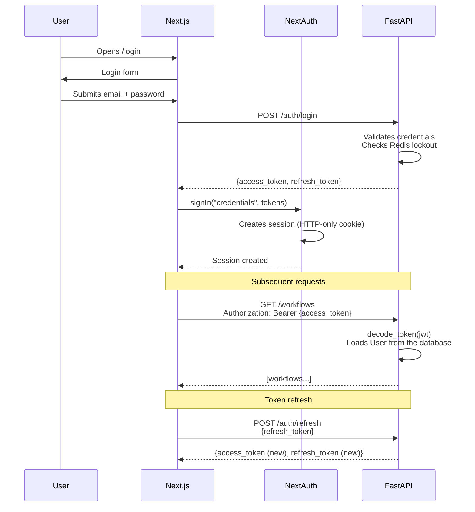

### JWT Tokens

| Token | Duration | Usage |
|-------|---------|-----|
| **Access token** | 30 minutes (fixed in `jwt_utils`) | Authentication of API requests |
| **Refresh token** | 2 days (family rotation) | Renewal of the access token |

> `APP_SECRET` is the **HMAC signing** secret for the JWTs (required), not the token's
> duration. **Executors do not use JWT** — the WebSocket connection is authenticated by **mTLS**
> (see "Enrollment and Connection Protocol").

**Token path in the NextAuth session:** `session.user.access_token` (defined in the session callback in `web/auth.ts`).

### RBAC (Role-Based Access Control)

Role hierarchy from lowest to highest:

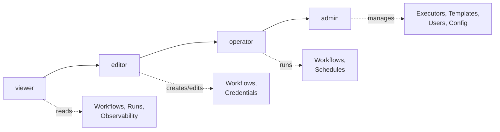

| Role | Permissions |
|------|-----------|
| `viewer` | Read access to workflows, observability, runs |
| `editor` | viewer + create/edit/delete workflows and credentials |
| `operator` | editor + run workflows and manage schedules |
| `admin` | operator + manage executors, node templates, users, settings |

### Brute-Force Protection

| Layer | Mechanism | Limit |
|--------|-----------|--------|
| IP | slowapi rate limiter | 5 req/min on `/auth/login` (and `/auth/register`) |
| Username | Redis lockout | 5 failures → 15 min lockout (`login_failed` / `login_locked`) |

---

## Multi-tenancy (Workspaces)

Each user belongs to one or more workspaces. All resources are isolated by `workspace_id`.

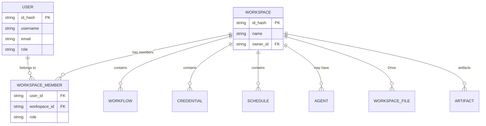

The workspace scope is passed as the **query param `workspace_id`** (or comes from the resolved resource itself, e.g.: `workflow_com_papel`) and checked against the user's memberships by `verify_workspace_access` / `get_user_workspace_ids`. There is no `x-workspace-id` header nor a `get_workspace` dependency.

### Isolation Model

- **Workflows**: `workspace_id` required; queries always filter by workspace
- **Credentials**: the `credentials` table has `owner_id` **and** a `workspace_id`
  (nullable). Resolution at runtime only accepts credentials whose owners have access
  to the workflow's workspace (`workspace_credential_owners`)
- **Schedules**: bound to the workflow's workspace
- **Artifacts/Drive**: partitioned by workspace in MinIO (`artifacts/{workspace_id}/...`)
- **Runs**: `WorkflowRun.workspace_id` is written at dispatch and never changes. It is
  by it that observability authorizes access to the history — not by the
  workflow's current workspace, which may have changed (see below)
- **Executors**: the default pool (`is_default`) is visible to everyone; `dedicated` executors respect the workspace (`target_executor_id`) and/or the assignment to users

### Moving a Workflow between Workspaces

`POST /workflows/{id_hash}/move` changes the workflow's tenant while preserving the
`id_hash`. It is a route of its own because `PUT` cannot accept `workspace_id`: there the
authorization would be resolved against the workspace PRIOR to the change. It requires the
`admin` or `owner` role **in both** workspaces.

The operation **does not fail** because of a broken dependency — it returns a report of
warnings (`warnings`) with what stops working at the destination: credentials whose
owner cannot reach the new workspace, sub-workflows and Drive files that were left
behind, a change of executor, a `notification_url` outside the allowlist.

What always changes, because it is a consequence of the tenant change:

| Field | Effect | Why |
|---|---|---|
| `schedules.active` + the `ScheduleTrigger` node | turned off | so it does not trigger on its own at the destination before someone reviews it |
| `portal_access` / `portal_shared_with` | `disabled` / `null` | the shared list names members of the old tenant |
| `group_id` | `null` | `WorkflowGroup` belongs to the source workspace |
| `pinned_outputs` / `pin_metadata` | cleared | the s3_keys are under `pin-cache/{ws_origem}/` and are unreadable at the destination |

History (runs, artifacts, metrics) **stays in the source workspace** —
the objects live under `artifacts/{ws_origem}/` and there is no copying between prefixes.
`POST /workflows/{id_hash}/move/preview` returns the same report without writing.

---

## Credential Management

Credentials (connection strings, API keys) are stored **encrypted** with Fernet in the database.

### Encryption Flow

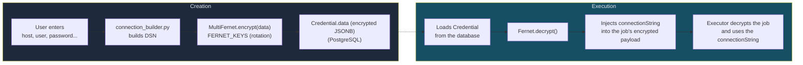

### Security

- Fernet key required via `FERNET_KEYS` (a list, allows rotation) or `FERNET_KEY`
  (base64url of 32 bytes); uses `MultiFernet` — `encrypt()` uses the 1st key, `decrypt()`
  tries all of them in order
- Credentials are decrypted only at the moment of dispatch to the executor
- The connectionString is injected **inside the encrypted payload** (X25519 + AES-256-GCM)
- The executor never receives the `credential_id` — only the already resolved connection string

**Supported types:** PostgreSQL, MySQL, S3, HTTP (API Key, Bearer Token).

### Secrets are not written into the definition

The only place for a credential is the `credentials` table, encrypted. The workflow's `definition` stores
the **`credential_id`** — a reference —, and the server injects the value into a **copy** at dispatch
(`app/services/credential_resolver.py`), a copy that dies with the run. The persisted definition
must never contain the value.

The write boundaries **refuse with 422** anyone who tries: `POST /workflows` and `PUT /workflows/{id}`
in REST, plus the three build tools of the MCP server. All of them call the same function,
`definition_contains_secret`
(`app/core/utils/redacao.py`), which scans the entire definition and returns the **paths** of the
fields — the refusal message names the field and **never** the value.

The MCP `validate_workflow` tool also refuses, even though it does not write: the secret has already traveled through
transport and logs, and refusing there makes the problem show up before the save.

**The refusal also covers free-form headers** (`Authorization`, `x-api-key`, `cookie`,
`proxy-authorization`), and that is a **product decision, not a technical consequence**: whoever needs
to send a token in a header creates a credential (the path exists — HTTP type, `http_auth` field).
Recorded here so that nobody "fixes" it by opening an exception.

**Measurement that backed the decision** (2026-09-14, production database): 31 live workflows, 286 nodes,
56 with `credential_id` in 9 workflows, and **zero** secrets stored — neither in `workflows` nor in
`workflow_versions`. The platform was already operating credential-only in practice; the guard turned into an
invariant a state that was true by convention, without refusing anything that existed.

#### What the guard refuses without it being a credential (measured, and accepted)

The rule matches by **key name**, and there are maps where the key is **user data**, not the name
of a configuration field. A review put together 30 realistic definitions, with the nodes' real
properties, and measured four legitimate patterns that are refused:

| pattern | flagged path |
|---|---|
| named bind `:token` in an SQL query, with a literal value in `queryParams` | `queryParams.token` |
| renaming a COLUMN called `senha` (password) | `renameFields.senha` |
| `WebhookTrigger` declaring the format of the payload it receives | `payload_schema.token` |
| `HttpRequest` with a pagination token in a JSON `body` | `body.token` |

**These are deliberate refusals, not defects.** In these four cases the way out is the same as for everything else: use
a credential instead of the literal value. Whoever runs into one of them will see a 422 naming the exact
path — and the right answer is to switch to `credential_id`, not to loosen the rule.

**What was NOT done, and why.** Exempting those maps from the by-name rule would solve all four,
and it was considered. It was not adopted for two reasons: a real token pasted into `body` or
`queryParams` would start getting in silently; and detection would become **narrower than redaction**,
which still redacts `params_schema.token` and the like — exactly what
`app/core/utils/redacao.py` forbids in writing, because "the boundary accepts what the delivery later
erases".

`tests/unit/test_guarda_segredo_na_escrita.py` pins down all four. If one of them stops being refused,
the test breaks — and the message says that changing that is a product decision, not a bug fix.

#### Two fixes the same review prompted

- `_literal_residue` (`flow/utils/definition_lint.py`) joined the pieces of the string **with nothing**,
  gluing together lines of free text and fabricating a `host:usuario@dominio` that nobody wrote —
  the body of an email and comments in a `PythonScript` were flagged as storing a password. The
  asymmetry gave it away: the SAME URL with a path at the end passed. It now joins with a space.
- `POST /workflows/validate` ran the guard over the already pruned Pydantic model, and was therefore
  **more permissive than the write**: the user passed validation and was refused on save. It
  switched to running over the raw body (the route was removed later, for having no caller; validation remains in MCP).

---

## Storage (MinIO)

MinIO is used as the S3-compatible storage backend for three functions:

### Use Cases

| Function | S3 Prefix | Description |
|--------|-----------|-----------|
| **Artifacts** | `artifacts/{workspace_id}/{run_id}/` | Artifacts produced by runs (GeoJSON, Shapefile, GeoParquet; GeoPackage, KMZ/KML, Excel and CSV from "Salvar arquivo"; PNG/JPG/PDF from the image map) |
| **Drive** | `drive/{workspace_id}/` | Workspace files (manual upload or synchronized with executors) |
| **Portal** | `portal/{workspace_id}/` | Layers published for public viewing |

### Configuration

| Variable | Default | Description |
|----------|--------|-----------|
| `MINIO_ENDPOINT` | `http://minio:9000` | Internal endpoint (server-side) |
| `MINIO_EXTERNAL_ENDPOINT` | = `MINIO_ENDPOINT` | External endpoint (pre-signed URLs reachable by executors/browsers) |
| `MINIO_ROOT_USER` | (required, no default; the compose stops without it) | Access credential |
| `MINIO_ROOT_PASSWORD` | (required, no default; the compose stops without it) | Access credential |
| `MINIO_BUCKET` | `atlans-drive` | Name of the main bucket |
| `MINIO_PRESIGN_EXPIRY` | `3600` without the variable; `.env.example` sets `900` | Validity of pre-signed URLs (seconds) |

### Operations

The `app/core/storage.py` module provides:
- `upload()` — upload of content in bytes
- `download()` — download of the full content
- `presigned_put()` / `presigned_get()` — pre-signed URLs (use the external endpoint)
- `head()` — object metadata (size, etag, content_type)
- `delete()` — removal of objects
- `ensure_bucket()` — creates the bucket at startup if it does not exist

### Synchronization with Executors

Artifacts with `destination: "drive"` are registered in the `WorkspaceFile` table (Drive) instead of `Artifact`, allowing automatic synchronization with executors via events on the `executor:{id}:drive_events` channel. The default value `destination: "artifacts"` registers only in the `Artifact` table (download via the API).

---

## Database

### PostgreSQL + PostGIS

Atlans uses PostgreSQL with the PostGIS extension for geospatial operations. Migrations are managed by **Alembic** (not by `create_all`).

**Zero base (F3 of the simplification).** There is ONE alembic revision
(`alembic/versions/20260924_0001_base_zero.py`, id `9ed006ca1660`), whose body
is `scripts/init_schema.sql` itself — the migration reads and runs the file,
leaving out only the commands on `alembic_version` and the comment lines.
Practical consequences:

- **New database**: `alembic upgrade head` (by hand: the API does not migrate on its own, and the
  automatic entrypoint was removed in 2026-05 — see the comment in
  Dockerfile.api) or `psql -f scripts/init_schema.sql` — both produce the
  same database, with the same stamp (`psql` without the extensions' schemas, which
  go separately). A deploy that checks `alembic current` × `heads` before
  starting keeps working without changes.
- **Schema change while nothing is in production**: you edit
  `init_schema.sql` (and the model) and recreate the database — the tests
  `test_init_schema_bootstrap.py` and `test_base_zero.py` tie the file,
  the models and the revision to one another. When there is real production, the
  first incremental migration will be born again on top of the zero base.
- **Database created by the old chain** (stamp prior to the squash): the schema is
  the same; run `alembic stamp --purge 9ed006ca1660` once to swap the
  stamp, or reset from scratch with the script. No automatic path purges a
  database with data: with the old stamp alembic fails BEFORE touching
  anything, and the revision itself refuses to run on a database that has tables
  without a stamp (the message points to the stamp and the deliberate reset).

### Main Tables

| Table | Description |
|--------|-----------|
| `users` | Users (id_hash, username, email, hashed_password, role) |
| `workspaces` | Workspaces (id_hash, name, owner_id) |
| `workspace_members` | User ↔ workspace link with a role |
| `workflows` | Workflow definition (name, definition JSON, workspace_id, group_id, pinned_outputs, portal_access). It does **not** have `target_agent_id` — routing is by `Workspace.target_executor_id` |
| `workflow_versions` | Version history of the definition |
| `workflow_runs` | Each run (task_id, status, host, start_time, end_time, duration_seconds, node_stats) |
| `workflow_groups` | Logical grouping of workflows |
| `schedules` | Schedules (strategy, cron_expression, interval, unit, rrule_expression, next_run_at) |
| `credentials` | Encrypted credentials (Fernet) per workspace |
| `executors` | Registered executors (id_hash, name, status, executor_type, is_default, public_key, cert_serial/fingerprint, capabilities, max_concurrent_jobs, max_queue_size) |
| `workspace_executors` | Executor ↔ workspace routing policy (tiers / mode) |
| `executor_enrollment_otp` | Executor enrollment OTPs (one-time) |
| `user_executor_assignments` | User ↔ executor link (for `dedicated` executors) |
| `artifacts` | Artifacts produced by runs (s3_key, format, features, expires_at) |
| `workspace_files` | Files of the workspace Drive |
| `portal_layers` | Layers published on the portal |
| `portal_features` | Individual features of portal layers |
| `workflow_run_metrics` | Run metrics (CPU, RAM, bytes, spatial) |
| `node_run_metrics` | Per-node metrics (duration, features, geometry_type, CRS) |
| `usage_daily` | Daily usage summary per workspace |
| `system_config` | Global key-value settings |
| `audit_events` | Audit trail of sensitive actions |
| `allowed_file_extensions` | Extensions allowed in the Drive (config) |
| `platform_file_settings` | Platform file limits / configuration |

### Async Connection

The project uses `asyncpg` as the driver and `SQLAlchemy` with `AsyncSession`. Configurable connection pool:

| Variable | Default | Description |
|----------|--------|-----------|
| `POOL_SIZE` | 10 | Simultaneous connections in the pool |
| `MAX_OVERFLOW` | 5 | Temporary extra connections |
| `POOL_TIMEOUT` | 30 | Seconds of waiting for a connection |
| `POOL_RECYCLE` | 1800 | Connection recycling (30 min) |
| `POOL_PRE_PING` | true | Checks the connection before using it |
| `DB_STATEMENT_TIMEOUT` | 60 | Seconds until Postgres cancels a statement (0 turns it off) |
| `DB_COMMAND_TIMEOUT` | 90 | Seconds until asyncpg gives up on the response (0 turns it off) |
| `ECHO_SQL` | false | Logging of SQL queries |

---

## Frontend (Next.js)

### Technologies

- **Next.js 16** (App Router)
- **React 19** with Server Components
- **Radix UI** (primitives) + **Tailwind CSS 4** as the component layer (it does **not** use MUI)
- **Zustand** for UI state (stores in `web/app/stores/`)
- **@xyflow/react (XYFlow)** for the visual DAG editor
- **@tanstack/react-virtual** for virtualization of large lists
- **NextAuth v5** for authentication (HTTP-only cookie)
- **TypeScript** throughout the code

### Routing

```
app/
├── (auth)/              # No authentication. All FIVE only REDIRECT to the Home with the
│   ├── login/           #   sign-in modal (/?entrar=1, /?cadastro=1, /?verificar=1&token=,
│   ├── register/        #   /?recuperar=1, /?redefinir=1&token=). They stay up because that is what
│   ├── forgot-password/ #   is written in the emails already sent. None of them is a page anymore.
│   ├── reset-password/
│   └── verify-email/
├── (portal)/            # Public portal (published layers, no login)
└── (dashboard)/         # Protected by proxy.ts (NextAuth) — except the Home `/`, which opens without a session
    ├── projects/            # Projects (workflows)
    ├── workflow/[id]/       # Visual editor
    ├── credentials/         # Credential management
    ├── workspaces/          # Workspace management
    ├── observability/       # Metrics and history
    ├── artifacts/           # Run artifacts
    ├── drive/               # Workspace files
    ├── executores/          # Executor management
    └── admin/               # Users, nodes, workspaces (trash), config
```

### Global State

UI state is mostly managed by **Zustand stores** (`web/app/stores/`),
complemented by a few React Contexts:

| Store / Context | What it manages |
|----------|---------------|
| `workflowExecutionStore` (Zustand) | The workflow's execution state (node status in real time) |
| `canvasViewStore` (Zustand) | Canvas view state |
| `runPanelStore` (Zustand) | Runs / logs panel |
| `workflowCatalogStore` / `workflowSaveStore` / `subflowDrilldownStore` (Zustand) | Catalog, saving and drill-down into sub-workflows |
| `useFlowContext` | DAG graph of the workflow being edited (nodes, edges) |
| `useCredentialsContext` | List of the workspace's credentials |
| `WorkspaceContext` / `ThemeContext` | Active workspace / light-dark theme |
| ~~`useProjectsContext`~~ (removed) | The Projects list lives in the `use-projetos-dados` hook; the dialogs receive the workflow by prop |

### Web extensions (`web/extensoes`)

The counterpart of the server's registry (see [Extensions](#extensions-appextensoes)). The core never imports
an extension by name: it reads `EXTENSOES` from `@/extensoes`, and each extension is the description of what
it hangs on each plug-in point (`web/extensoes/tipos.ts`):

| Plug-in point | Where the core draws it | Without an extension |
|---|---|---|
| `camadas` | once in the shell (`SidebarRoot`), in both shells: modals and global effects | nothing |
| `itensDaConta` | in the account menu (`user-sidebar.tsx`), after Configurações (Settings), with the portal palette | the menu is Tema (Theme), Configurações and Log out |
| `ofertaDaCota` | next to the full-quota notice (`aviso-de-cota.tsx`), on the three surfaces that show it | the notice stands alone |
| `painelDoModelo` | wraps the assistant model selector in the administration (`modelo-do-assistente.tsx`), and adds a sentence to the section's introduction | just the selector |

What lists the extensions present is `web/extensoes/instaladas.ts`; in the free distribution the list
is empty. The loose files in `web/extensoes/` are the registry, and they are core; each subfolder is
an extension. A heavy piece that only one screen uses is loaded on demand (`lazy`), because the registry
lives in the shell, which every route loads.

Each extension piece goes through an error boundary (`LimiteDaExtensao`): if it breaks while
rendering (a defect of its own, or the on-demand chunk that did not arrive), the spot shows what the
core would show without an extension, and the error goes to the console with its name. In the model panel,
this keeps the selector and the "Voltar ao padrão do ambiente" (Back to the environment default), which are the screen's emergency exit.

What holds the boundary in place:

- the CI job **Frontend sem extensões (núcleo)** (Frontend without extensions (core)) runs
  `scripts/sem_extensoes.sh` (deletes the extensions and their tests and empties the list of installed
  ones) and, then, the usual typecheck, suite and build;
- `web/__tests__/fronteira-das-extensoes.test.ts` fails if a core file (or one of its
  tests) mentions an extension by name. The paths come from the TypeScript syntax tree: imports,
  exports, `import()`, `require` and the `vi.mock` calls and relatives, with or without a comment in between;
- to check on your machine without deleting anything: `npm run typecheck:nucleo` (`tsconfig.nucleo.json`)
  and `npm run test:nucleo` point the list of installed extensions to the empty one (`nenhuma.ts`).

An extension's tests live in `web/__tests__/extensoes/<extensão>/`.

### Visual Editor

The editor uses `@xyflow/react` to render the interactive DAG:

- **Visual nodes** → `web/app/components/workflow/custom-nodes/`
- **Edges** → `web/app/components/workflow/custom-edges/`
- **Side panel** → `web/app/components/workflow/nodes-configuration/`
- **Node palette** → `web/app/components/workflow/drawer/`

Each node's configuration schema is loaded via `GET /nodes/` — the frontend generates the form fields dynamically from the `properties` schema.

#### Node Appearance (Visual Card)

Each node is rendered as a `158x60px` card with:
- **Colored stripe** on the left — color by `type` (trigger=violet, action=blue, spatial=emerald, datasource=amber, output=pink, control=orange)
- **Icon section** — background at 10% opacity of the type's color
- **Text section** — node alias + category label
- **Floating toolbar** — appears on hover (edit, copy, delete)
- **Status indicator** — outer ring (blue=running, green=completed, red=failed)

#### Edges

Edges use `getSmoothStepPath` and are colored according to status:

| State | Color | Effect |
|--------|-----|--------|
| Running (`started`) | Blue | Flowing dashes animation |
| Completed (`completed`) | Green | Solid |
| Failed (`failed`) | Red | Solid |
| Handle `true` (Conditional) | Green | Solid |
| Handle `false` (Conditional) | Red | Solid |
| No status | Gray (`slate-400`) | Solid |

#### Authentication Flow in the Frontend

```mermaid
sequenceDiagram
    participant B as Browser
    participant MW as proxy.ts
    participant NA as NextAuth
    participant API as FastAPI

    B->>MW: Opens protected route
    MW->>NA: Checks session
    alt Valid session
        NA-->>MW: session.user.access_token
        MW-->>B: Renders page
        B->>API: Request with Authorization header
    else Expired session
        NA->>API: POST /auth/refresh
        API-->>NA: New tokens
        NA-->>MW: Session renewed
    else No session
        MW-->>B: Redirect /?entrar=1&callbackUrl=... (the Home with the sign-in modal); at `/` the Home renders anonymously
    end
```

---

## Desktop App (Electron)

The `desktop/` directory is an **Electron** shell (`main` / `preload` / `renderer` processes,
build via Vite, packaging via `electron-builder`) that **loads the web interface from
a remote URL** — the installation's, baked in at build time (`ATLANS_DESKTOP_UI_URL`, see
`desktop/scripts/enderecos.mjs`) — and does not embed the frontend: it is a shell over the hosted
`web/`. Same-origin guards (`ehOrigemInterna`) allow that URL's host and its `api.`,
and block external origins (e.g.: `docs.` on the same domain, third-party domains).

---

## Complete Execution Flow

End-to-end diagram of a user running a workflow from the editor:

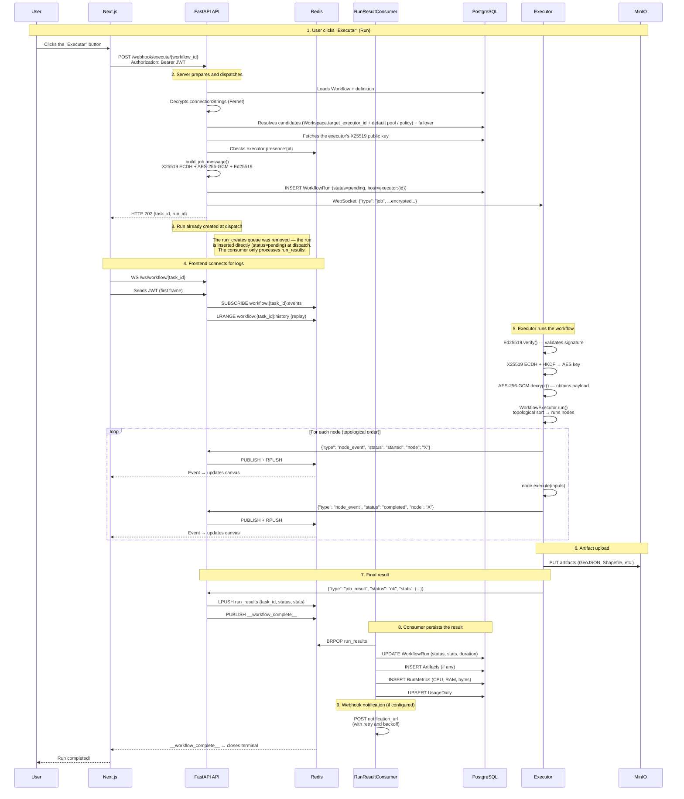

### Data Flow Summary

```
User → Next.js → FastAPI → [encrypts job] → WebSocket → Executor
                                                            ↓
                                                     Executor (DAG)
                                                            ↓
                                                   node_events → Redis → Frontend (real time)
                                                            ↓
                                                   job_result → Redis → Consumer → PostgreSQL
                                                            ↓
                                                   artifacts → MinIO
```

---

## Environment Variables

| Variable | Required | Description |
|----------|------------|-----------|
| `DATABASE_URL` | Yes | PostgreSQL connection URL (asyncpg) |
| `REDIS_URL` | No | Redis URL (default: `redis://redis:6379/0`) |
| `APP_SECRET` | Yes | Secret for JWT and HMAC signing |
| `FERNET_KEYS` / `FERNET_KEY` | Yes | Fernet key(s) for credential encryption (`FERNET_KEYS` = a list, allows rotation via MultiFernet) |
| `EXECUTOR_SIGNING_KEY` | No* | Ed25519 key for signing jobs (*required for dispatching to executors) |
| `MINIO_ENDPOINT` | No | Internal MinIO endpoint (default: `http://minio:9000`) |
| `MINIO_EXTERNAL_ENDPOINT` | No | External MinIO endpoint for pre-signed URLs |
| `MINIO_ROOT_USER` | Yes* | MinIO credential (*required for storage operations; no default) |
| `MINIO_ROOT_PASSWORD` | No | MinIO credential |
| `MINIO_BUCKET` | No | Main bucket (default: `atlans-drive`) |
| `ALLOWED_ORIGINS` | No | Comma-separated CORS origins (default: `*`) |
| `EXECUTOR_POLICY_ROUTING` | No | `on`/`off` (default `off`) — turns on routing by workspace policy; otherwise, legacy routing (target_executor_id + default pool) |
| `EXECUTOR_JOB_TTL_SECONDS` | No | Job validity in seconds (default: 300) |
| `POOL_SIZE` | No | Connection pool size (default: 10) |
| `MAX_OVERFLOW` | No | Temporary extra connections (default: 5) |
| `DB_STATEMENT_TIMEOUT` | No | Deadline for each statement in Postgres, in seconds (default: 60; 0 turns it off) |
| `DB_COMMAND_TIMEOUT` | No | asyncpg's deadline for the response, in seconds (default: 90; 0 turns it off) |
| `ECHO_SQL` | No | Logging of SQL queries (default: false) |
| `EMAIL_BACKEND` | No | Email transport (verification, password reset, alerts, SendEmail node): `resend`, `smtp` or `log`. Empty = Resend with the key, SMTP with the host, log with neither. An unknown value, `smtp` without `SMTP_HOST` or `resend` without the key prevent the API from starting |
| `RESEND_API_KEY` | No | Resend API key |
| `SMTP_HOST` / `SMTP_PORT` | No | SMTP server. Empty port = the mode's port (587, 465 or 25) |
| `SMTP_SEGURANCA` | No | `starttls` (default), `ssl` or `nenhuma`; any other value prevents the API from starting |
| `SMTP_USERNAME` / `SMTP_PASSWORD` | No | SMTP login. Without a username, there is no login |
| `EMAIL_FROM` | No | Sender of every email (default: `Atlans <noreply@host do FRONTEND_URL>`). `RESEND_FROM_EMAIL`, the old name, still works |
| `EXIGIR_EMAIL_VERIFICADO` | No | `false` lets people sign in without a verified email, for an installation without a transport (default: `true`). With a transport, the workspace invitation still requires a verified account |
| `FRONTEND_URL` | No | Frontend URL for links in emails (default: `http://localhost:3000`) |
| `EMAIL_VERIFY_TOKEN_TTL` | No | TTL of the email verification token in minutes (default: 1440) |
| `PASSWORD_RESET_TOKEN_TTL` | No | TTL of the password reset token in minutes (default: 30) |
